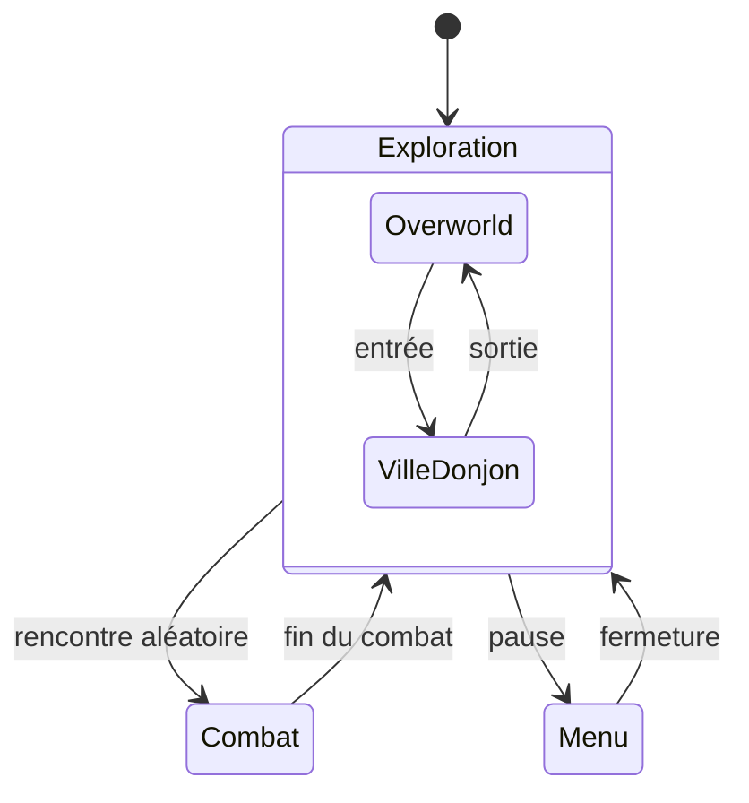
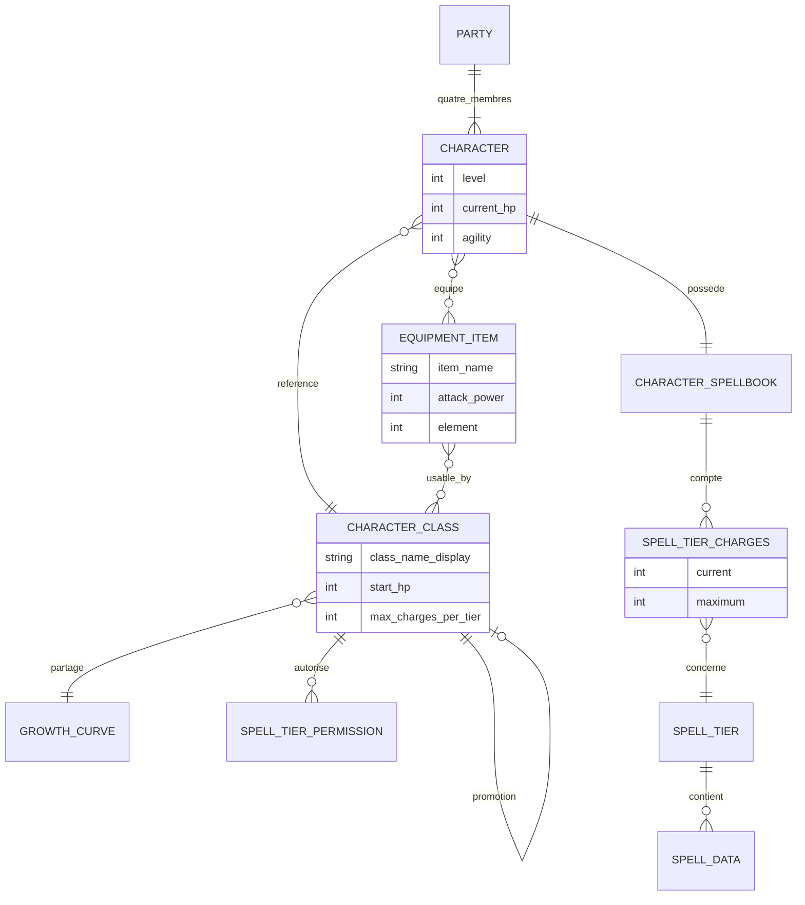

# Décorticage architecture — Final Fantasy (NES, 1987)

Grille appliquée : les 4 niveaux complets, glitch illustratif. Affirmations techniques recalées sur le [désassemblage commenté de Disch/BenWenger](https://github.com/BenWenger/FinalFantasyDisassembly).

## Niveau 1 — Machine à états globale



La documentation officielle distingue 4 « modes » (overworld, villes/donjons, écran de combat, menu), mais comme pour Zelda 1, ville/donjon/overworld partagent le même modèle d'interaction — déplacement libre en vue du dessus. Architecturalement, ça reste 2 vrais états : Exploration et Combat.

Le désassemblage confirme le partage au niveau le plus concret : **la même routine de décompression sert les deux** (`DecompressMap`). Ce qui change, c'est uniquement la stratégie d'appel — l'overworld est décompressé ligne par ligne au fil du déplacement, les cartes standard d'un seul bloc à l'entrée. Même code, deux régimes d'utilisation : c'est le niveau 1 vu depuis le niveau 2.

Différence structurelle notable avec Pokémon : le combat oppose un **parti de 4** côté joueur, pas un affrontement 1 contre 1. La scène de combat doit gérer plusieurs acteurs simultanés par camp — ordre des tours par Agilité, cibles multiples possibles — pas juste deux combattants qui s'échangent des coups.

## Niveau 2 — Découpage des scènes

L'overworld fait bien **256 × 256 tuiles**, stocké compressé. Le commentaire du code est explicite : *« there are 256 rows, which means 512 bytes for indexing »*, et le calcul des domaines de rencontre le corrobore — la carte est divisée en une grille 8 × 8 de domaines de 32 × 32 tuiles chacun, soit 256.

**Le format de compression, corrigé.** La version initiale de ce fichier décrivait un RLE « octet de tuile + compteur de répétition » systématique. Le format réel utilise un **bit de drapeau**, ce qui est plus économe :

| Octet lu | Signification |
|---|---|
| `< $80` | **tuile littérale unique** — l'identifiant est l'octet lui-même |
| `$80`–`$FE` | **run** — tuile = `octet & $7F`, et **l'octet suivant est la longueur** |
| `= $FF` | **terminateur** de ligne |

Conséquences à retenir : une tuile isolée coûte **un** octet et non deux, seules les tuiles `$00`–`$7F` sont adressables (le bit 7 est confisqué par le drapeau), et une longueur de `0` signifie **256** — la boucle sort sur le débordement du compteur. C'est un RLE *hybride*, à mi-chemin entre le RLE pur et un format littéral : exactement l'arbitrage que fait n'importe quel encodeur moderne quand les runs courts sont fréquents.

**Les pointeurs par ligne sont confirmés**, et leur raison d'être est structurelle : `lut_OWPtrTbl` fait **512 octets = 256 pointeurs de 2 octets**, indexé par la ligne courante. L'indirection est nécessaire précisément parce que 256 entrées de 2 octets dépassent l'adressage 8 bits. Et seules **16 lignes tiennent en RAM à la fois** (les 4 bits bas du numéro de ligne servent de poids fort de la destination) : une nouvelle ligne est décompressée **à chaque déplacement vertical**.

Ce qui fait de l'overworld de Final Fantasy la troisième variante de fenêtre glissante du corpus, après les block buffers de Mario et la RAM de collision de Sonic — mais sur l'autre axe. Mario glisse en **colonnes** parce qu'il défile horizontalement ; Final Fantasy glisse en **lignes** parce qu'on s'y déplace verticalement autant qu'horizontalement, et que le format est indexé par ligne. La contrainte de format et l'axe de déplacement décident ensemble de l'axe du streaming.

Pour Godot : décompresser dans un `TileMap` au chargement suit le même principe que pour Mario, avec une étape de décompression plus simple à écrire.

```gdscript
class_name RleMapDecoder
extends RefCounted

const ROW_WIDTH := 256
const RUN_FLAG := 0x80
const TERMINATOR := 0xFF

## Décompresse une ligne. Le format d'origine, transposé tel quel :
## bit 7 = drapeau de run, $FF = fin de ligne, longueur 0 = 256.
static func decode_row(data: PackedByteArray, offset: int) -> PackedByteArray:
	var row := PackedByteArray()
	row.resize(ROW_WIDTH)
	var written := 0
	var i := offset
	while written < ROW_WIDTH:
		var b := data[i]
		i += 1
		if b == TERMINATOR:
			break
		if b < RUN_FLAG:
			row[written] = b
			written += 1
			continue
		var tile := b & 0x7F
		var length := data[i]
		i += 1
		if length == 0:
			length = 256               ## 0 signifie 256, pas "rien"
		for _n in mini(length, ROW_WIDTH - written):
			row[written] = tile
			written += 1
	return row
```

Sans contrainte de VRAM côté Godot, la compression elle-même n'est utile que si tu vises une carte réellement énorme ou générée à la volée — mais le `length == 0 → 256` est le genre de convention qu'il vaut mieux avoir vue une fois, parce qu'elle est fréquente et qu'elle produit une boucle vide si on la lit naïvement.

## Niveau 3 — Structures de données

C'est le jeu le plus riche du corpus sur ce niveau, et pour une raison précise : il a **douze classes, huit niveaux de sorts, quatre personnages et un système d'équipement**, tous modélisés en tables indexées. Trois mécanismes valent le détour, dont deux qui contredisent l'intuition.

### Les classes : six choisies, douze existantes

Le jeu définit **douze identifiants de classe** : les six sélectionnables à la création (Guerrier, Voleur, Moine, Mage Rouge, Mage Blanc, Mage Noir) et leurs six formes promues (Chevalier, Ninja, Maître, Mage Rouge Sup., Mage Blanc Sup., Mage Noir Sup.).

**Nuance à apporter à la version initiale de ce fichier**, qui disait le parti « figé pour toute la partie ». Le *choix* de classe est bien définitif — il n'existe aucune routine de remplacement de membre, et les quatre emplacements sont alloués en dur (`ch_stats`, `$40` octets par personnage, indexés `00/40/80/C0`). Mais la classe elle-même **change une fois** : la promotion chez Bahamut fait simplement `ch_class += 6` pour les quatre personnages. Un `+= 6` sur un identifiant, et les douze classes deviennent six paires. C'est de la modélisation par convention numérique : élégant, compact, et totalement muet sur son intention si on ne connaît pas la règle.

Ce qui est stocké par classe, et comment :

| Donnée | Structure |
|---|---|
| Stats de départ | table indexée par classe, `$B` octets utiles padés à `$10` |
| Courbe de progression | 2 octets × 49 niveaux × 6 classes — **les promues partagent les données de leur forme d'origine** |
| Bonus de précision / défense magique au level-up | deux tables indexées par classe, plafonnées à 200 |
| Sorts autorisés | table de pointeurs à 12 entrées → LUT de 8 octets (1 par niveau de sort, 1 bit par sort) |
| Palettes et graphismes | tables indexées par classe |

Le fait que les classes promues partagent la courbe de progression de leur forme d'origine est intéressant : c'est une **table de jointure implicite** (`classe_promue → classe_de_base`) réalisée par un simple modulo 6. Et c'est aussi la raison d'un bug documenté plus bas — Chevalier et Ninja partageant leurs données de level-up avec Guerrier et Voleur, il a fallu un test explicite pour leur donner de la magie.

### Le piège numéro un : la permission de sort est inversée

La LUT de permission magique contient **un bit par sort**, et **le bit mis signifie « ne peut PAS lancer »**. Les trois classes non magiques ont donc huit octets à `$FF`, et le Mage Rouge une combinaison à trous.

Ce n'est pas un détail d'implémentation : c'est un choix qui rend la donnée par défaut (`$00`, tout à zéro) équivalente à « peut tout lancer ». Pour un tableau qu'on initialise à zéro, la sémantique par défaut devient la plus permissive — l'inverse de ce qu'on veut. Toute nouvelle classe oubliée dans la table serait omnipotente plutôt qu'impuissante.

```gdscript
class_name CharacterClass
extends Resource

## Convention de l'original : classe promue = classe de base + 6.
## Explicité ici par une référence, plutôt que par de l'arithmétique.
@export var class_name_display: String = ""
@export var promoted_form: CharacterClass          ## null si déjà promue

@export_group("Stats de départ")
@export var start_hp: int = 30
@export var start_strength: int = 10
@export var start_agility: int = 10
@export var start_vitality: int = 10
@export var start_luck: int = 10

@export_group("Progression")
## Les formes promues réutilisent la courbe de leur forme d'origine :
## on la référence au lieu de la dupliquer (Flyweight).
@export var growth_curve: GrowthCurve
@export var max_charges_per_tier: int = 9          ## 4 pour Chevalier et Ninja

@export_group("Magie")
## Sens POSITIF, contrairement à l'original où le bit mis = interdit.
## Une classe non renseignée ne peut donc rien lancer, ce qui est le bon défaut.
@export var allowed_spells: Array[SpellTierPermission] = []

func can_cast(tier: int, slot: int) -> bool:
	if tier >= allowed_spells.size():
		return false
	return allowed_spells[tier].is_allowed(slot)
```

Inverser la polarité par rapport à l'original n'est pas de la coquetterie : c'est aligner le défaut du langage (zéro, vide, `false`) sur le comportement le plus restrictif. La même règle vaut pour un `Dictionary` de permissions, un `@export_flags`, ou une colonne booléenne en base.

### Le piège numéro deux : la permission d'équipement n'est pas sur la classe

C'est le point le plus contre-intuitif du jeu, et le plus riche pour qui vient du relationnel. On s'attendrait à trouver, sur chaque classe, la liste des équipements autorisés. C'est l'inverse : **chaque objet porte un mot de 12 bits, un bit par classe, bit mis = classe interdite**. Le masque d'une classe est `$800 >> identifiant`. Et c'est un mot de deux octets et non un octet précisément parce qu'il y a plus de huit classes.

En vocabulaire JPA, la relation many-to-many `Classe ↔ Objet` existe bien, mais **le côté propriétaire est l'objet**, pas la classe. Conséquence concrète, la même qu'en base : répondre à « que peut porter un Mage Blanc ? » exige de **parcourir tous les objets** et de tester un bit, là où répondre à « qui peut porter cette épée ? » est une lecture directe. Le choix du côté propriétaire décide de la requête qui est gratuite et de celle qui est coûteuse.

Pour un jeu où la question posée est toujours « puis-je équiper cet objet ? » au moment où on le regarde dans un menu, le stockage côté objet est le bon. Pour un jeu où il faut afficher « équipements disponibles pour ce personnage », c'est le mauvais — et l'index inverse devient nécessaire :

```gdscript
class_name EquipmentItem
extends Resource

@export var item_name: String = ""
@export var attack_power: int = 0
@export var element: Element = Element.NONE

## Côté propriétaire de la relation, comme dans l'original.
## Sens positif : ce sont les classes AUTORISÉES.
@export var usable_by: Array[CharacterClass] = []

func usable_by_class(c: CharacterClass) -> bool:
	return usable_by.has(c)
```

```gdscript
class_name EquipmentIndex
extends RefCounted

## L'index inverse que l'original n'avait pas les moyens de tenir.
## Construit une fois au chargement, exactement comme le Dictionary
## d'index qu'il faut construire à la main pour interroger les
## PokemonSpecies par type (voir l'analyse Pokémon, "où ça diverge d'un ORM").
var _by_class: Dictionary = {}                     ## CharacterClass -> Array[EquipmentItem]

func build(all_items: Array[EquipmentItem]) -> void:
	_by_class.clear()
	for item in all_items:
		for c in item.usable_by:
			if not _by_class.has(c):
				_by_class[c] = [] as Array[EquipmentItem]
			_by_class[c].append(item)

func items_for(c: CharacterClass) -> Array[EquipmentItem]:
	return _by_class.get(c, [] as Array[EquipmentItem])
```

### Les sorts : des charges par niveau, et trois slots sur quatre

**Confirmé** : les charges sont comptées **par niveau de sort**, pas par sort individuel. La structure de personnage contient huit octets de charges courantes et huit de charges maximales, et il n'existe aucun compteur par sort. En combat, l'identifiant du consommable est littéralement *le niveau du sort*.

Deux précisions que la version initiale n'avait pas :

- **Quatre slots en structure, trois utilisables.** L'espace de sorts fait `$20` octets pour 8 niveaux, soit un pas de 4, et la conversion en format de combat boucle bien sur 4. Mais la boutique de magie n'écrit et ne teste que **trois** slots, puis affiche *« That level is full »*. Le quatrième octet de chaque niveau est du padding jamais rempli en jeu normal.
- **Le maximum de charges dépend de la classe** : 9 par niveau pour les classes magiques, mais **4 seulement pour Chevalier et Ninja** — le test existe précisément parce qu'ils partagent leurs données de level-up avec Guerrier et Voleur, qui n'ont pas de magie du tout.

C'est une relation many-to-many **avec payload à granularité grossière** : `Character ↔ SpellTier` portant les charges restantes, là où Pokémon avait `Pokemon ↔ Move` portant les PP par capacité précise. Même famille de relation, grain plus large — et l'arbitrage est lisible : huit compteurs au lieu de trente-deux, au prix de ne plus pouvoir épuiser un sort en particulier.

```gdscript
class_name SpellTier
extends Resource

const SLOTS_PER_TIER := 3          ## 4 en structure d'origine, 3 utilisables

@export_range(1, 8) var tier: int = 1
@export var spells: Array[SpellData] = []

class_name CharacterSpellbook
extends RefCounted

const TIERS := 8

## Charges par NIVEAU, pas par sort : huit compteurs, comme l'original.
var current_charges: PackedByteArray = PackedByteArray()
var max_charges: PackedByteArray = PackedByteArray()
var known: Array[Array] = []       ## known[tier] -> Array[SpellData], max 3

func _init() -> void:
	current_charges.resize(TIERS)
	max_charges.resize(TIERS)
	known.resize(TIERS)
	for t in TIERS:
		known[t] = [] as Array[SpellData]

func can_cast(tier: int) -> bool:
	return current_charges[tier - 1] > 0

func spend(tier: int) -> void:
	current_charges[tier - 1] = maxi(0, current_charges[tier - 1] - 1)

func learn(tier: int, spell: SpellData) -> bool:
	if known[tier - 1].size() >= SpellTier.SLOTS_PER_TIER:
		return false               ## "That level is full"
	known[tier - 1].append(spell)
	return true
```

### Le schéma vu comme base de données



Deux relations à remarquer, parce qu'elles n'existaient dans aucun jeu précédent du corpus :

- **`CHARACTER_CLASS → CHARACTER_CLASS` (auto-référence)** — la promotion. Même forme que le tuyau de Mario reliant deux `AREA_DATA`, appliquée à une hiérarchie de types plutôt qu'à une topologie.
- **`EQUIPMENT_ITEM ↔ CHARACTER_CLASS` (many-to-many sans payload, propriétaire côté objet)** — la seule many-to-many du corpus dont le côté propriétaire est contre-intuitif, et c'est précisément ce qui en fait le meilleur exemple pédagogique.

Le parti de 4 est modélisé `PARTY ||--|{ CHARACTER` : une cardinalité exactement de 4, pas « zéro ou plusieurs ». Une contrainte de cardinalité fixe, imposée par l'allocation en dur des quatre emplacements. En GDScript, `Array[Character]` avec un `assert(members.size() == 4)` au chargement rend explicite ce que l'original garantissait par arithmétique d'adresse.

## Niveau 4 — Design patterns observés

| Pattern | Où | Idiome Godot |
|---|---|---|
| Flyweight | courbes de progression partagées entre forme de base et promue | Resource référencée |
| Composition over inheritance | `Character` référence une `CharacterClass` | Resource référencée |
| Factory | création d'un personnage depuis sa classe et son niveau | fonction statique |
| Strategy | un effet différent par sort et par action de combat | sous-classes de `BattleAction` |
| State | déroulement d'un tour à 4 acteurs par camp | objet State imbriqué |
| Observer | l'UI de combat suit 4 barres de PV et 8 compteurs de charges | `signal` |

Les définitions générales sont dans [`../_framework/design-patterns.md`](../_framework/design-patterns.md).

### Strategy — les cinq actions, et le pont direct vers le RPG tour par tour

C'est ici que ce jeu devient le plus utile pour le backlog. Les cinq actions d'un combat au tour par tour (attaque, sort, objet, défense, fuite) sont l'exemple canonique de Strategy, et le modèle de données ci-dessus est celui que le RPG réutilisera presque tel quel :

```gdscript
class_name BattleAction
extends Resource

@export var display_name: String = ""

func can_execute(actor: Character, battle: BattleController) -> bool:
	return true

func execute(actor: Character, targets: Array[Character], battle: BattleController) -> void:
	push_warning("execute() non implémenté")

class_name AttackAction
extends BattleAction

func execute(actor: Character, targets: Array[Character], battle: BattleController) -> void:
	var target := targets[0]
	var element := actor.weapon.element if actor.weapon else Element.NONE
	battle.resolve_physical(actor, target, element)

class_name CastAction
extends BattleAction

@export var spell: SpellData

func can_execute(actor: Character, battle: BattleController) -> bool:
	return actor.spellbook.can_cast(spell.tier) \
		and actor.character_class.can_cast(spell.tier, spell.slot)

func execute(actor: Character, targets: Array[Character], battle: BattleController) -> void:
	actor.spellbook.spend(spell.tier)
	for t in targets:
		spell.effect.apply(actor, t)

class_name DefendAction
extends BattleAction

func execute(actor: Character, _targets: Array[Character], _battle: BattleController) -> void:
	actor.add_modifier(&"defense", 2.0, 1)       ## un tour

class_name FleeAction
extends BattleAction

func execute(actor: Character, _targets: Array[Character], battle: BattleController) -> void:
	if randf() < battle.flee_chance_for(actor):
		battle.end_battle_fled()
	else:
		battle.log_message("%s ne parvient pas à fuir" % actor.display_name)
```

`can_execute()` séparé d'`execute()` est ce qui permet de griser un bouton de menu sans dupliquer la règle. Et noter que `CastAction.can_execute()` teste **deux** conditions indépendantes — les charges disponibles et la permission de classe — exactement comme le double verrou des sorts de [Zelda II](../zelda-2).

### State — un tour à quatre acteurs

Le State de Pokémon gérait deux combattants. Ici il faut ordonner et dérouler huit acteurs potentiels, ce qui ajoute une notion absente jusqu'ici : **une file d'attente d'acteurs dans l'état**.

```gdscript
class_name BattleState
extends RefCounted

func enter(battle: BattleController) -> void:
	pass

class_name RollInitiativeState
extends BattleState

func enter(battle: BattleController) -> void:
	var order := battle.all_combatants()
	order.sort_custom(func(a, b): return a.agility > b.agility)
	battle.turn_queue = order
	battle.transition_to(NextActorState.new())

class_name NextActorState
extends BattleState

func enter(battle: BattleController) -> void:
	if battle.turn_queue.is_empty():
		battle.transition_to(RollInitiativeState.new())     ## nouveau round
		return
	var actor: Character = battle.turn_queue.pop_front()
	if not actor.is_alive():
		battle.transition_to(NextActorState.new())          ## mort entre-temps
		return
	if actor.is_player_controlled:
		battle.transition_to(AwaitingInputState.new(actor))
	else:
		battle.transition_to(ResolvingState.new(actor, actor.choose_ai_action()))

class_name ResolvingState
extends BattleState

var _actor: Character
var _action: BattleAction

func _init(actor: Character, action: BattleAction) -> void:
	_actor = actor
	_action = action

func enter(battle: BattleController) -> void:
	await battle.play_action(_actor, _action)
	if battle.one_side_wiped():
		battle.end_battle()
	else:
		battle.transition_to(NextActorState.new())
```

Le `if not actor.is_alive()` de `NextActorState` est le genre de détail qui n'existe pas dans un combat à deux : la file est calculée en début de round, mais un acteur peut mourir avant son tour. Un état qui porte une file doit vérifier la validité de chaque élément au moment de le sortir, pas au moment de l'enfiler. C'est la même prudence que la vérification d'un identifiant avant de le déréférencer — et le corpus entier montre ce qui arrive quand on ne la fait pas.

## Glitch illustratif — le mix-up de champ, en trois exemplaires

La version initiale de ce fichier retenait le bug d'attaque ennemie. Il est **confirmé**, il est **plus large qu'annoncé**, et il est accompagné dans le même jeu de deux frères qui illustrent mieux la leçon. Les trois forment une famille : pas une histoire de mémoire non réinitialisée ni de timing, mais **le mauvais champ lu, une fois pour toutes, à l'écriture du code** — reproductible à 100 %, y compris dans des conditions parfaitement normales.

### Le bug d'attaque, et son jumeau côté joueur

Côté ennemi, le code lit l'élément de **faiblesse de l'attaquant** et l'écrit comme élément **de son attaque**. Le commentaire de Disch dans le désassemblage ne mâche pas ses mots :

```
LDY #ENROMSTAT_ELEMWEAK   ; uses enemy's elemental WEAKNESS as their attack element.  BUGGED ?
LDA ($86), Y              ; This doesn't make any sense, as it leads to things like FrWolves
STA btl_attacker_element  ;  attacking with fire.
```

Un loup de glace, faible au feu, attaque donc avec l'élément Feu. Les protections censées bloquer le vrai élément de l'attaque ne servent à rien.

**Ce qui n'était pas dans la version initiale : la même erreur existe côté joueur, doublée.** La routine d'attaque physique du joueur lit `btlch_elemweak` — la faiblesse élémentaire du personnage, qui vaut toujours 0 — là où elle devrait lire l'octet d'élément de **l'arme équipée**. Et juste au-dessus, elle lit `btlch_category` — la catégorie du personnage, toujours 0 — là où elle devrait lire celle de l'arme.

C'est l'explication d'un fait que tout joueur de la version NES a constaté sans le comprendre : **les épées élémentaires ne font rien**. Coral, Were, Rune, Ice — leur bonus ne se déclenche jamais. Idem pour les bonus « tue-géants / tue-dragons / tue-morts-vivants », morts avec la catégorie.

Pour l'exactitude : l'élément est bien consommé ailleurs. `élément_attaquant AND faiblesse_défenseur` non nul donne **+40 de chance de toucher et +4 aux dégâts de base**, et `résistance_défenseur AND élément_attaquant` annule la chance d'infliger un statut. La plomberie fonctionne ; c'est ce qu'on lui donne en entrée qui est faux.

### Le meilleur des trois : le taux de critique est l'index d'inventaire de l'arme

Celui-là mérite d'être le glitch retenu pour ce jeu. La routine qui prépare les stats de combat d'un personnage trouve l'arme équipée, puis écrit **son index dans l'inventaire** directement dans le champ « taux de critique » :

```
LDY #btlch_critrate
AND #$7F
STA (btl_ib_charstat_ptr), Y   ; BUGGED - this sets the critical rate to the weapon index,
                               ;  rather than actually fetching the critical rate from the weapon stats.
```

L'octet « taux de critique » des données d'arme, documenté en tête du fichier comme *« byte 2: Critical rate (BUGGED — not used) »*, est de la **donnée morte**. Le taux de critique d'un personnage est proportionnel à **la position de son arme dans la liste d'objets**.

D'où le fait célèbre que Masamune, dernière arme de la liste, a le meilleur taux de critique du jeu — **par accident pur**. Une seule instruction manquante (le déréférencement des stats de l'arme) sépare le jeu de son comportement voulu, et la mécanique se retrouve pilotée par un détail d'ordonnancement de l'inventaire.

C'est l'illustration la plus nette qu'on puisse souhaiter de « deux champs du même type confondus » : un index et un taux sont tous deux des entiers sur un octet, le compilateur n'a rien à dire, et le jeu tourne parfaitement. Le plus proche d'un **JOIN fait sur la mauvaise colonne** dans une requête SQL — sauf que la requête renvoie des résultats plausibles, donc personne ne la corrige.

### Le troisième, d'une autre nature : le buff jeté à la frontière

TMPR et SABR (les sorts d'augmentation d'attaque) calculent correctement leur effet et l'ajoutent bien à la statistique de force du défenseur. Mais les deux routines qui sérialisent les stats d'un **joueur** ciblé ne transportent pas ce champ :

```
;; BUGGED
;  This routine does not load btlmag_defender_strength, which means TMPR/SABR
;  will not work when cast on players!
```

Le buff est calculé, puis jeté. Comme ces sorts ne visent que des joueurs, ils sont **intégralement inopérants**. Ici la formule est juste : c'est la **frontière de sérialisation qui est incomplète**. Un couple charger/sauver dont les deux moitiés ne couvrent pas les mêmes champs — l'équivalent exact d'un DTO auquel il manque un champ, où tout compile et où la valeur disparaît silencieusement au passage.

Mention pour la route, parce qu'elle complète le tableau : la statistique **Intelligence est morte**. Elle apparaît deux fois dans tout le désassemblage — une fois affichée dans la fiche de personnage, une fois écrite à la création — et **n'est jamais lue** par le moteur. Les dégâts de sort ne dépendent que de l'efficacité du sort et du hasard. Du code de plomberie écrit, appelé, et dont le résultat n'est branché sur rien.

### Les leçons

1. **Deux champs du même type se confondent sans bruit.** Aucune des trois erreurs ne plante, ne ralentit ni ne produit de valeur absurde à l'œil. Le seul garde-fou réaliste est le **nommage** : `weapon_inventory_index` et `weapon_critical_rate` ne se confondent pas, `index` et `rate` si. En GDScript, un type distinct ou au minimum une nomenclature préfixée coûte moins que la relecture qui aurait trouvé le bug.
2. **Une donnée jamais lue est un bug silencieux, pas une donnée inutile.** L'octet de taux de critique des armes et la statistique Intelligence existent, sont éditables, semblent faire quelque chose. Un test qui vérifie qu'un champ de donnée influence bien une sortie observable attrape ça ; la relecture de code, non.
3. **Une frontière de sérialisation est une surface à couvrir autant que la logique.** TMPR ne souffre d'aucune erreur de formule. Le couple charger/sauver est asymétrique, et c'est tout. À chaque fois qu'on écrit un `to_dict()`, il faut se demander ce qui manque dans le `from_dict()` — et c'est exactement le risque que court le `GameState.gd` de Dodge the Creeps dès qu'il portera plus que le highscore.
4. **Contraste avec le reste du corpus** : les trois autres familles ([Pokémon](../pokemon-rouge-bleu), [Mario](../super-mario-bros), [Zelda II](../zelda-2)) exigent des conditions particulières — une carte précise, une manipulation, un débordement. Celles-ci sont présentes à chaque exécution. Ce sont les seules du corpus qu'un test unitaire aurait trouvées.

## Corrections et ajouts

- **Niveau 2, format RLE** — corrigé. Ce n'est pas « octet de tuile + compteur » systématique : c'est un **bit de drapeau** (bit 7). Octet `< $80` = tuile littérale sur un seul octet, `$80`–`$FE` = run avec la longueur dans l'octet suivant, `$FF` = terminateur, longueur `0` = 256. Seules les tuiles `$00`–`$7F` sont adressables. Ajout d'un décodeur GDScript.
- **Niveau 2, pointeurs de ligne** — confirmés et chiffrés : 512 octets = 256 pointeurs de 2 octets, 16 lignes en RAM à la fois, une ligne décompressée à chaque déplacement vertical. Ajouté la raison structurelle de l'indirection (256 × 2 dépasse l'adressage 8 bits) et la comparaison d'axe de streaming avec Mario.
- **Niveau 1** — ajouté : la même routine `DecompressMap` sert l'overworld et les cartes standard, avec deux régimes d'appel différents. C'est l'illustration la plus concrète de « même mode, données différentes ».
- **Niveau 3, classes** — nuancé « figé pour toute la partie » : le *choix* est définitif, mais la classe change une fois à la promotion Bahamut (`ch_class += 6`). Ajouté les 12 identifiants, la table de ce qui est stocké par classe, et le fait que les formes promues **partagent la courbe de progression** de leur forme d'origine (jointure implicite par modulo 6).
- **Niveau 3** — ajouté le premier piège, absent de la version initiale : **la permission de sort est inversée** (bit mis = interdit), ce qui rend le défaut à zéro maximalement permissif. La transposition inverse volontairement la polarité.
- **Niveau 3** — ajouté le second piège, le plus riche : **la permission d'équipement est stockée sur l'objet, pas sur la classe** (mot de 12 bits, bit mis = classe interdite, masque `$800 >> id`). Analysé comme un choix de côté propriétaire d'une many-to-many, avec la conséquence sur le coût des requêtes et l'index inverse à construire.
- **Niveau 3, sorts** — confirmé les charges par niveau, et ajouté deux précisions : **3 slots utilisables dans une structure à 4** (le quatrième est du padding, la boutique affiche « That level is full » à 3), et **maximum 9 charges par niveau sauf 4 pour Chevalier et Ninja** — test nécessaire parce qu'ils partagent leurs données de level-up avec des classes sans magie.
- **Niveau 3** — ajouté le diagramme ERD avec les deux relations inédites dans le corpus (auto-référence de promotion, many-to-many à propriétaire inversé) et la cardinalité fixe du parti de 4.
- **Niveau 4** — était absent. Ajouté : Strategy sur les cinq actions de combat avec `can_execute()` séparé, State avec file d'acteurs et la vérification de validité au moment du `pop_front()`, et le pont explicite vers le RPG tour par tour du backlog.
- **Glitch** — enrichi et corrigé. Le bug d'attaque ennemie est **confirmé** et **doublé** : la même erreur existe côté joueur sur l'élément *et* sur la catégorie, ce qui explique que les épées élémentaires du NES ne fassent rien. Ajouté le bug **taux de critique = index d'inventaire de l'arme** (qui devient le glitch principal du fichier, et explique Masamune), le bug **TMPR/SABR perdu à la frontière de sérialisation**, et la statistique **Intelligence jamais lue**. Ajouté quatre leçons, dont la plus opérationnelle : ce sont les seuls bugs du corpus qu'un test unitaire aurait trouvés.
- **Sources** — remplacement des sources secondaires par le désassemblage commenté, avec les noms de routines.

## Sources

- Carte de l'overworld, format RLE, pointeurs de ligne : [`bank_0F.asm`](https://github.com/BenWenger/FinalFantasyDisassembly/blob/master/Final%20Fantasy%20Disassembly/bank_0F.asm) (`LoadOWMapRow`, `DecompressMap`) et [`Constants.inc`](https://github.com/BenWenger/FinalFantasyDisassembly/blob/master/Final%20Fantasy%20Disassembly/Constants.inc) (`lut_OWPtrTbl`, `BANK_OWMAP`)
- Structure de personnage, charges par niveau : [`variables.inc`](https://github.com/BenWenger/FinalFantasyDisassembly/blob/master/Final%20Fantasy%20Disassembly/variables.inc) (`ch_magicdata`, `ch_mp`, `ch_curmp`, `ch_maxmp`)
- Classes, permissions magiques et d'équipement, promotion : [`bank_0E.asm`](https://github.com/BenWenger/FinalFantasyDisassembly/blob/master/Final%20Fantasy%20Disassembly/bank_0E.asm) (`lut_MagicPermisPtr`, `lut_ClassEquipBit`, `DoClassChange`, boutique de magie)
- Courbes de progression, plafond de charges, level-up : [`bank_0B.asm`](https://github.com/BenWenger/FinalFantasyDisassembly/blob/master/Final%20Fantasy%20Disassembly/bank_0B.asm)
- Bugs de combat (élément, catégorie, taux de critique, TMPR/SABR) : [`bank_0C.asm`](https://github.com/BenWenger/FinalFantasyDisassembly/blob/master/Final%20Fantasy%20Disassembly/bank_0C.asm) (`PlayerAttackEnemy_Physical`, `LoadOneCharacterIBStats`, `BtlMag_Effect_AttackUp2`, `BtlMag_LoadEnemyDefenderStats`)
- Vue d'ensemble des bugs de la version NES : [TASVideos — Final Fantasy](https://tasvideos.org/GameResources/NES/FinalFantasy1)
