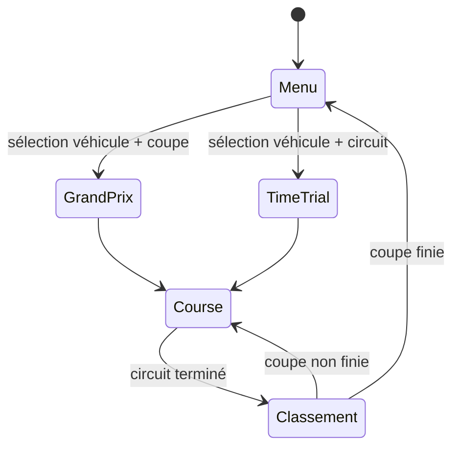
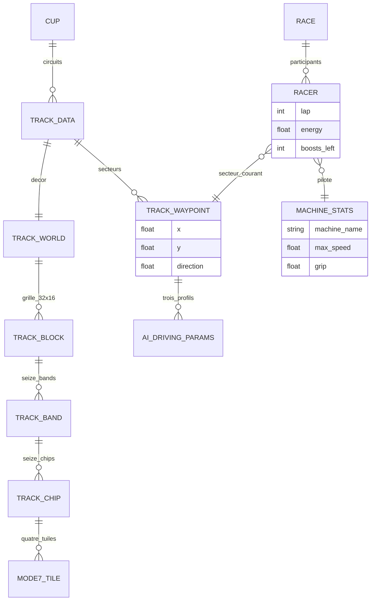

# Décorticage architecture — F-Zero (SNES, 1990)

Grille appliquée : les 4 niveaux complets. Affirmations techniques recalées sur [fullsnes](https://problemkaputt.de/fullsnes.htm), le [wiki SNESdev](https://snes.nesdev.org/wiki/Mode_7), le format de l'éditeur [fuzee](https://github.com/bonimy/fuzee) et le travail de recompilation [FZeroSNESRecomp](https://github.com/mstan/FZeroSNESRecomp). Ce fichier est le plus prudent du corpus : plusieurs affirmations y sont explicitement marquées comme non vérifiées au niveau octet.

## Niveau 1 — Machine à états globale



Premier genre du corpus sans "Combat" au sens classique, mais avec un vrai choix d'état à faire quand même : Grand Prix (plusieurs circuits, classement cumulé, adversaires IA) et Time Trial (un seul circuit, pas d'adversaire) ne sont pas la même chose que "la même course avec des données différentes" — les règles de fin de partie et de scoring changent structurellement selon le mode, contrairement à Zelda 1/Mario où seule l'apparence changeait.

Le test qui tranche, et il vaut la peine d'être formulé parce qu'il est réutilisable : **est-ce que la condition de sortie de l'état change ?** En Grand Prix, on sort d'une course pour aller à un écran de classement qui décide s'il y a une course suivante, avec un cumul de points à maintenir entre les courses. En Time Trial, on sort vers le menu. Ce n'est pas un paramètre, c'est une autre machine.

C'est le même critère qui distinguait Combat et Exploration chez [Pokémon](../pokemon-rouge-bleu) — pas « l'écran est-il différent » mais « les règles de transition sont-elles différentes ».

## Niveau 2 — Découpage des scènes : le Mode 7

Aucun des autres jeux du corpus n'a eu besoin de ça : F-Zero simule un sol en pseudo-3D sans un seul polygone, via une astuce matérielle propre à la SNES.

### Ce que le Mode 7 est exactement

Le Mode 7 est un **mode d'arrière-plan à une seule couche** : uniquement BG1, une tilemap de 128 × 128 tuiles de 8 × 8 pixels (256 tuiles disponibles), soit une surface de 1024 × 1024 pixels. Le matériel applique une **transformation affine** via quatre registres 16 bits signés (M7A à M7D, en unités de 1/256 de pixel) autour d'un centre donné par M7X/M7Y :

```
(x_vram, y_vram) = [M7A M7B; M7C M7D] · (position_écran + décalage − centre) + centre
```

La perspective vient de ce que **la matrice change à chaque ligne de balayage** : plus une ligne est « loin » à l'écran, plus l'échelle appliquée la réduit. Aucune géométrie 3D n'est jamais calculée. Le véhicule de cette variation par ligne est le HDMA, et le matériel le prévoit explicitement — fullsnes documente un mode de transfert DMA dédié aux registres à double écriture avec la mention *« eg. for BGnxOFS, M7x »*.

**Pour F-Zero spécifiquement**, le travail de rétro-ingénierie disponible montre des matrices M7 relevées par ligne de balayage et des canaux HDMA actifs à chaque frame, **plus quatre découpages raster par interruption de timer** (bandes réarmées aux lignes 18 → 28 → 47 → 86) qui séparent le ciel, la piste et le HUD. Formulation prudente retenue : *une seule couche (BG1) transformée par une matrice affine réécrite ligne par ligne, recadrée par quatre interruptions raster qui séparent ciel, piste et HUD.* Quel canal HDMA écrit précisément les registres M7 n'a pas pu être vérifié sur un désassemblage de première main.

À distinguer de deux choses. Ce n'est pas une tuile plate comme chez [Mario](../super-mario-bros) — le sol n'est pas juste posé, il est projeté en perspective. Et ce n'est pas la vraie 3D par polygones de Star Fox : **correction de date**, Star Fox est sorti en **1993**, pas « la même année » que F-Zero (novembre 1990 au Japon, titre de lancement de la Super Famicom). Deux ans et trois mois séparent les deux, et Star Fox a exigé le coprocesseur Super FX embarqué dans la cartouche. Le Mode 7 est un effet 2D qui donne l'illusion de 3D ; le Super FX calculait de la vraie géométrie.

### Le circuit n'est pas une texture continue

**Correction principale de ce niveau.** La version initiale décrivait le circuit comme « une texture continue plus une trajectoire de référence ». C'est une **hiérarchie de tuiles à quatre niveaux**, exactement dans l'esprit des chaînes d'indirection de [Zelda 1](../zelda-1), [Metroid](../metroid) et [Sonic](../sonic) — mais avec un niveau de plus :

| Niveau | Taille | Encodage |
|---|---|---|
| Monde | 8192 × 4096 px | grille de **32 × 16 blocks**, **1 octet par case** = identifiant de block |
| Block | 256 × 256 px | **16 bands** de 16 px de haut, via une table de pointeurs (`id × 32` → 16 pointeurs) |
| Band | 256 × 16 px | **16 chips** de 16 × 16 px, **2 octets chacun** = identifiant de chip sur 16 bits |
| Chip | 16 × 16 px | **2 × 2 tuiles** de 8 × 8 = numéros de tuiles Mode 7 |

Quatre niveaux, quatre tables partagées. Le corpus a maintenant cinq jeux qui font la même chose (Zelda 1, Mario avec ses templates de colonnes, Metroid, Sonic, F-Zero), avec des profondeurs de 2 à 4 niveaux. La conclusion s'impose : **la chaîne d'indirections partagées n'est pas une astuce, c'est le format canonique du décor en 8 et 16 bits.** Chaque niveau existe parce qu'il capture une échelle de répétition différente — le motif de 16 px, la bande, le quartier.

### La troisième fenêtre glissante du corpus

La tilemap Mode 7 en VRAM ne contient qu'une **fenêtre glissante de 1024 × 1024 pixels** autour de la caméra, alignée sur 16 px, **streamée par bandes de lignes et de colonnes** au fil du déplacement.

C'est la troisième variante de fenêtre glissante après les deux block buffers de [Mario](../super-mario-bros) (colonnes) et le chargement ligne par ligne de [Final Fantasy](../final-fantasy-1) (lignes) — et la première qui glisse **sur les deux axes à la fois**, parce qu'un véhicule tourne. Trois jeux, trois axes de streaming, et à chaque fois l'axe est dicté par le mouvement : horizontal pour un scrolling latéral, vertical pour un overworld parcouru à pied, bidimensionnel pour une caméra qui pivote.

Conséquence directe et intéressante : **la carte « aliase » tous les 1024 pixels.** Échantillonner au-delà de la fenêtre streamée affiche les tuiles qu'une autre portion du circuit a laissées dans la même cellule. En version commerciale c'est invisible — la fenêtre est toujours plus large que le champ de vision. Le projet de recompilation le rend visible en élargissant le viewport, sous forme de pop-in. On y revient au niveau 4, parce que c'est architecturalement la même question que le numéro de salle de [Metroid](../metroid) résolu dans la mauvaise banque : *un identifiant dont le sens dépend d'un contexte extérieur.*

Pour Godot : le Mode 7 est un shader relativement simple à reproduire aujourd'hui — projeter une texture avec une transformation de perspective selon la hauteur et l'angle de la caméra. Un tour de force matériel de 1990 devenu un exercice de shader ordinaire.

## Niveau 3 — Structures de données

### La hiérarchie de décor, transposée

```gdscript
class_name TrackChip
extends Resource

## 16 x 16 px = 2 x 2 tuiles Mode 7. Le grain le plus fin du décor.
## Donnée de référence pure, citée par des milliers de bands.
@export var tiles: PackedInt32Array = PackedInt32Array()   ## 4 entrées
@export var surface: SurfaceKind                            ## voir réserve ci-dessous

class_name TrackBand
extends Resource

## 16 chips côte à côte : une bande de 256 x 16 px.
@export var chips: Array[TrackChip] = []

class_name TrackBlock
extends Resource

## 16 bands empilées : un quartier de 256 x 256 px.
@export var bands: Array[TrackBand] = []

class_name TrackWorld
extends Resource

const GRID_WIDTH := 32
const GRID_HEIGHT := 16

## 32 x 16 identifiants de block. C'est l'équivalent exact de la
## grille 32 x 32 de Metroid : un tableau d'index, adressé par coordonnées.
@export var block_grid: Array[TrackBlock] = []

func block_at(cell: Vector2i) -> TrackBlock:
	if cell.x < 0 or cell.x >= GRID_WIDTH or cell.y < 0 or cell.y >= GRID_HEIGHT:
		return null                    ## pas d'aliasing : on renvoie null
	return block_grid[cell.y * GRID_WIDTH + cell.x]
```

Le `return null` hors bornes n'est pas une précaution de style : c'est **le correctif de l'aliasing**. L'original n'avait pas les moyens de tester les bornes à chaque échantillon, donc il repliait implicitement les coordonnées. Rien n'oblige à reproduire ça, et le corpus a montré quatre fois ce que coûte un index non borné.

### La trajectoire de référence : la vraie découverte du fichier

La « trajectoire de référence » existe bel et bien, et elle est plus riche que la version initiale ne le laissait entendre. Chaque circuit porte jusqu'à **254 enregistrements de zone**, chacun contenant :

- une position `x`, `y` ;
- une **direction** ;
- **trois jeux de paramètres d'IA** — vitesse visée, angle, décalage latéral.

C'est à la fois le découpage du circuit en secteurs (pour le classement, les temps au tour, la détection de raccourci) **et** la donnée de pilotage des adversaires. Un seul tableau qui sert deux systèmes, ce qui est exactement le genre de mutualisation qui a fait les glitches des autres jeux — sauf qu'ici les deux usages sont en lecture seule, donc inoffensifs. La leçon symétrique de MissingNo : **partager une donnée entre deux consommateurs est sans risque tant que personne n'écrit.**

Les trois jeux de paramètres méritent une hypothèse : ils correspondent probablement à trois profils de pilotage (agressif, prudent, sur la trajectoire optimale), ce qui rendrait le Strategy du niveau 4 **entièrement piloté par la donnée du circuit** plutôt que par une classe d'IA. À vérifier, mais la forme de la donnée y invite.

```gdscript
class_name TrackWaypoint
extends Resource

## Un des 254 enregistrements de zone. Sert au découpage en secteurs
## ET au pilotage de l'IA — deux consommateurs, une seule donnée,
## tous les deux en lecture seule.
@export var position: Vector2
@export var direction: float                   ## radians
@export var ai_profiles: Array[AiDrivingParams] = []   ## 3 jeux dans l'original

class_name AiDrivingParams
extends Resource

@export var target_speed: float = 1.0
@export var target_angle: float = 0.0
@export var lateral_offset: float = 0.0        ## écart à la trajectoire centrale
```

```gdscript
class_name TrackData
extends Resource

@export var track_name: String = ""
@export var world: TrackWorld
@export var waypoints: Array[TrackWaypoint] = []
@export var lap_count: int = 5
@export var pit_zones: Array[Rect2] = []

#region Recherche de secteur
## Le découpage en secteurs sert au classement : "qui est devant ?"
## se résout en comparant (tour, index de waypoint, distance au suivant).
func nearest_waypoint_index(world_position: Vector2, hint: int = 0) -> int:
	var best := hint
	var best_dist := INF
	## Recherche locale autour du dernier connu : O(1) amorti plutôt que O(254).
	for offset in range(-4, 12):
		var i := wrapi(hint + offset, 0, waypoints.size())
		var d := world_position.distance_squared_to(waypoints[i].position)
		if d < best_dist:
			best_dist = d
			best = i
	return best
#endregion
```

La recherche locale autour du dernier waypoint connu est le détail pratique : comparer les positions de 254 waypoints par véhicule et par frame serait absurde, alors qu'un véhicule ne peut sauter que de quelques secteurs entre deux frames. C'est le même raisonnement que l'historique de six salles de [Zelda 1](../zelda-1) — exploiter la continuité du mouvement pour borner une recherche.

### Les véhicules et l'énergie : ce qui est confirmé, ce qui ne l'est pas

**Confirmé** : les quatre machines sont Blue Falcon, Golden Fox, Wild Goose et Fire Stingray (pilotes Captain Falcon, Dr. Stewart, Pico, Samurai Goroh), chacune avec ses performances propres. Le système d'énergie est confirmé aussi : un **compteur de durabilité qui fait office de bouclier**, qui diminue au contact des mines, des bords de piste et des machines adverses, et qui se **recharge en roulant sur la zone de pit** placée sur ou près de la ligne droite des stands ; à zéro, la machine est détruite et une machine de réserve est perdue. Sont également documentés : jusqu'à **trois Super Jet stockés** (environ 4 secondes chacun), les plaques de saut et les zones d'accélération.

**Non confirmé, et c'était affirmé dans la version initiale** : qu'il existe une table ROM donnant accélération, vitesse maximale, maniabilité et résistance par machine. C'est très probable — c'est le pattern data-driven qu'on retrouve dans les huit jeux du corpus — mais aucune source consultable ne l'établit au niveau octet. Les grilles de statistiques Body/Boost/Grip que l'on trouve facilement concernent **F-Zero X et GX**, pas l'original SNES. À traiter comme une hypothèse raisonnable, pas comme un fait.

**Non confirmé également** : comment la **surface** sous le véhicule (route, herbe, zone de pit, bord) est déterminée. Trois possibilités plausibles — via l'identifiant de chip, via le numéro de tuile 8 × 8 sous le véhicule, ou via une table d'attributs séparée — et aucune n'a pu être établie. Le champ `surface` du `TrackChip` ci-dessus est donc une **proposition de conception**, pas une transposition.

```gdscript
class_name MachineStats
extends Resource

## Hypothèse de modélisation : la forme data-driven que le corpus
## rend très probable, sans qu'une table ROM l'ait confirmée ici.
@export var machine_name: String = ""
@export var pilot_name: String = ""
@export var max_speed: float = 478.0
@export var acceleration: float = 1.0
@export var grip: float = 1.0
@export var body_strength: float = 1.0         ## résistance aux collisions
@export var max_energy: float = 100.0
@export var boosts_per_lap: int = 1
```

### L'énergie : la quatrième variante de ressource du corpus

Quatre jeux, quatre modèles de ressource vitale — et c'est une des comparaisons les plus utiles du corpus pour concevoir la sienne :

| Jeu | Modèle | Propriété distinctive |
|---|---|---|
| [Pokémon](../pokemon-rouge-bleu) | PV | dégradation progressive, soin par objet |
| [Metroid](../metroid) | énergie + réservoirs | plafond extensible par collecte |
| [Sonic](../sonic) | anneaux | tampon binaire, tout ou rien, plafonné à 32 en pratique |
| **F-Zero** | énergie de machine | **bouclier rechargeable par zone géographique** |

La particularité de F-Zero est que le rechargement est **lié à un lieu**, pas à un objet ni à une action. Ça transforme une statistique en contrainte de parcours : il faut *passer par* les stands, donc renoncer à la trajectoire optimale. Un compteur devient une décision de pilotage — c'est le meilleur exemple du corpus de ce qu'une ressource bien placée fait au gameplay.

### Le schéma vu comme base de données



La relation `RACER }o--|| TRACK_WAYPOINT` est celle qui fait le classement : la position d'un concurrent dans la course, c'est le triplet (tour, index de secteur, distance au secteur suivant). Aucun calcul géométrique global — juste un index dans une liste ordonnée et une distance locale. C'est la même économie que le compteur saturé de Zelda 1 : la donnée minimale qui répond à la question posée.

## Niveau 4 — Design patterns observés

| Pattern | Où | Idiome Godot |
|---|---|---|
| Flyweight | chips, bands, blocks partagés sur quatre niveaux | Resource référencée |
| Strategy | profils de pilotage de l'IA, portés par la donnée du circuit | Resource + `Callable` |
| State | Grand Prix / Time Trial, et les phases d'une course | objet State imbriqué |
| Composition over inheritance | un `Racer` référence des `MachineStats` | Resource référencée |
| Object Pool | fenêtre glissante de la tilemap, créneaux de concurrents | tableau pré-alloué |

Les définitions générales sont dans [`../_framework/design-patterns.md`](../_framework/design-patterns.md).

### Strategy — l'IA pilotée par la donnée du circuit

C'était le candidat annoncé dans la version initiale, et la structure des enregistrements de zone suggère qu'il est encore plus data-driven qu'on ne le pensait : les trois jeux de paramètres par waypoint permettent de faire varier le comportement **par secteur de circuit** plutôt que par adversaire.

```gdscript
class_name DrivingStrategy
extends Resource

@export var profile_index: int = 0             ## lequel des 3 jeux du waypoint
@export var aggression: float = 0.5            ## 0 = évite, 1 = cherche le contact

func steer(racer: Racer, track: TrackData, delta: float) -> void:
	var wp := track.waypoints[racer.waypoint_index]
	var params: AiDrivingParams = wp.ai_profiles[profile_index]
	var target := wp.position + Vector2(params.lateral_offset, 0.0).rotated(wp.direction)
	racer.steer_toward(target, params.target_speed, delta)

class_name RubberBandStrategy
extends DrivingStrategy

@export var catchup_bonus: float = 0.08

func steer(racer: Racer, track: TrackData, delta: float) -> void:
	super.steer(racer, track, delta)
	## Un profil qui triche un peu quand il est distancé : la donnée du
	## circuit reste la même, seule la lecture qu'on en fait change.
	if racer.position_in_race > 3:
		racer.speed_multiplier = 1.0 + catchup_bonus
```

Le point architectural : la trajectoire est une donnée du **circuit**, la façon de la suivre est une donnée du **concurrent**. Séparer les deux, c'est pouvoir ajouter un adversaire sans toucher aux circuits, et un circuit sans toucher aux adversaires. C'est le même découplage que `MonsterType.behavior` chez [Zelda 1](../zelda-1), appliqué à une donnée de niveau plutôt qu'à une entité.

### Object Pool — la fenêtre glissante, et sa conséquence

La fenêtre de 1024 × 1024 en VRAM est le pool le plus contraint du corpus : une seule instance, recyclée en permanence, par bandes. Et sa conséquence — l'aliasing tous les 1024 pixels — est architecturalement la même question qui traverse tout le corpus :

```gdscript
class_name Mode7Window
extends Node

const WINDOW_PX := 1024
const ALIGN_PX := 16

var _anchor := Vector2i.ZERO                   ## coin de la fenêtre, aligné

func center_on(camera_position: Vector2) -> void:
	var desired := Vector2i(camera_position) - Vector2i.ONE * (WINDOW_PX / 2)
	var aligned := Vector2i(
		snappedi(desired.x, ALIGN_PX),
		snappedi(desired.y, ALIGN_PX))
	if aligned == _anchor:
		return
	_stream_bands(_anchor, aligned)
	_anchor = aligned

## L'original repliait implicitement les coordonnées hors fenêtre.
## Ici on rend l'erreur visible plutôt que plausible.
func sample(world_position: Vector2) -> TrackChip:
	var local := Vector2i(world_position) - _anchor
	if local.x < 0 or local.x >= WINDOW_PX or local.y < 0 or local.y >= WINDOW_PX:
		push_warning("Échantillonnage hors fenêtre streamée : %s" % world_position)
		return null
	return _chip_at(local)
```

Le `push_warning` plutôt qu'un repliage silencieux est le tout petit correctif qui distingue les huit jeux du corpus de ce qu'on peut faire aujourd'hui. Aucun des quatre bugs de lecture hors contexte du corpus ne se serait propagé si la lecture avait crié.

## Glitch illustratif — aucun, et c'est une conclusion, pas un manque

La version initiale de ce fichier notait « pas de glitch retenu cette fois — rien d'aussi solidement documenté que les précédents n'est ressorti des recherches ». Après vérification, cette conclusion tient, et il vaut la peine de dire ce qui a été écarté et pourquoi :

- **Les deux circuits inatteignables du mode Practice** (White Land II, Fire Field) sont jouables en forçant l'index de circuit en RAM au-delà de sa plage normale. C'est un **index hors plage**, comme chez [Zelda II](../zelda-2) — mais il s'agit de **contenu coupé** rendu accessible par triche, pas d'un bug atteignable en jouant.
- **L'aliasing de la tilemap Mode 7** (niveau 2) est bien un cas de lecture hors contexte, et il est de la même famille que le glitch de [Metroid](../metroid). Mais il est **invisible en version commerciale** : la fenêtre streamée est toujours plus large que le champ de vision. C'est un bug latent que le design empêche d'atteindre, pas un bug.
- La page TASVideos du jeu ne documente que du routage de speedrun (finir deuxième pour sauter l'animation de victoire), aucun glitch.

**Et l'absence est instructive.** F-Zero est le jeu du corpus qui manipule le moins de données mutables : pas d'inventaire, pas de progression sauvegardée, pas d'état persistant entre les courses au-delà d'un cumul de points, pas de monde à explorer. Presque tout est en lecture seule. Les quatre familles de bugs du corpus — [donnée non réinitialisée](../pokemon-rouge-bleu), [donnée jamais initialisée](../super-mario-bros), [index hors plage](../zelda-2), [mauvais contexte de résolution](../metroid) — supposent toutes un état mutable ou une table résolue dynamiquement. Là où il n'y a presque rien à corrompre, il n'y a presque rien à corrompre.

Ce n'est pas un compliment fait aux développeurs : c'est une propriété de la surface d'attaque. Le corollaire est utilisable directement — **la quantité d'état mutable d'un système est une bonne estimation de sa surface de bugs.** Un jeu de course n'a pas moins de bugs qu'un RPG parce qu'il est mieux écrit, mais parce qu'il a moins à se souvenir.

## Corrections et ajouts

- **Niveau 2, date — corrigé.** Star Fox est sorti en **1993**, pas « la même année » que F-Zero (novembre 1990, titre de lancement de la Super Famicom). Deux ans et trois mois d'écart, et la formulation a été reprise pour mentionner que Star Fox a exigé le coprocesseur Super FX.
- **Niveau 2, Mode 7** — détaillé et rendu prudent : une seule couche (BG1), tilemap de 128 × 128 tuiles de 8 × 8, transformation affine via M7A–M7D en unités de 1/256 de pixel autour de M7X/M7Y. Ajouté les **quatre découpages raster par frame** (lignes 18 → 28 → 47 → 86) qui séparent ciel, piste et HUD. **Signalé comme non vérifié** au niveau octet quel canal HDMA écrit les registres M7.
- **Niveau 2, structure du circuit — correction principale.** Ce n'est pas « une texture continue » : c'est une **hiérarchie à quatre niveaux** (monde 8192 × 4096 → grille de 32 × 16 blocks de 256 px → 16 bands de 16 px → 16 chips de 16 × 16 → 2 × 2 tuiles Mode 7). Ajouté le constat que cinq jeux du corpus utilisent maintenant la même forme de chaîne d'indirections partagées, avec des profondeurs de 2 à 4.
- **Niveau 2, fenêtre glissante** — ajouté : la tilemap en VRAM ne contient qu'une **fenêtre de 1024 × 1024 px** alignée sur 16 px, streamée par bandes, donc la carte **aliase tous les 1024 pixels**. C'est la troisième fenêtre glissante du corpus après Mario (colonnes) et Final Fantasy (lignes), et la première bidimensionnelle.
- **Niveau 3** — était réduit à un aperçu. Développé : la hiérarchie de décor en Resources (avec `return null` hors bornes plutôt que repliage implicite), les **254 enregistrements de zone** avec position, direction et **trois jeux de paramètres d'IA** — ce qui en fait à la fois le découpage en secteurs et la donnée de pilotage —, la recherche locale de waypoint, et le diagramme ERD.
- **Niveau 3, réserves explicites.** La version initiale affirmait que les différences entre véhicules sont « des données (accélération, vitesse max, maniabilité) ». **Aucune table ROM consultable ne l'établit** : c'est marqué comme hypothèse raisonnable. De même, **la détermination de la surface** (route, herbe, pit, bord) n'a pas pu être établie — le champ `surface` proposé est une décision de conception, pas une transposition.
- **Niveau 3** — ajouté la comparaison des quatre modèles de ressource vitale du corpus, dont la particularité de F-Zero : le rechargement est lié à **un lieu**, donc une statistique devient une décision de pilotage.
- **Niveau 4** — était absent. Ajouté : Strategy avec la trajectoire comme donnée du circuit et la façon de la suivre comme donnée du concurrent, Object Pool sur la fenêtre Mode 7 avec le `push_warning` hors bornes comme correctif minimal de toute la famille de bugs du corpus.
- **Glitch** — l'absence est **confirmée** et argumentée. Détaillé ce qui a été écarté (circuits coupés atteignables par triche, aliasing invisible en retail, routage TASVideos) et pourquoi l'absence est instructive : F-Zero est le jeu du corpus avec le moins d'état mutable, et la quantité d'état mutable est une bonne estimation de la surface de bugs.
- **Sources** — remplacement des sources grand public par fullsnes, SNESdev, le format de l'éditeur fuzee et le projet de recompilation, avec les réserves associées.

## Sources

- Mode 7, registres M7A–M7D, modes de transfert HDMA : [fullsnes](https://problemkaputt.de/fullsnes.htm), [SNESdev — Mode 7](https://snes.nesdev.org/wiki/Mode_7)
- Matrices par ligne de balayage, découpages raster, fenêtre glissante de la tilemap : [FZeroSNESRecomp](https://github.com/mstan/FZeroSNESRecomp) (`src/fzero_runtime.c`, `src/fzero_renderer.c`) — travail de rétro-ingénierie, pas un désassemblage annoté
- Hiérarchie blocks / bands / chips / tuiles, enregistrements de zone : format de l'éditeur [fuzee](https://github.com/bonimy/fuzee/blob/master/src/fzcd.h)
- Dates de sortie, véhicules, système d'énergie, Super Jet : [Wikipédia — F-Zero](https://en.wikipedia.org/wiki/F-Zero_(video_game)), [Wikipédia — Star Fox](https://en.wikipedia.org/wiki/Star_Fox_(1993_video_game)), [F-Zero Wiki](https://fzero.fandom.com/wiki/Blue_Falcon)
- Circuits coupés du mode Practice : [TCRF — F-Zero](https://tcrf.net/F-Zero) ; absence de glitch documenté : [TASVideos](https://tasvideos.org/276G)
