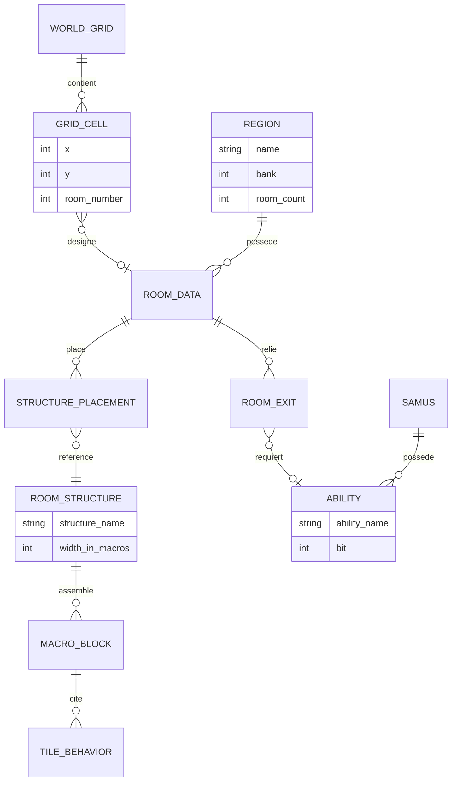

# Décorticage architecture — Metroid (NES, 1986)

Grille appliquée : les 4 niveaux complets, glitch illustratif. Affirmations techniques recalées sur le [désassemblage de nmikstas](https://github.com/nmikstas/metroid-disassembly).

## Niveau 1 — Machine à états globale

Comme Mario et Zelda 1, pas d'état "Combat" séparé : Samus tire et encaisse des dégâts dans la même boucle temps réel que l'exploration, un ennemi rencontré ne déclenche aucun changement de scène. Sur 8 jeux décortiqués, Metroid rejoint le camp "même modèle d'interaction partout" (Mario, Zelda 1, Sonic) plutôt que le camp "vrai changement de mode" (Pokémon, Zelda II, Final Fantasy) — malgré une progression proche du RPG (réservoirs d'énergie, compteur de missiles), ça ne suffit pas à justifier un état séparé tant que l'interaction elle-même ne change pas.

Ce qui tient lieu d'état global, ici, est une seule variable : `InArea` (`$74`), qui vaut `$10` pour Brinstar, `$11` pour Norfair, `$12` pour le repaire de Kraid, `$13` pour Tourian et `$14` pour le repaire de Ridley. Ses quatre bits bas indexent une table qui décide **quelle banque de ROM est active**. Changer de région, c'est changer de banque — et rien d'autre. On verra au niveau 2 que cette économie a une conséquence structurelle majeure.

## Niveau 2 — Découpage des scènes

### La correction principale de ce fichier : Zebes n'est pas un graphe

La version initiale de ce fichier annonçait « Zebes est un **graphe**, pas une grille », et en faisait la nouveauté du corpus. C'est faux au niveau de la structure de données, et la réalité est plus intéressante.

**Zebes est une grille globale unique de 32 × 32 écrans.** La table `WorldMap` occupe `$A53E`–`$A93D` en banque 0, soit exactement **1024 octets = 32 lignes de 32**, et `CopyMap` la recopie **une seule fois au démarrage** vers la RAM de cartouche `$7000`–`$73FF`. L'accès est purement par coordonnées :

```
adresse = (MapPosY × 32) + MapPosX + $7000
```

`GetRoomNum` lit **un octet à cette adresse, et c'est un numéro de salle**. La valeur `$FF` marque une case inutilisée : la routine sort en erreur, et l'écran précédent reste affiché. Confirmation indépendante : les identifiants d'objets uniques encodent `IIIIIIXX XXXYYYYY`, soit un type suivi de **5 bits de X et 5 bits de Y sur la carte du monde** — cinq bits chacun, donc 32 × 32.

Il n'y a **aucune structure de nœuds et d'arêtes** dans le jeu. Le graphe est une propriété du **level design** — les portes, les ascenseurs, les passages secrets — pas du format de données. Formulation correcte : *une grille globale de 32 × 32 écrans adressée par coordonnées, dont la topologie non triviale vient du placement des connexions, pas de la structure de stockage.*

Et les régions ne sont pas des grilles séparées : ce sont des **sous-zones disjointes de la même grille**. Leurs points d'entrée sont des coordonnées dans ce carré unique — Brinstar (3, 14), Norfair (22, 13), Kraid (7, 20), Tourian (3, 4), Ridley (25, 24) — et leurs nombres de salles diffèrent (47, 46, 37, 21, 42 respectivement).

### L'ascenseur ne téléporte pas, il change d'interpréteur

C'est le détail qui rend l'architecture d'origine compréhensible. Quand Samus prend un ascenseur, l'objet porte un octet de région de destination dans son créneau, fait un `ora #$10`, et déclenche le changement de banque. Il **ne repositionne pas** `MapPosX`/`MapPosY` — seule la routine d'initialisation le fait, au démarrage ou après une mort.

Autrement dit : **les coordonnées continuent de défiler normalement, et c'est la banque qui interprète la grille qui change.** Chaque banque expose ses propres tables — pointeurs de salles, structures, définitions de macro-blocs, tables d'ennemis. Le même numéro de salle, lu dans deux banques différentes, donne deux salles différentes.

C'est une indirection par contexte global : la donnée est un index, et ce qu'il désigne dépend d'une variable d'état ailleurs. Le parallèle relationnel est direct — un identifiant dont le sens dépend d'une colonne de discriminant, ou pire, d'une variable de session. Ça marche parfaitement tant que les deux restent cohérents, et c'est exactement ce que le glitch de ce jeu casse.

### Le scrolling, bloqué par la porte elle-même

Le jeu n'a pas de « chargement de scène » : il défile en continu sur la grille. Comment empêcher alors de voir la salle d'à côté à travers un mur ? Par deux drapeaux, `DoorOnNameTable0` et `DoorOnNameTable3`, qui font que **`GetRoomNum` refuse de charger la salle située derrière une porte** tant que Samus ne l'a pas franchie. La porte n'est pas une transition : c'est un verrou sur le chargement.

### La progression par capacité — et la surprise

Certains passages restent bloqués tant que Samus n'a pas une capacité précise (Bombes, Rayon Glace…), chacune gardée par un « ancien » à trouver. Contrairement à une clé Zelda (consommée, propre à une porte), une capacité Metroid est permanente et débloque **tous** les passages de ce type, où qu'ils soient — ce qui rend le retour en arrière non seulement possible mais nécessaire. C'est le mécanisme qui donne son nom au genre « metroidvania ».

**Mais aucun de ces verrous n'est vérifié en code.** C'est la seconde surprise de ce fichier, et elle est confirmée par l'inventaire exhaustif des lectures de l'octet de capacités : les ~13 sites de lecture sont **tous** dans la physique, les dégâts ou les armes — se mettre en boule, poser une bombe, la portée du tir, le type de rayon, le saut, la division des dégâts par la Varia. **Aucune porte, aucun passage ne teste un bit de capacité.**

La collision avec le décor se fait par **seuil d'identifiant de tuile** : `< $80` solide, `$80`–`$9F` destructible, `≥ $A0` traversable, `$A0`/`$A1` portes. Une porte s'ouvre parce qu'on lui tire dessus, un bloc cède parce qu'une bombe en détruit le type — pas parce qu'un test de capacité a autorisé le passage. Le seul verrou réellement codé du jeu est le **compteur de missiles** pour les portes rouges : une ressource, pas un drapeau de capacité.

Voilà pourquoi le **sequence breaking** est endémique à ce jeu et à tout le genre. Un verrou posé uniquement dans le level design reste contournable par un exploit de physique. Le contraste avec [Zelda II](../zelda-2) est frappant : là-bas, les quatre objets-clés de l'overworld sont vérifiés en code, de quatre façons différentes. Deux jeux du même genre naissant, deux réponses opposées à la même question — et c'est celui qui a tout mis dans le level design qui a donné son nom au genre.

La transposition Godot, du coup, n'est pas une reproduction mais un **choix explicite** :

```gdscript
class_name RoomExit
extends Resource

@export var target_room_id: StringName
@export var target_spawn_point: StringName

## Verrou VÉRIFIÉ EN CODE — ce que Metroid ne faisait pas.
## "" = pas de restriction.
@export var required_ability: StringName = &""

func can_pass(abilities: AbilitySet) -> bool:
	return required_ability == &"" or abilities.has(required_ability)
```

```gdscript
class_name RoomNode
extends Resource

@export var room_id: StringName
@export var scene_path: String
@export var map_position: Vector2i          ## la grille de l'original
@export var exits: Array[RoomExit] = []
```

Garder `map_position` **et** `exits` n'est pas redondant : les coordonnées servent à la minimap et à l'adjacence naturelle, les sorties explicites aux connexions qui ne sont pas adjacentes (ascenseurs, passages secrets). L'original n'avait que les coordonnées et faisait porter le reste au level design ; on peut faire les deux, et c'est ce qui permet d'avoir des verrous impossibles à contourner par un bug de physique.

## Niveau 3 — Structures de données

### La chaîne d'indirection : salle → structures → macro-blocs → tuiles

Comme [Zelda 1](../zelda-1) et comme [Sonic](../sonic), Metroid ne stocke pas ses écrans en tuiles brutes. Chaque banque de région expose quatre tables, et elles s'enchaînent :

| Table | Rôle |
|---|---|
| `RmPtrTbl` | pointeurs de salles — une entrée par numéro de salle de la région |
| `StrctPtrTbl` | structures — motifs réutilisables placés dans une salle |
| `MacroDefs` | définitions de macro-blocs, chacun **2 × 2 tuiles** |
| `SpecItmsTbl` | objets spéciaux (capacités, réservoirs) par coordonnées de carte |

Trois niveaux de réutilisation empilés, exactement comme les squares/colonnes/layouts de Zelda 1. Le corpus a maintenant assez d'exemples pour en tirer une règle : **dès qu'un jeu 8/16 bits décrit un décor, il le fait par une chaîne d'indirections où chaque niveau est partagé.** Ce n'est pas une astuce par jeu, c'est le format canonique de l'époque — et le `TileSet` de Godot en est la version moderne (atlas → tuile → terrain), à ceci près que Godot ne t'oblige pas à en écrire les niveaux intermédiaires.

```gdscript
class_name MacroBlock
extends Resource

## 2 × 2 tuiles, comme MacroDefs. Donnée de référence pure :
## une salle ne possède pas ses macro-blocs, elle les cite.
@export var tiles: PackedInt32Array = PackedInt32Array()   ## 4 entrées

class_name RoomStructure
extends Resource

## Un motif réutilisable : plateforme, alcôve, colonne de blocs.
@export var structure_name: String = ""
@export var width_in_macros: int = 1
@export var macros: Array[MacroBlock] = []

class_name RoomData
extends Resource

@export var room_id: StringName
## Placements de structures, pas de tuiles.
@export var placements: Array[StructurePlacement] = []
@export var enemy_spawns: Array[EnemySpawn] = []

class_name StructurePlacement
extends Resource

@export var structure: RoomStructure
@export var position: Vector2i
```

### La collision par seuil : une convention numérique porteuse de sens

Le mécanisme de collision mérite d'être isolé, parce qu'il est à la fois élégant et exactement le genre de chose à ne pas reproduire :

| Plage d'identifiant | Comportement |
|---|---|
| `< $80` | solide |
| `$80`–`$9F` | destructible |
| `≥ $A0` | traversable |
| `$A0` / `$A1` | porte |

Aucune table de propriétés : le comportement **est** la valeur de l'identifiant. Ajouter une tuile destructible impose de la placer dans `$80`–`$9F`, donc de réordonner l'atlas graphique. Le comportement physique et l'identité graphique sont **couplés par l'adressage** — une seule colonne qui porte deux informations, sans discriminant.

C'est le même antipattern que la plage `[$32, $62)` des listes d'objets de Zelda 1, et la même leçon : une plage numérique comme discriminant implicite est compacte, indolore à l'écriture, et illisible à la relecture. En Godot, le `TileSet` sépare nativement les deux — un `custom_data_layer` porte la propriété, l'atlas porte l'image :

```gdscript
class_name TileBehavior
extends Resource

enum Kind { SOLID, DESTRUCTIBLE, PASSABLE, DOOR }

## La propriété est une donnée du TileSet (custom data layer),
## pas une conséquence de la position de la tuile dans l'atlas.
@export var kind: Kind = Kind.SOLID
@export var destroyed_by: StringName = &""       ## "bomb", "missile", ""
@export var replacement_tile: int = -1
```

### Les capacités : un octet, huit bits, un ensemble

`SamusGear` est **un seul octet en RAM** (`$6878`), et les huit bits sont les huit capacités du jeu :

| Bit | Capacité |
|---|---|
| `$01` | Bombes |
| `$02` | High Jump |
| `$04` | Long Beam |
| `$08` | Screw Attack |
| `$10` | Maru Mari (boule) |
| `$20` | Varia |
| `$40` | Wave Beam |
| `$80` | Ice Beam |

Le code du mot de passe NARPASSWORD écrit littéralement `lda #$FF / sta SamusGear` : tout débloqué en une instruction. C'est la définition minimale d'un ensemble, et c'est architecturalement correct — la version initiale de ce fichier l'avait vu (« une simple collection de flags côté progression, pas besoin d'entité de jointure avec payload ici »), et c'est vérifié.

Le point à noter pour le modèle de données : c'est une relation many-to-many `Samus ↔ Capacité` **sans payload**, et comme l'ensemble des capacités est fini, petit et connu à la compilation, le bitmask est la représentation optimale. Comparer avec le movepool de [Pokémon](../pokemon-rouge-bleu), où la relation portait des PP et exigeait une entité de jointure : le critère n'est pas la nature de la relation, c'est **la présence ou l'absence d'attribut propre à la relation**.

```gdscript
class_name AbilitySet
extends RefCounted

## Bitmask, comme SamusGear — mais avec des noms.
const BOMBS := 1 << 0
const HIGH_JUMP := 1 << 1
const LONG_BEAM := 1 << 2
const SCREW_ATTACK := 1 << 3
const MORPH_BALL := 1 << 4
const VARIA := 1 << 5
const WAVE_BEAM := 1 << 6
const ICE_BEAM := 1 << 7

const NAMES := {
	&"bombs": BOMBS,
	&"high_jump": HIGH_JUMP,
	&"long_beam": LONG_BEAM,
	&"screw_attack": SCREW_ATTACK,
	&"morph_ball": MORPH_BALL,
	&"varia": VARIA,
	&"wave_beam": WAVE_BEAM,
	&"ice_beam": ICE_BEAM,
}

var _bits: int = 0

func has(ability: StringName) -> bool:
	return (_bits & NAMES.get(ability, 0)) != 0

func grant(ability: StringName) -> void:
	_bits |= NAMES.get(ability, 0)

func to_dict() -> Dictionary:
	return {"abilities": _bits}
```

Un entier à sauvegarder, une constante nommée par capacité, et un `Dictionary` pour l'accès par nom depuis les données de porte. La sérialisation reste un seul champ — utile, parce qu'ajouter une neuvième capacité ne casse aucune sauvegarde existante.

### Le schéma vu comme base de données



La relation à regarder est `GRID_CELL }o--o| ROOM_DATA`, et son ambiguïté est tout le sujet : une case de grille porte un **numéro** de salle, pas une référence. Le numéro est résolu dans les tables de la région courante. C'est une clé étrangère **sans contrainte**, dont la table cible dépend d'une variable d'état extérieure au modèle. En base, ce serait une colonne `room_number` sans `FOREIGN KEY`, résolue contre une table choisie par une variable de session.

C'est parfaitement fonctionnel. C'est aussi exactement la porte d'entrée du glitch.

## Niveau 4 — Design patterns observés

| Pattern | Où | Idiome Godot |
|---|---|---|
| Flyweight | macro-blocs et structures partagés entre salles | Resource référencée |
| Composition over inheritance | une salle place des structures, n'en hérite pas | Resource référencée |
| Strategy | un effet différent par type de rayon | sous-classes de `BeamEffect` |
| State | Samus debout / en boule / en saut vissé | objet State imbriqué |
| Object Pool | créneaux d'objets et d'ennemis pré-alloués | tableau pré-alloué |
| Flag set (bitmask) | `SamusGear` : les capacités comme ensemble | entier + constantes nommées |

Les définitions générales sont dans [`../_framework/design-patterns.md`](../_framework/design-patterns.md).

### Strategy — les rayons

Chaque rayon modifie le tir : portée (Long Beam), traversée des murs et dégâts (Wave), gel des ennemis (Ice). Trois comportements pour une même action, choisis par la donnée :

```gdscript
class_name BeamEffect
extends Resource

@export var projectile_scene: PackedScene
@export var damage: int = 1

func on_hit(target: Node2D) -> void:
	target.take_damage(damage)

class_name IceBeamEffect
extends BeamEffect

@export var freeze_duration: float = 4.0

func on_hit(target: Node2D) -> void:
	super.on_hit(target)
	target.freeze(freeze_duration)          ## devient une plateforme

class_name WaveBeamEffect
extends BeamEffect

@export var pierces_walls: bool = true
```

Le gel de l'Ice Beam est le cas intéressant : un ennemi gelé devient une **plateforme**, donc l'effet du rayon modifie la topologie franchissable. C'est aussi ce qui alimente la moitié des routes de sequence breaking — un verrou de level design contourné par un effet d'arme que personne n'avait croisé avec le placement des blocs.

### State — et le cas de la boule

```gdscript
class_name SamusState
extends RefCounted

func physics_update(samus: CharacterBody2D, delta: float) -> void:
	pass

func can_enter(samus: CharacterBody2D) -> bool:
	return true

class_name MorphBallState
extends SamusState

func can_enter(samus: CharacterBody2D) -> bool:
	## La capacité conditionne l'ÉTAT, pas le passage.
	## C'est exactement ce que fait l'original : le bit Maru Mari
	## est testé pour se mettre en boule, jamais pour ouvrir un passage.
	return samus.abilities.has(&"morph_ball")

func physics_update(samus: CharacterBody2D, delta: float) -> void:
	samus.collision_height = 8.0
	samus.can_shoot = false
```

Le commentaire est le cœur de la leçon de ce jeu : la capacité pilote l'**état du personnage**, et c'est l'état qui rend le passage physiquement franchissable. Le verrou est *émergent*, pas déclaré. Élégant, et fragile — puisque n'importe quel autre moyen d'atteindre la même géométrie contourne le verrou.

### Object Pool — et l'ouverture vers la génération procédurale

Metroid est le cas du corpus où la fenêtre glissante est la plus généralisable, et c'est ici que l'idée gardée de côté depuis [Mario](../super-mario-bros) trouve son terrain naturel.

Tout est déjà en place dans l'original : le monde est **adressé par coordonnées** sur une grille unique, les salles sont **résolues à la demande** au moment où le scrolling en a besoin, et les cases vides (`$FF`) sont un cas géré. C'est-à-dire que l'architecture ne suppose jamais que le monde entier existe — elle suppose seulement qu'on peut répondre à *« qu'y a-t-il en (x, y) ? »*.

Remplacer la table de 1024 octets par une fonction, et le monde devient illimité :

```gdscript
class_name WorldGrid
extends RefCounted

## L'original lisait un octet à (y * 32 + x). Rien n'oblige la source
## à être une table : il suffit de savoir répondre pour une coordonnée.
var _generator: RoomResolver
var _cache: Dictionary = {}                 ## Vector2i -> RoomData

const CACHE_RADIUS := 3

func room_at(cell: Vector2i) -> RoomData:
	if _cache.has(cell):
		return _cache[cell]
	var room := _generator.resolve(cell)    ## table, seed, ou règles
	if room != null:
		_cache[cell] = room
	return room                              ## null = la case $FF de l'original

func evict_far_from(center: Vector2i) -> void:
	for cell in _cache.keys():
		if absi(cell.x - center.x) > CACHE_RADIUS or absi(cell.y - center.y) > CACHE_RADIUS:
			_cache.erase(cell)
```

La différence entre « Zebes en ROM » et « metroidvania infini par seed » tient entièrement dans `RoomResolver.resolve()`. Le reste — cache autour du joueur, éviction derrière, case vide gérée comme un cas normal — est la même architecture que celle de 1986, et le même principe que les deux block buffers de Mario : *décompresser juste en avance de ce qui est consommé, recycler derrière.*

Deux réserves honnêtes si l'envie vient un jour. D'abord, un metroidvania procédural doit garantir que le monde généré est **franchissable dans l'ordre des capacités** — ce qui est un problème de génération sous contraintes, largement plus dur que la génération elle-même. Ensuite, le cache doit être **déterministe par coordonnée** : si `resolve((5, 7))` ne renvoie pas la même chose au second passage, le joueur voit le monde se réécrire derrière lui. Une seed figée et un ordre de tirage figé, exactement la règle FNV-1a du pet desktop.

## Glitch illustratif — les Secret Worlds (Door Glitch)

### Correction de nom et de portée

La version initiale de ce fichier parlait d'une « salle secrète de Norfair » dont les octets de layout seraient interprétés comme des salles du repaire de Ridley. L'intuition est bonne, le nom ne l'est pas : il n'existe aucun glitch canonique sous ce nom. Le nom établi dans la communauté est **« Secret Worlds »** (ou « Hidden Worlds »), et il est déclenché par le **Door Glitch** — rester dans une porte bleue et enchaîner mise en boule et démorphage-saut pour traverser le mur verticalement.

### Le mécanisme, et pourquoi il découle directement du niveau 2

Tout ce qu'il faut est déjà écrit plus haut :

1. Il n'y a **qu'une seule grille** de 32 × 32 pour tout Zebes.
2. Les régions en sont des **sous-zones disjointes**, pas des cartes séparées.
3. Le numéro de salle lu dans une case est **résolu dans les tables de la banque courante**.
4. L'ascenseur — le seul mécanisme qui change de banque — **ne change pas les coordonnées**.

Donc : si Samus sort de la sous-zone de sa région sans passer par un ascenseur, les coordonnées continuent d'avancer, la grille continue de renvoyer des numéros de salle valides… mais ces numéros appartiennent à une région voisine, et ils sont résolus dans les tables de **la banque restée active**. Les salles sont reconstruites avec les mauvaises structures, les mauvais macro-blocs, les mauvais ennemis. Et les cases à `$FF` font sortir `GetRoomNum` en erreur, laissant en place les tuiles de l'écran précédent — d'où la corruption visuelle caractéristique.

Norfair et le repaire de Ridley étant effectivement voisins dans la grille, « des octets de Norfair lus comme des salles de Ridley » décrit bien ce qui se passe. Ce n'était juste pas un glitch nommé, et le mécanisme est plus général que ça.

### La leçon : le contexte, pas l'instant

C'est la variante **spatiale** du thème qui traverse tout le corpus, et elle complète le tableau :

| Jeu | Nature du décalage |
|---|---|
| [Pokémon](../pokemon-rouge-bleu) | deux **instants** — la donnée n'a pas été réécrite depuis l'usage précédent |
| [Mario](../super-mario-bros) | deux **chemins** — le seul chemin qui initialise a été contourné |
| [Zelda II](../zelda-2) | deux **plages** — l'index sort du tableau |
| **Metroid** | deux **contextes** — l'index est valide, la table dans laquelle on le résout ne l'est pas |

Metroid est le seul des quatre où **la donnée lue est parfaitement valide**. Le numéro de salle existe, la case de grille existe, la table existe, la lecture réussit. Ce qui est faux, c'est l'appariement entre l'index et la table — et rien, dans la donnée elle-même, ne permet de le détecter.

C'est le cas le plus difficile à attraper, et c'est aussi celui qui a un remède architectural net : **un identifiant ne devrait pas dépendre d'un contexte global pour avoir un sens.** Si le numéro de salle avait inclus sa région (comme les identifiants d'objets uniques du jeu incluent leurs coordonnées), l'incohérence aurait été détectable localement. En Godot, c'est la différence entre un `int room_number` résolu contre « la région courante » et un `StringName room_id` globalement unique — ou, plus simplement, entre un index dans un tableau et une référence directe vers la Resource :

```gdscript
## Fragile : le sens du numéro dépend d'une variable d'état ailleurs.
var room_number: int
func resolve() -> RoomData:
	return GameState.current_region.rooms[room_number]

## Robuste : la référence porte son propre contexte.
@export var room: RoomData
```

Le second n'est pas seulement plus lisible : il est **invérifiable-par-erreur**. Une référence de Resource cassée se voit au chargement, un index résolu dans la mauvaise table ne se voit jamais.

### Et le sequence breaking, plus large que ce glitch

Au-delà du Door Glitch, le sequence breaking — accéder à une zone avant d'avoir la capacité prévue — est **endémique** aux jeux à portes et capacités, et le niveau 2 explique pourquoi dans ce cas précis : **aucun passage de Metroid ne teste une capacité en code.** Tous les verrous sont géométriques. Un mur qu'on ne peut « normalement » pas franchir reste franchissable par n'importe quel exploit de physique, et le jeu n'a aucun moyen de s'en apercevoir.

Le choix, pour tes propres projets, n'est pas moral — les deux approches sont défendables. Un verrou géométrique récompense l'ingéniosité du joueur et rend le speedrun vivant ; un verrou codé (`required_ability` du niveau 2) garantit la progression et rend le jeu testable. Ce qu'il faut éviter, c'est de croire qu'on a un verrou codé alors qu'on n'a qu'un mur.

## Corrections et ajouts

- **Niveau 2 — la correction principale de ce fichier.** « Zebes est un graphe, pas une grille » est **faux** au niveau de la structure de données. C'est une **grille globale unique de 32 × 32 écrans** (`WorldMap`, 1024 octets, recopiée une fois au boot en RAM de cartouche `$7000`), adressée par `(Y × 32) + X`, où chaque case contient **un numéro de salle** et `$FF` marque une case vide. Confirmation croisée par l'encodage des identifiants d'objets uniques (5 bits de X, 5 bits de Y). Le graphe est une propriété du **level design**, pas du format. Les régions sont des **sous-zones disjointes de la même grille**, avec leurs coordonnées d'entrée et leurs nombres de salles.
- **Niveau 2, ascenseurs** — ajouté le point qui rend le tout cohérent : l'ascenseur **ne repositionne pas les coordonnées**, il ne fait que changer la banque de ROM qui interprète la grille. C'est ce qui explique le glitch.
- **Niveau 2, scrolling** — ajouté : ce sont deux drapeaux de porte qui font que `GetRoomNum` **refuse de charger** la salle voisine tant que la porte n'est pas franchie. La porte est un verrou de chargement, pas une transition.
- **Niveau 2, capacités — seconde correction majeure.** **Aucune porte, aucun passage ne teste un bit de capacité.** L'inventaire des ~13 lectures de `SamusGear` montre qu'elles sont toutes dans la physique, les dégâts ou les armes. La collision se fait par **seuil d'identifiant de tuile** (`< $80` solide, `$80`–`$9F` destructible, `≥ $A0` traversable), et le seul verrou codé du jeu est le **compteur de missiles** des portes rouges. Le code `required_ability` est conservé mais **requalifié** : c'est une proposition pour Godot, explicitement présentée comme ce que l'original ne faisait pas. Ajout du contraste avec Zelda II, où les quatre objets-clés sont vérifiés en code.
- **Niveau 1** — ajouté : l'état global tient en une variable (`InArea`, `$10`–`$14`) dont les bits bas choisissent la banque de ROM.
- **Niveau 3** — était réduit à un aperçu. Développé en entier : la chaîne d'indirection salle → structures → macro-blocs (2 × 2 tuiles) → tuiles, avec la règle générale que le corpus permet maintenant d'énoncer ; la collision par seuil d'identifiant analysée comme un discriminant implicite à ne pas reproduire, avec la transposition en `custom_data_layer` ; `SamusGear` détaillé bit par bit avec son `AbilitySet` en GDScript et l'argument sur la sérialisation ; diagramme ERD dont la relation centrale est la clé étrangère sans contrainte résolue contre une table choisie par variable d'état.
- **Niveau 4** — était absent. Ajouté : Strategy sur les rayons (avec l'Ice Beam qui modifie la topologie franchissable, donc alimente le sequence breaking), State avec le point clé que la capacité conditionne l'état et non le passage, et **la généralisation vers la génération procédurale infinie** que le brief gardait en réserve pour un metroidvania — avec ses deux réserves honnêtes (franchissabilité sous contraintes, déterminisme par coordonnée).
- **Glitch** — corrigé sur le nom et la portée : le nom établi est **Secret Worlds**, déclenché par le **Door Glitch**, pas « la salle secrète de Norfair ». Le mécanisme est réécrit comme une conséquence directe du niveau 2 (grille unique + résolution dans la banque courante + ascenseur qui ne bouge pas les coordonnées). Ajouté le tableau comparatif des quatre natures de décalage du corpus (instant / chemin / plage / **contexte**), le constat que Metroid est le seul cas où la donnée lue est parfaitement valide, et le remède architectural (un identifiant ne doit pas dépendre d'un contexte global — référence de Resource plutôt qu'index).
- **Sources** — remplacement des sources secondaires par le désassemblage, avec les noms de routines et les adresses.

## Sources

- Grille du monde, résolution de salle, régions, ascenseurs, banques : [`Source_Files/Bank07.asm`](https://github.com/nmikstas/metroid-disassembly/blob/master/Source_Files/Bank07.asm) (`GetRoomNum`, `AreaInit`, `DoorOnNameTable0/3`) et [`Bank00.asm`](https://github.com/nmikstas/metroid-disassembly/blob/master/Source_Files/Bank00.asm) (`WorldMap`, `CopyMap`, `BankTable`)
- Tables par région (pointeurs de salles, structures, macro-blocs, objets spéciaux) : [`Source_Files/Bank01.asm`](https://github.com/nmikstas/metroid-disassembly/blob/master/Source_Files/Bank01.asm) (`AreaPointers`, `RmPtrTbl`, `StrctPtrTbl`, `MacroDefs`, `SpecItmsTbl`)
- Capacités, masques de bits, seuils de collision : [`Source_Files/Metroid_Defines.asm`](https://github.com/nmikstas/metroid-disassembly/blob/master/Source_Files/Metroid_Defines.asm) (`SamusGear`)
- Secret Worlds et Door Glitch : [TASVideos — Metroid](https://tasvideos.org/GameResources/NES/Metroid), [Metroid Wiki](https://metroid.fandom.com/wiki/Metroid_(game))
- Sequence breaking : [metroid.fandom.com — Sequence Breaking](https://metroid.fandom.com/wiki/Sequence_Breaking)
