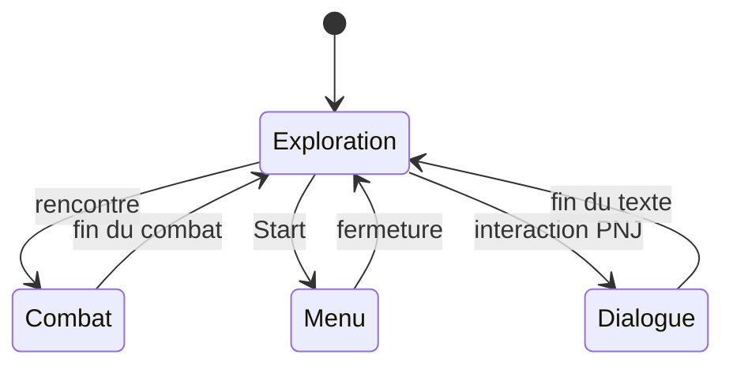
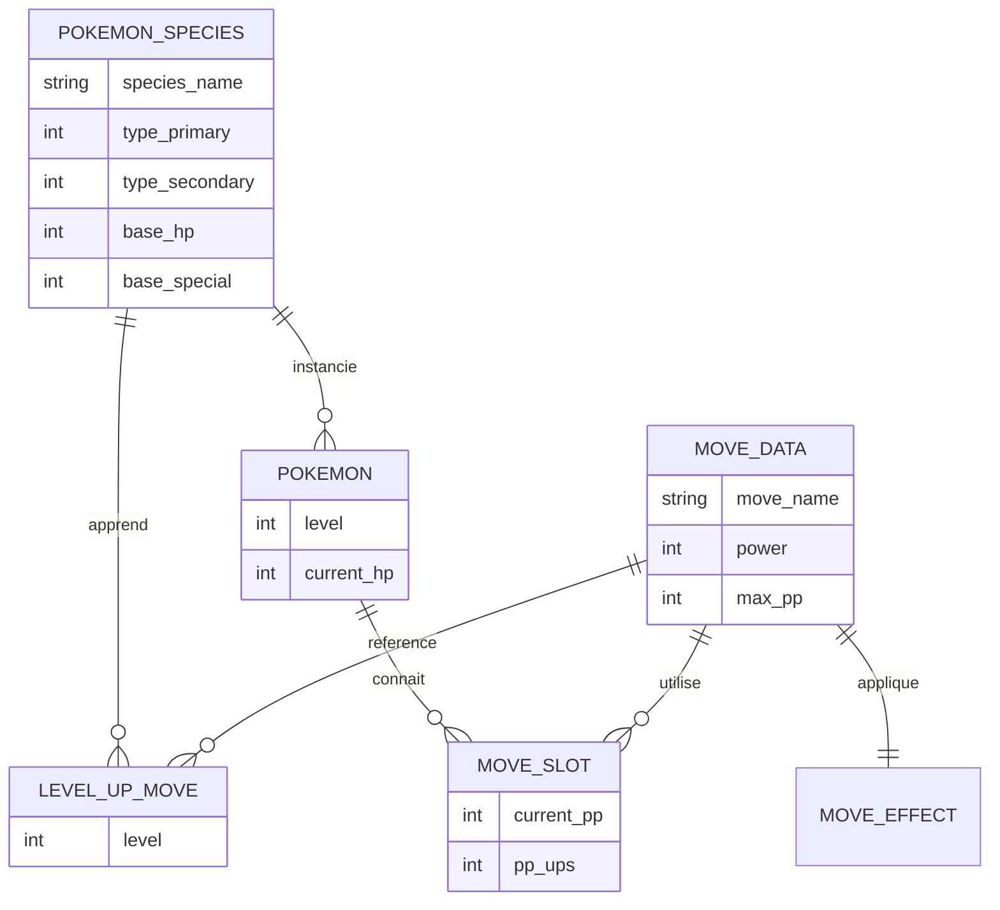

# Décorticage architecture — Pokémon Rouge/Bleu (Game Boy, 1996)

Grille appliquée : les 4 niveaux complets, glitch illustratif. Affirmations techniques recalées sur le désassemblage [pret/pokered](https://github.com/pret/pokered).

## Niveau 1 — Machine à états globale

Le jeu bascule entre quelques états globaux (Exploration, Combat, Menu, Dialogue), pilotés par un chef d'orchestre central — le rôle d'un singleton autoload chez Godot, comme dans la doc officielle.



L'overworld ne sait pas se battre : il notifie juste "combat contre le dresseur X" ou "Pokémon sauvage Y", l'autoload charge une scène `Battle.tscn` **unique** et lui passe les données. Une seule scène de combat, réutilisée pour les 151 espèces et tous les dresseurs.

Nuance que le désassemblage rend visible et qui compte pour la suite : l'original n'a **pas** d'énumération d'état globale propre. Ce qui tient lieu de machine à états, c'est un ensemble de drapeaux et d'index de script dispersés (`wIsInBattle`, `wCurMapScript`, `wStatusFlags7`, `wMiscFlags`), chacun avançant de son côté. Toute la famille de bugs du niveau « glitch » plus bas découle de là : quand l'état n'est pas une valeur unique mais une conjonction de drapeaux, il existe des combinaisons que personne n'a prévues. La leçon Godot est directe — un `enum GameState` dans l'autoload avec **un seul** `current_state`, c'est ce que l'original ne pouvait pas se permettre et que rien ne t'empêche d'avoir.

## Niveau 2 — Découpage des scènes

Chaque ville, route ou intérieur est son propre découpage, relié par des warps (portes, grottes) et des raccords de bord pour un scroll continu entre routes adjacentes — pas une seule scène géante avec tout Kanto dedans.

Transposé à Godot : une scène par zone, des `Area2D` en bordure qui déclenchent le changement de scène et repositionnent le joueur au bon point d'entrée.

Point structurel à retenir pour le niveau 3 : la donnée de rencontre sauvage n'appartient pas à la zone de façon durable, elle est **chargée dans une zone de travail globale à chaque entrée de carte** (`LoadWildData`). C'est un cache mono-emplacement, réécrit par la carte courante — et le glitch le plus célèbre du jeu vient de ce que ce cache n'est pas réécrit quand la carte n'a rien à y mettre.

## Niveau 3 — Structures de données

Pas de hiérarchie `Bulbizarre extends Pokemon` : une seule structure de données répétée 151 fois. Composition over inheritance plutôt que hiérarchie de classes.

Côté original, la structure d'espèce fait 28 octets (`BASE_DATA_SIZE = $1C`) et contient **cinq** stats de base — `hp, atk, def, spd, spc` (`NUM_STATS = 5`). Il n'y a qu'une seule statistique Spéciale en Gen 1 : la scission Attaque Spéciale / Défense Spéciale arrive en Gen 2. Le type est stocké sur **exactement deux octets**, et un Pokémon mono-type est encodé par `type1 == type2` (Charmander : `db FIRE, FIRE`) plutôt que par une valeur « aucun » — détail à connaître parce qu'il change la façon de tester l'efficacité de type.

### La donnée figée (une par espèce)

```gdscript
class_name PokemonSpecies
extends Resource

enum Type { NORMAL, FEU, EAU, PLANTE, ELECTRIK, PSY, POISON, VOL }

@export var species_name: String = ""
@export var type_primary: Type = Type.NORMAL
@export var type_secondary: Type = Type.NORMAL
@export var base_hp: int = 1
@export var base_attack: int = 1
@export var base_defense: int = 1
@export var base_speed: int = 1
@export var base_special: int = 1
@export var level_up_moves: Array[LevelUpMove] = []

func is_monotype() -> bool:
	return type_primary == type_secondary
```

(Note : `type_primary`/`type_secondary` est un many-to-many Species↔Type simplifié en deux champs fixes plutôt qu'un vrai tableau, parce que la contrainte "max 2 types" rend le tableau inutilement complexe. J'ai retiré la valeur `NONE` de l'enum pour coller à l'encodage réel : le mono-type se lit `type_primary == type_secondary`, ce qui évite d'avoir deux représentations possibles du même état.)

### L'instance qui évolue (une par individu) + la factory

```gdscript
class_name Pokemon
extends RefCounted

signal hp_changed(current: int, maximum: int)
signal fainted(pokemon: Pokemon)

const MAX_STAT_VALUE := 999

var species: PokemonSpecies
var level: int
var max_hp: int
var current_hp: int
var attack: int
var defense: int
var speed: int
var special: int
var moves: Array[MoveSlot]

#region Construction
static func from_species(p_species: PokemonSpecies, p_level: int, p_dvs := DVSet.new()) -> Pokemon:
	var mon := Pokemon.new()
	mon.species = p_species
	mon.level = p_level
	mon.max_hp = _stat_hp(p_species.base_hp, p_level, p_dvs.hp)
	mon.current_hp = mon.max_hp
	mon.attack = _stat(p_species.base_attack, p_level, p_dvs.attack)
	mon.defense = _stat(p_species.base_defense, p_level, p_dvs.defense)
	mon.speed = _stat(p_species.base_speed, p_level, p_dvs.speed)
	mon.special = _stat(p_species.base_special, p_level, p_dvs.special)
	mon.moves = _default_moveset(p_species, p_level)
	return mon

# Formule Gen 1 canonique (CalcStat, home/move_mon.asm), Stat Exp omise.
static func _stat_hp(base: int, p_level: int, dv: int) -> int:
	var raw := int((base + dv) * 2 * p_level / 100.0) + p_level + 10
	return mini(raw, MAX_STAT_VALUE)

static func _stat(base: int, p_level: int, dv: int) -> int:
	var raw := int((base + dv) * 2 * p_level / 100.0) + 5
	return mini(raw, MAX_STAT_VALUE)
#endregion

func take_damage(amount: int) -> void:
	current_hp = maxi(0, current_hp - amount)
	hp_changed.emit(current_hp, max_hp)
	if current_hp == 0:
		fainted.emit(self)
```

`Pokemon` hérite de `RefCounted`, pas de `Node` : un individu en équipe n'a rien à faire dans l'arbre de scène.

La formule canonique complète est `⌊((Base + DV) × 2 + ⌊⌈√StatExp⌉ / 4⌋) × Niveau / 100⌋`, puis `+ Niveau + 10` pour les PV et `+ 5` pour les autres, plafonnée à 999. Les DV (0–15, 4 bits par stat, celui des PV étant reconstruit depuis les bits de poids faible des quatre autres) sont l'ancêtre des IV modernes ; la Stat Exp est l'ancêtre des EV. Le code ci-dessus modélise les DV et ignore la Stat Exp — c'est un choix, pas un oubli : pour un projet perso, un modificateur individuel par stat suffit largement à produire de la variété entre deux individus de la même espèce, et c'est exactement le rôle architectural que joue le DV.

### Le movepool — many-to-many avec payload

```gdscript
class_name MoveData
extends Resource

enum Category { PHYSICAL, SPECIAL, STATUS }

@export var move_name: String = ""
@export var type: PokemonSpecies.Type = PokemonSpecies.Type.NORMAL
@export var category: Category = Category.PHYSICAL
@export var power: int = 0
@export var accuracy: int = 100
@export var max_pp: int = 10
@export var effect: MoveEffect

class_name LevelUpMove
extends Resource

@export var level: int = 1
@export var move: MoveData

class_name MoveSlot
extends RefCounted

const PP_UP_MAX := 3

var move: MoveData
var current_pp: int
var pp_ups: int = 0

func _init(p_move: MoveData) -> void:
	move = p_move
	current_pp = max_pp()

# AddBonusPP : chaque PP Up ajoute ⌊PP de base / 5⌋, bonus plafonné à 7.
func max_pp() -> int:
	var bonus := mini(int(move.max_pp / 5.0) * pp_ups, 7)
	return move.max_pp + bonus
```

`LevelUpMove` (Species↔Move, attribut `level`) et `MoveSlot` (Pokemon↔Move, attributs `current_pp` et `pp_ups`) sont chacun une **entité de jointure promue** : dès qu'une relation many-to-many porte un attribut propre à la relation, elle devient sa propre entité plutôt qu'une simple table de jointure — comme en JPA/Hibernate ou Entity Framework.

L'original va plus loin dans l'économie de place, et c'est instructif : PP restants et compteur de PP Up **partagent le même octet** (`PP_MASK = %00111111` pour les PP 0–63, `PP_UP_MASK = %11000000` pour les 0–3 PP Up). Deux colonnes logiques dans un seul octet physique, avec des masques pour les séparer. C'est l'équivalent exact d'un champ bitfield en base : ça marche, ça tient, et ça rend toute lecture naïve du champ silencieusement fausse. La version GDScript garde deux propriétés séparées — sur PC, l'octet économisé ne vaut pas le risque de confusion, et c'est déjà un arbitrage que tu peux justifier explicitement dans tes propres modèles.

Côté learnset, `data/pokemon/evos_moves.asm` stocke par espèce d'abord les évolutions puis les paires `(niveau, capacité)` en ordre croissant, chaque section terminée par un `0`. C'est un tableau variable-length sans compteur : le terminateur fait office de borne. En GDScript, `Array[LevelUpMove]` exporté dans la Resource remplace ça sans y penser — mais c'est le même modèle logique, une collection ordonnée attachée à l'entité de référence.

### Le schéma vu comme base de données



Deux familles : **données de référence** (`PokemonSpecies`, `MoveData`, `MoveEffect` — peu modifiées, partagées) vs **données d'instance** (`Pokemon`, `MoveSlot` — une ligne par objet réel, référencent le référentiel par clé étrangère).

Trois formes de relation qui reviennent tout le temps dans ce genre de modèle : many-to-one simple (`Pokemon.species`), many-to-many sans payload (types), many-to-many avec payload (movepool, moveset).

### Où ça diverge d'un vrai ORM

- **Pas de moteur de requête** — pas de `WHERE type = 'FEU'`. Pour lister les Pokémon Feu, il faut construire soi-même un `Dictionary` d'index au chargement
- **Pas d'intégrité référentielle** — supprimer un `.tres` référencé ailleurs laisse une référence cassée, silencieusement
- **Pas de transaction ni de session** — donc pas de dirty-checking, pas de flush

### Le piège : cache de Resources = identity map sans protection en écriture

Les Resources chargées depuis le même chemin sont partagées en mémoire (le loader de Godot les met en cache par chemin). Mais contrairement à une entity JPA gérée par une session, rien n'empêche d'écrire dessus à la volée. Si un effet de combat fait par erreur `target.species.base_defense -= 10` au lieu de gérer la baisse de stat sur l'instance, ça corrompt la donnée de référence pour tous les Pokémon de cette espèce, silencieusement, tant que le process tourne. D'où l'intérêt strict de la séparation species (jamais modifié) / Pokemon (toujours modifié). Pour le rare cas où une vraie copie mutable d'une Resource est nécessaire : `.duplicate()`.

Garde-fou peu coûteux si tu veux dormir tranquille : exposer les données de référence en lecture seule derrière un getter, ou garder une assertion de développement qui vérifie au retour au menu que les stats de base n'ont pas bougé. Une identity map sans dirty-checking, c'est une identity map dont c'est à toi de tenir les invariants.

## Niveau 4 — Design patterns observés

| Pattern | Où | Idiome Godot |
|---|---|---|
| Singleton | état global du niveau 1 | Autoload |
| Factory | `Pokemon.from_species()` | fonction statique |
| Composition over inheritance | `Pokemon` référence un `PokemonSpecies` | Resource référencée |
| Flyweight | species et movedata partagés entre instances | cache du `ResourceLoader` |
| Strategy | un effet différent par capacité | sous-classes de `MoveEffect` |
| Observer | l'UI de combat réagit aux PV | `signal` / `.connect()` |
| State | déroulement interne d'un tour | objet `BattleState` imbriqué |

Les définitions générales sont dans [`../_framework/design-patterns.md`](../_framework/design-patterns.md) ; ci-dessous, seulement ce qui est propre à ce jeu.

### Strategy — les effets de capacité

```gdscript
class_name MoveEffect
extends Resource

func apply(user: Pokemon, target: Pokemon) -> void:
	push_warning("apply() non implémenté")

class_name DamageEffect
extends MoveEffect

func apply(user: Pokemon, target: Pokemon) -> void:
	var dmg := user.attack - target.defense
	target.take_damage(maxi(1, dmg))

class_name StatStageEffect
extends MoveEffect

@export var stat: String = "attack"
@export var stages: int = -1

func apply(user: Pokemon, target: Pokemon) -> void:
	target.apply_stat_stage(stat, stages)
```

Ajouter une capacité avec un comportement inédit = une nouvelle sous-classe `MoveEffect`, zéro ligne touchée ailleurs. Le point important, et c'est ce qui rend le pattern gratuit ici : `MoveEffect` étant une `Resource`, l'effet est **une donnée du `MoveData`**, éditable dans l'inspecteur. Le choix du comportement n'est pas dans le code du moteur de combat, il est dans le `.tres` de la capacité.

### State — le déroulement d'un tour

À distinguer du niveau 1 : ici, le comportement change **sans** changer de scène. Le grand état `Combat` contient sa propre machine à états locale.

```gdscript
class_name BattleState
extends RefCounted

func enter(battle: BattleController) -> void:
	pass

func handle_input(battle: BattleController, action: String) -> void:
	pass

class_name AwaitingInputState
extends BattleState

func enter(battle: BattleController) -> void:
	battle.ui.enable_action_menu()

func handle_input(battle: BattleController, action: String) -> void:
	battle.transition_to(ResolvingState.new(action))

class_name ResolvingState
extends BattleState

var chosen_action: String

func _init(action: String) -> void:
	chosen_action = action

func enter(battle: BattleController) -> void:
	battle.ui.disable_action_menu()
	await battle.execute(chosen_action)
	battle.transition_to(CheckVictoryState.new())

class_name CheckVictoryState
extends BattleState

func enter(battle: BattleController) -> void:
	if battle.enemy_fainted():
		battle.end_battle()
	else:
		battle.transition_to(AwaitingInputState.new())
```

Chaque état sait dans quel état aller ensuite : pas de `match current_phase:` géant dans le contrôleur. Et surtout — c'est ce que l'original n'avait pas — **un seul** champ porte l'état courant, donc il n'existe pas de combinaison de drapeaux contradictoires à atteindre.

### Observer — découpler l'UI de la donnée

```gdscript
# BattleUI.gd — l'UI s'abonne, le Pokémon ne sait pas que l'UI existe
func bind(mon: Pokemon) -> void:
	mon.hp_changed.connect(_on_hp_changed)
	mon.fainted.connect(_on_fainted, CONNECT_ONE_SHOT)

func _on_hp_changed(current: int, maximum: int) -> void:
	$HPBar.value = float(current) / maximum * 100.0
```

Sans ça, `Pokemon.take_damage()` devrait appeler directement l'UI **et** la logique de combat : un objet de données qui connaît l'affichage, c'est une inversion de couche. Piège à connaître : une connexion qui survit à l'objet qui l'a créée — `disconnect()` au changement de Pokémon actif, ou `CONNECT_ONE_SHOT` pour un écouteur à usage unique comme `fainted`.

## Glitch illustratif — MissingNo (Old Man glitch)

Le mécanisme réel est plus intéressant que la version courante, parce qu'il faut **deux** bugs pour le produire.

**Premier bug — un cache partiel jamais invalidé.** Le tutoriel du Vieil Homme copie le nom du joueur (`wPlayerName`, 11 octets) dans la zone qui sert normalement aux données de rencontre en herbe, pour afficher « OLD MAN » dans le combat de démonstration. Le commentaire du désassemblage est explicite : *« Since wLinkEnemyTrainerName == wGrassRate, this affects wild encounters »*. `$D887` n'est pas « la zone des données de rencontre » en bloc : c'est précisément `wGrassRate`, **l'octet de taux** de rencontre. Les 11 octets du nom occupent `$D887`–`$D891`, soit ce taux **plus les cinq premiers créneaux** de `wGrassMons` (`$D888`–`$D89B`, 10 paires niveau/espèce).

Or `LoadWildData` n'écrase le tableau **que si l'octet de taux de la nouvelle carte est non nul** :

```
ld [wGrassRate], a
and a
jr z, .NoGrassData
```

Une carte à taux « herbe » 0 ne réinitialise donc rien. Le nom du joueur reste en place, indéfiniment.

**Second bug — la bonne table choisie avec la mauvaise tuile.** `TryDoWildEncounter` décide **s'il y a** rencontre d'après la tuile en (9,9) — si c'est `$14`, de l'eau, il utilise `wWaterRate` — mais choisit **quelle table lire** d'après la tuile en (8,9). Sur les demi-blocs « left shore », la tuile en bas à droite est `$14` mais celle en bas à gauche non : le jeu déclenche une rencontre au taux de l'eau, puis va la chercher dans la table de l'herbe. Le commentaire du code nomme même le lieu.

**Et la carte n'est pas celle qu'on croit.** Cinnabar Island pointe sur `NothingWildMons`, taux herbe **et** eau à 0 : aucune rencontre n'y est possible. La bande d'eau à l'est de l'île appartient à **Route 20** (`connection east, Route20`), qui utilise `SeaRoutesWildMons` : taux herbe **0** (tableau jamais initialisé) et taux eau **5** (rencontres possibles). C'est cette combinaison précise qui produit MissingNo — pas « Cinnabar ne définit aucune donnée de Pokémon ». Le littoral des Seafoam, également Route 20, se comporte pareil.

Trois leçons, pas une :

1. **Un emplacement à double usage sans invalidation explicite** est un bug en attente. Ici le pire cas : l'invalidation existe, mais elle est conditionnée à une valeur de la donnée entrante (`taux ≠ 0`).
2. **Décider *si* et décider *quoi* à partir de deux sources différentes**, c'est se garantir qu'elles finiront par divergent. Un seul appel, une seule tuile, une seule décision.
3. C'est la même famille que le piège de resource cache du niveau 3 (`target.species.base_defense -= 10`), côté lecture cette fois.

### Variante liée à la machine à états — Trainer-Fly

Interrompre par un Vol la séquence déclenchée quand un dresseur repère le joueur laisse le jeu dans un état incohérent. Ici encore, la version courante — « le jeu reste bloqué en transition en cours » — est une simplification : **il n'existe aucun drapeau "transition de combat en cours"**. `CheckFightingMapTrainers` fait trois choses indépendantes :

- pose `wStatusFlags7` bit `BIT_TRAINER_BATTLE` (legacy `$D733` bit 3, « trainer wants to battle ») ;
- **incrémente `wCurMapScript`** pour que l'étape suivante du script de carte soit `DisplayEnemyTrainerTextAndStartBattle` ;
- tandis que `wMiscFlags` bit `BIT_SEEN_BY_TRAINER` (legacy `$CD60` bit 0) a déjà été posé par la routine de détection.

Voler coupe la séquence avant `StartTrainerBattle`/`EndTrainerBattle`, qui sont les seules à remettre tout ça à zéro. Le menu qui ne répond plus vient précisément de `$CD60` bit 0 : dans `OverworldLoop`, un `bit BIT_SEEN_BY_TRAINER, a / jr nz` **saute l'appel à `DisplayTextID`** pour aller tester `wCurOpponent`. Le menu n'est pas « désactivé », il n'est jamais demandé.

Pour la suite du glitch (Mew), le mécanisme est une **union mémoire**, et c'est ce détail qui vaut le détour. `InitBattleEnemyParameters` lit `wEngagedTrainerClass` → `wCurOpponent` et, si la valeur est inférieure à 200, `wEngagedTrainerSet` → `wCurEnemyLevel`. Or ces deux octets sont déclarés dans une `UNION` qui recouvre les variables de combat : `wEngagedTrainerClass` (`$CD2D`) est l'octet de poids faible de `wEnemyMonUnmodifiedSpecial`, et `wEngagedTrainerSet` (`$CD2E`) est `wEnemyMonAttackMod`. D'où le Mew canonique : espèce = Spécial du dernier adversaire (`$15` = 21 = MEW), niveau = cran d'Attaque (7).

Une `UNION`, c'est deux schémas de données superposés sur les mêmes octets, avec un discriminant implicite — « on est en combat, ou on est en train de démarrer un combat ». Rien ne vérifie ce discriminant à la lecture. L'équivalent moderne le plus proche est une table à colonnes polyvalentes (`value_int`, `value_ref`, dont le sens dépend d'une colonne `type`) : ça marche exactement aussi longtemps que tout le monde teste le type avant de lire.

Le contraste avec les états explicites du niveau 4 est le vrai enseignement : `wCurOpponent` et `wCurEnemyLevel` ne peuvent contenir n'importe quoi que parce qu'aucun état unique ne dit « je suis en train d'entrer en combat ».

## Corrections et ajouts

- **Niveau 1** — ajout de la constatation centrale : l'original n'a pas d'état global unique, seulement des drapeaux et des index de script indépendants. C'est la cause commune des deux glitches, ça méritait d'être dit au niveau 1 plutôt que découvert au niveau 4.
- **Niveau 3, espèces** — précisé les 5 stats de base réelles (Spécial unique en Gen 1, scission en Gen 2), les 28 octets de la structure, et l'encodage du mono-type par `type1 == type2`. La valeur `NONE` de l'enum a été retirée en conséquence : elle créait une seconde représentation du même état.
- **Niveau 3, formule de stats** — la version précédente était la formule canonique **avec DV = 0 et Stat Exp = 0**, sans le dire. Corrigé : formule complète donnée, DV modélisés dans le code, Stat Exp explicitement écartée avec la raison, plafond à 999 ajouté (`MAX_STAT_VALUE`).
- **Niveau 3, PP** — ajout de l'encodage réel : PP restants et compteur de PP Up partagent un octet (`PP_MASK` / `PP_UP_MASK`), bonus de `⌊PP de base / 5⌋` par PP Up plafonné à 7. Modélisé en deux champs séparés côté GDScript, avec l'arbitrage assumé.
- **Niveau 3, learnset** — ajout du format réel d'`evos_moves` (tableau variable-length terminé par zéro) et du parallèle avec `Array[LevelUpMove]`.
- **Niveau 3** — ajout d'un garde-fou concret contre l'écriture accidentelle sur une donnée de référence.
- **Niveau 4** — était réduit à une liste avec deux patterns « pour plus tard ». Développé : tableau récapitulatif, Strategy avec le point clé (l'effet est une donnée du `.tres`, pas du code moteur), State complet avec `await`, Observer avec le piège des connexions survivantes.
- **Glitch, MissingNo** — réécrit. Trois corrections de fond : `$D887` est `wGrassRate` (l'octet de *taux*), pas la zone de données ; l'invalidation existe mais est conditionnée à `taux ≠ 0` ; et **la carte responsable est Route 20, pas Cinnabar Island** (Cinnabar a ses deux taux à 0, donc n'a jamais de rencontre). Ajout du second bug, jusqu'ici absent : tuile (9,9) pour décider s'il y a rencontre, tuile (8,9) pour choisir la table.
- **Glitch, Trainer-Fly** — réécrit. Il n'y a pas de drapeau « transition en cours » : ce sont trois choses indépendantes (`wStatusFlags7`, `wCurMapScript`, `wMiscFlags`), et le menu muet vient du saut de `DisplayTextID`. Le mécanisme de Mew est précisé comme une `UNION` mémoire (`$CD2D`/`$CD2E` recouvrant `wEnemyMonUnmodifiedSpecial` et `wEnemyMonAttackMod`), avec son équivalent moderne en table à colonnes polyvalentes.
- **Sources** — remplacement des sources secondaires par les fichiers du désassemblage, avec les noms de routines.

## Sources

- Old Man glitch, copie du nom : [`engine/battle/core.asm`](https://github.com/pret/pokered/blob/master/engine/battle/core.asm) (`DisplayBattleMenu`, branche `BATTLE_TYPE_OLD_MAN`) ; restauration : [`engine/items/item_effects.asm`](https://github.com/pret/pokered/blob/master/engine/items/item_effects.asm)
- Choix de table de rencontre : [`engine/battle/wild_encounters.asm`](https://github.com/pret/pokered/blob/master/engine/battle/wild_encounters.asm) (`TryDoWildEncounter`) ; chargement : [`engine/overworld/wild_mons.asm`](https://github.com/pret/pokered/blob/master/engine/overworld/wild_mons.asm) (`LoadWildData`)
- Tables de rencontre concernées : [`data/wild/maps/SeaRoutes.asm`](https://github.com/pret/pokered/blob/master/data/wild/maps/SeaRoutes.asm), [`data/wild/maps/nothing.asm`](https://github.com/pret/pokered/blob/master/data/wild/maps/nothing.asm), [`data/maps/headers/CinnabarIsland.asm`](https://github.com/pret/pokered/blob/master/data/maps/headers/CinnabarIsland.asm)
- Trainer-Fly et Mew : [`home/trainers.asm`](https://github.com/pret/pokered/blob/master/home/trainers.asm) (`CheckFightingMapTrainers`, `InitBattleEnemyParameters`), [`home/overworld.asm`](https://github.com/pret/pokered/blob/master/home/overworld.asm), `UNION` dans [`ram/wram.asm`](https://github.com/pret/pokered/blob/master/ram/wram.asm) ; vue d'ensemble : [Bulbapedia — Mew glitch](https://bulbapedia.bulbagarden.net/wiki/Mew_glitch), [Trainer-Fly glitch](https://bulbapedia.bulbagarden.net/wiki/Trainer-Fly_glitch)
- Structure d'espèce et formule de stats : [`data/pokemon/base_stats/`](https://github.com/pret/pokered/blob/master/data/pokemon/base_stats/charmander.asm), [`constants/pokemon_data_constants.asm`](https://github.com/pret/pokered/blob/master/constants/pokemon_data_constants.asm), [`home/move_mon.asm`](https://github.com/pret/pokered/blob/master/home/move_mon.asm) (`CalcStat`), [Bulbapedia — Stat](https://bulbapedia.bulbagarden.net/wiki/Stat)
- PP, PP Up, learnset : [`constants/pokemon_data_constants.asm`](https://github.com/pret/pokered/blob/master/constants/pokemon_data_constants.asm) (`PP_MASK`, `PP_UP_MASK`), [`engine/items/item_effects.asm`](https://github.com/pret/pokered/blob/master/engine/items/item_effects.asm) (`AddBonusPP`, `GetMaxPP`), [`data/pokemon/evos_moves.asm`](https://github.com/pret/pokered/blob/master/data/pokemon/evos_moves.asm)
