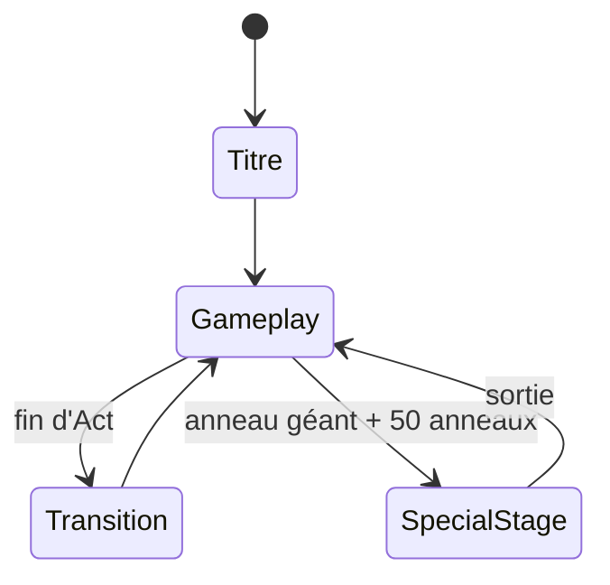
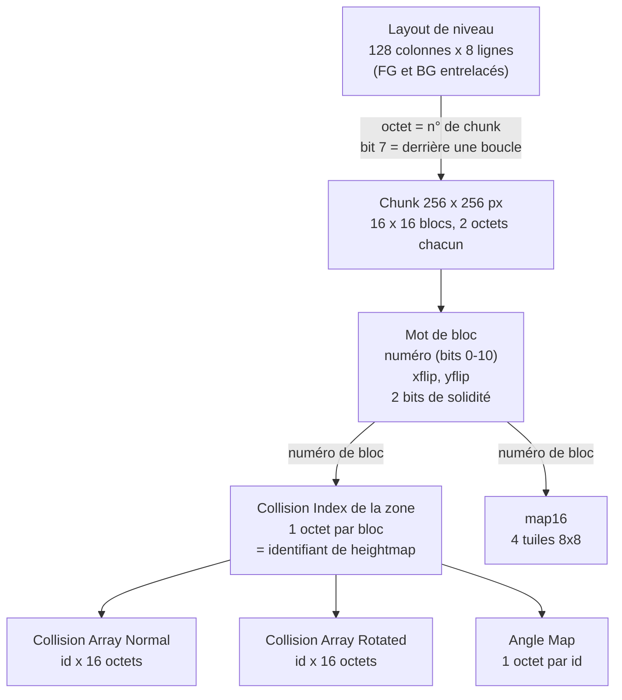
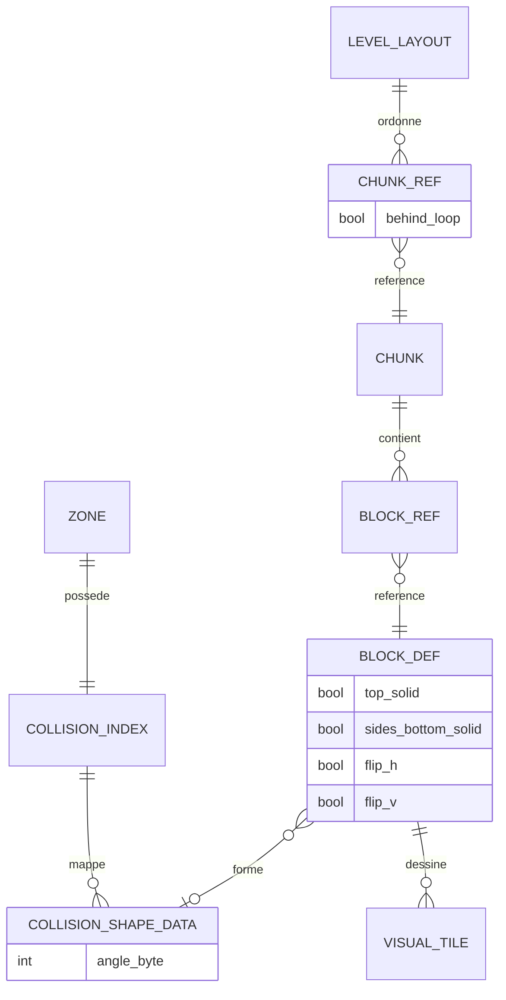

# Décorticage architecture — Sonic the Hedgehog (Genesis, 1991)

Grille appliquée : les 4 niveaux complets, glitch illustratif. Affirmations techniques recalées sur le [désassemblage Sonic Retro `s1disasm`](https://github.com/sonicretro/s1disasm) et le [Sonic Physics Guide](https://info.sonicretro.org/Sonic_Physics_Guide).

## Niveau 1 — Machine à états globale



Comme Mario, Zelda 1 et Metroid : le gameplay principal reste temps réel sans état "Combat" séparé, toucher un Badnik se résout dans la même boucle. Mais le Special Stage (labyrinthe rotatif en pseudo-3D pour les Chaos Emeralds) est un vrai changement de mode — modèle d'interaction complètement différent, donc un vrai état, comme le Combat de Pokémon.

## Niveau 2 — Découpage des scènes : la vraie nouveauté du corpus

Les autres jeux du corpus utilisent une collision binaire par tuile : solide ou vide. Sonic a besoin de bien plus, parce que courir sur une pente, une boucle, ou un plafond en étant à l'envers change la donne à chaque frame.

### La donnée par bloc

**Première correction d'unité**, la même que pour Zelda 1 : l'unité de collision n'est pas la *tuile* (8 × 8 px, l'unité graphique du matériel) mais le **bloc de 16 × 16 px**. Chaque bloc référence :

- un **tableau de hauteurs** (« height array ») de **16 octets signés**, une valeur par colonne de pixels, de −16 à +16 ;
- un **angle** sur **un octet**.

Les tailles sont vérifiables directement dans les fichiers du désassemblage : `Collision Array (Normal).bin` fait **4096 octets = 256 blocs × 16 octets**, et `Angle Map.bin` fait **256 octets**, un par bloc.

**Deuxième correction, sur l'angle.** Il est bien codé sur un octet — 256 unités pour 360°, soit 1,40625° par unité — mais il est **stocké non signé** (0 à 255, `0` = plat) tout en étant **manipulé en arithmétique signée** par le moteur : `neg.b` pour le miroir horizontal, et les deux bits hauts donnent directement le quadrant. Utile à savoir, parce que c'est ce double traitement qui rend les quadrants gratuits.

Et `$FF` **n'est pas un angle** : c'est un **drapeau**. Les quatorze entrées à `$FF` de la table sont les seules valeurs impaires du fichier, et la routine de recherche du sol teste précisément ce bit de parité (`btst #0`) pour, dans ce cas, forcer l'angle au **multiple de 90° le plus proche**. Une valeur sentinelle qui se distingue par une propriété arithmétique de toutes les valeurs légitimes : c'est propre, et c'est exactement ce que le `$24` de la Warp Zone de [Mario](../super-mario-bros) n'était pas.

### Deux tableaux, pas un seul réinterprété

**Troisième correction, et la plus importante.** La version initiale de ce fichier disait : « marcher sur un mur ou un plafond fait lire le même tableau en inversant les axes (les hauteurs deviennent des largeurs) — une seule donnée, réinterprétée selon le contexte de déplacement plutôt que dupliquée pour chaque orientation ». C'est faux pour les murs, et vrai pour le plafond. Le détail mérite qu'on s'y arrête, parce qu'il est plus intéressant que l'histoire qu'il remplace :

| Direction | Tableau lu | Indexé par |
|---|---|---|
| Sol | `Collision Array (Normal)` | X dans le bloc |
| Plafond | `Collision Array (Normal)` | X dans le bloc, hauteur de bloc inversée |
| Murs | **`Collision Array (Rotated)`** | Y dans le bloc |

Il existe donc **deux tableaux distincts de 4096 octets**, aux contenus vérifiés différents. La recherche de sol lit le premier, la recherche de mur lit le second. Seul le **plafond** réutilise réellement le tableau de hauteurs, en appelant la routine de sol avec une hauteur de bloc inversée et un masque de miroir vertical. L'`Angle Map`, elle, est bien partagée par les deux.

Et le détail savoureux : une routine morte `ConvertCollisionArray` est restée dans le code, et elle montre que le tableau « rotated » était **généré depuis des bitmaps bruts au moment du build**. Le coût de la rotation a été payé une fois, à la compilation, pour ne jamais être payé à l'exécution. C'est un précalcul de données dérivées — l'équivalent d'une vue matérialisée en base, ou d'un index inverse construit au chargement comme celui des équipements de [Final Fantasy](../final-fantasy-1). Doubler la donnée pour diviser le travail par frame était le bon arbitrage sur un 68000 à 7,6 MHz, et il reste le bon aujourd'hui dès que la donnée est en lecture seule.

### Les capteurs

Le SPG nomme **six capteurs, A à F** :

| Capteurs | Rôle | Position relative |
|---|---|---|
| A, B | sol | ± rayon de largeur, + rayon de hauteur |
| C, D | plafond | ± rayon de largeur, − rayon de hauteur |
| E, F | murs (« push ») | ± rayon de poussée, 0 |

**Mais jamais les six à la fois** — la version initiale disait « 4 à 5 rayons », ce qui est exact *pour l'état aérien* et incomplet pour le reste :

- **Au sol** : A et B ; C et D inactifs ; **un seul** capteur de poussée, celui du sens du mouvement, et seulement si la vitesse au sol est non nulle et l'angle du sol dans [−90°, 90°]. Les capteurs de poussée **descendent de 8 pixels quand l'angle vaut 0**. Un capteur supplémentaire apparaît à vitesse nulle, pour l'animation d'équilibre au bord d'une plateforme.
- **En l'air** : le SPG écrit explicitement *« only 4 to 5 will be active at any given time »*, selon le quadrant du vecteur vitesse — vers le haut : C/D + E + F ; vers la droite : A/B + C/D + F ; vers le bas : A/B + E + F ; vers la gauche : A/B + C/D + E.

En boucle, les capteurs pivotent avec l'orientation du personnage, et les mêmes tableaux servent à chaque quart de tour, lus dans une orientation différente. C'est ce qui permet de courir la tête en bas sans code spécifique par orientation.

### Collision directionnelle

**Confirmé, et le nom exact existe** : deux **bits de solidité** sont portés par le mot qui décrit un bloc dans un chunk — bit `$D` = « top solid », bit `$E` = « left/right/bottom solid ». Les routines reçoivent le numéro de bit à tester en paramètre : la recherche de sol passe `$D`, toutes les routines de mur et de plafond passent `$E`.

Quatre combinaisons en découlent : non solide, sol traversable par le bas (les plateformes), murs-et-plafond seulement, entièrement solide. C'est ce qui permet de traverser une boucle par en dessous puis d'être bloqué par le même bloc vu d'en haut.

Comment Sonic 1 gère alors les loopings, où le même bloc doit être solide ou non selon le chemin emprunté ? Par **échange de l'identifiant de chunk** contre une copie aux solidités différentes. Sonic 2 et suivants introduisent deux *layers* de collision avec des *layer switchers* — la solution propre, arrivée un jeu plus tard.

Pour Godot : le `TileSet` natif permet des formes de collision par tuile (pas juste des rectangles), mais ne fait pas tourner automatiquement la rotation ou la vitesse du personnage selon la pente. Pour du vrai style Sonic, il faut un contrôleur `CharacterBody2D` sur mesure avec des `RayCast2D` en capteurs plutôt que `move_and_slide()` seul — c'est littéralement la même architecture capteurs + tableau de hauteurs, buildée à la main dans le moteur.

## Niveau 3 — Structures de données

### La chaîne complète : layout → chunk → bloc → (collision | graphisme)

**Quatrième correction.** La version initiale annonçait une indirection tuile → table de correspondance → tableau de hauteurs. L'indirection existe bien, mais il y en a **deux niveaux**, et la hiérarchie annoncée était fausse sur un point : dans Sonic 1 les chunks font **256 × 256 pixels**, pas 128 × 128 (les chunks de 128 × 128 sont ceux de Sonic 2 et de Sonic 3 & Knuckles).



Le point remarquable, et c'est lui qui justifie le terme Flyweight géométrique : **l'identité graphique et l'identité de collision sont séparées**. Le même numéro de bloc indexe d'un côté le `Collision Index` de la zone (qui donne un identifiant de heightmap, `0` signifiant « pas de collision »), et de l'autre `map16` (qui donne les quatre tuiles 8 × 8 du rendu). Deux blocs visuellement différents peuvent partager exactement la même forme de collision, et un bloc peut être visible sans être solide.

C'est la version géométrique de la séparation référence/instance de [Pokémon](../pokemon-rouge-bleu) : une table de formes partagée, indexée depuis plusieurs endroits, jamais dupliquée. Et le `Collision Index` étant **propre à la zone**, la même valeur de bloc ne désigne pas la même forme dans Green Hill et dans Marble — c'est à nouveau une clé étrangère dont la table cible dépend du contexte, comme le numéro de salle de [Metroid](../metroid), avec le même risque si les deux se désynchronisent.

```gdscript
class_name CollisionShapeData
extends Resource

## L'équivalent d'une entrée de Collision Array + Angle Map.
## Donnée de référence pure : partagée par tous les blocs qui la citent.
const WIDTH := 16
const FLAGGED_ANGLE := 0xFF

## 16 hauteurs signées, indexées par X dans le bloc.
@export var heights: PackedByteArray = PackedByteArray()
## 16 largeurs signées, indexées par Y — le tableau "rotated", précalculé.
@export var widths: PackedByteArray = PackedByteArray()
## 0-255 pour 360°. $FF = angle "drapeau" : forcer au multiple de 90° le plus proche.
@export_range(0, 255) var angle_byte: int = 0

func angle_radians(surface_normal: Vector2) -> float:
	if angle_byte == FLAGGED_ANGLE:
		return snappedf(surface_normal.angle(), PI / 2.0)
	return angle_byte * TAU / 256.0

#region Génération du tableau "rotated"
## L'original le générait au build (routine ConvertCollisionArray, restée
## morte dans le code). Ici : à l'import, une fois, jamais par frame.
func rebuild_widths_from_heights() -> void:
	widths.resize(WIDTH)
	for y in WIDTH:
		var w := 0
		for x in WIDTH:
			if heights[x] >= WIDTH - y:
				w += 1
		widths[y] = w
#endregion
```

```gdscript
class_name BlockDef
extends Resource

## Le mot de 2 octets de l'original, éclaté en champs nommés.
@export var collision: CollisionShapeData      ## null = pas de collision
@export var visual_tiles: Array[int] = []      ## 4 tuiles 8x8 (map16)
@export var flip_h: bool = false
@export var flip_v: bool = false
@export var top_solid: bool = true             ## bit $D
@export var sides_bottom_solid: bool = true    ## bit $E

func blocks_from(direction: Vector2) -> bool:
	if collision == null:
		return false
	if direction.y > 0.0:
		return top_solid                        ## on descend : le sol bloque
	return sides_bottom_solid
```

### Les capteurs, transposés

```gdscript
class_name SensorSet
extends RefCounted

## Six capteurs nommés, comme le SPG — mais jamais tous actifs.
enum Sensor { A, B, C, D, E, F }

var width_radius: float = 9.0
var height_radius: float = 19.0
var push_radius: float = 10.0

#region Composition selon l'état
func active_on_ground(ground_speed: float, ground_angle: float) -> Array[Sensor]:
	var out: Array[Sensor] = [Sensor.A, Sensor.B]
	if is_zero_approx(ground_speed):
		return out                              ## + le capteur d'équilibre au bord
	if absf(ground_angle) <= PI / 2.0:
		out.append(Sensor.F if ground_speed > 0.0 else Sensor.E)
	return out

func active_in_air(velocity: Vector2) -> Array[Sensor]:
	## 4 à 5 capteurs selon le quadrant de la vitesse.
	if absf(velocity.y) > absf(velocity.x):
		if velocity.y < 0.0:
			return [Sensor.C, Sensor.D, Sensor.E, Sensor.F]
		return [Sensor.A, Sensor.B, Sensor.E, Sensor.F]
	if velocity.x > 0.0:
		return [Sensor.A, Sensor.B, Sensor.C, Sensor.D, Sensor.F]
	return [Sensor.A, Sensor.B, Sensor.C, Sensor.D, Sensor.E]
#endregion

func offset_of(s: Sensor, ground_angle: float) -> Vector2:
	var drop := 8.0 if is_zero_approx(ground_angle) else 0.0
	match s:
		Sensor.A: return Vector2(-width_radius, height_radius)
		Sensor.B: return Vector2(width_radius, height_radius)
		Sensor.C: return Vector2(-width_radius, -height_radius)
		Sensor.D: return Vector2(width_radius, -height_radius)
		Sensor.E: return Vector2(-push_radius, drop)
		Sensor.F: return Vector2(push_radius, drop)
	return Vector2.ZERO
```

Le fait que l'ensemble actif dépende de l'état et du quadrant de la vitesse n'est pas une optimisation : c'est une **règle de gameplay**. Activer les six en permanence donnerait un personnage qui s'accroche aux plafonds en sautant et se bloque contre des murs en montant une pente. Le jeu est dans le choix des capteurs, pas seulement dans la géométrie.

### Les anneaux : un tampon de dégâts, avec des chiffres précis

Les anneaux ne sont pas un pool de PV : c'est un tampon binaire. Le comportement exact, vérifié :

- un bouclier absorbe le coup **sans perte** d'anneaux ;
- sinon, si le compteur est à **0**, c'est la mort ;
- sinon, le jeu crée l'objet de dispersion et met le compteur **à zéro** — pas de perte partielle.

Et les chiffres qui étaient absents de la version initiale :

| Paramètre | Valeur |
|---|---|
| Anneaux dispersés maximum | **32** (et limité par les créneaux d'objets libres) |
| Répartition | 2 cercles concentriques de 16 ; les 16 premiers à 4 px/frame, les 16 suivants à 2 |
| Invincibilité après coup | **120 frames**, remises à 120 à l'atterrissage |
| Clignotement | 4 frames visibles / 4 invisibles |
| Récupération possible | seulement quand il reste **moins de 90** des 120 frames |
| Anneau dispersé | hitbox 12 × 12, gravité `$18`, rebond `Y × −0,75`, test de sol **1 frame sur 4**, disparition après ~256 frames |

Le plafond de 32 est le détail qui change la lecture du système : **porter 100 anneaux n'est pas plus sûr que d'en porter 32.** Au-delà, le surplus est perdu sans être récupérable. Ce qui veut dire que le compteur d'anneaux a deux rôles séparés — assurance-vie (plafonnée à 32 en pratique) et monnaie pour le Special Stage (50 requis) — et que l'un des deux est silencieusement borné.

Le test de sol une frame sur quatre est l'autre détail à retenir : c'est un **échelonnement de charge** volontaire. 32 objets × une recherche de sol par frame était trop coûteux, donc chaque anneau ne teste qu'une frame sur quatre, avec un décalage de phase. En Godot, l'équivalent direct est de répartir des vérifications coûteuses sur plusieurs frames plutôt que de tout faire dans le même `_physics_process`.

```gdscript
class_name RingBuffer
extends RefCounted

const MAX_SCATTERED := 32
const INVINCIBILITY_FRAMES := 120
const RECOVERY_LOCKOUT_FRAMES := 30      ## récupérable quand il reste < 90

var count: int = 0
var _invincibility_left: int = 0

func take_hit(has_shield: bool) -> bool:
	if has_shield:
		return true                       ## survit sans perte
	if count == 0:
		return false                      ## mort
	var scattered := mini(count, MAX_SCATTERED)
	count = 0
	_scatter(scattered)
	_invincibility_left = INVINCIBILITY_FRAMES
	return true

func can_recollect() -> bool:
	return _invincibility_left < INVINCIBILITY_FRAMES - RECOVERY_LOCKOUT_FRAMES
```

### Le schéma vu comme base de données



La relation `ZONE ||--|| COLLISION_INDEX` est celle qu'il faut retenir : **la table de résolution est par zone**, ce qui fait du numéro de bloc un identifiant relatif. Trois jeux du corpus font le même choix — le numéro de salle de Metroid résolu par banque, le numéro de bloc de Sonic résolu par zone, le code de ville de Zelda II calculé depuis un index de zone — et dans les trois cas, c'est ce qui casse quand le contexte et l'index se désynchronisent.

## Niveau 4 — Design patterns observés

| Pattern | Où | Idiome Godot |
|---|---|---|
| Flyweight | formes de collision partagées, séparées de l'identité graphique | Resource référencée |
| State | Standing / Running / Rolling / Jumping, chacun ses règles de physique | objet State imbriqué |
| Strategy | comportement par Badnik, effet par objet (ressort, monitor) | sous-classes de Resource |
| Object Pool | 32 anneaux dispersés, créneaux d'objets pré-alloués | tableau pré-alloué |
| Composition over inheritance | un bloc référence une forme, n'en hérite pas | Resource référencée |

Les définitions générales sont dans [`../_framework/design-patterns.md`](../_framework/design-patterns.md).

### State — le cas le plus justifié du corpus

C'était le point spécifique annoncé dans la version initiale de ce fichier, et il est mérité : chaque état de Sonic a **ses propres règles de physique**, pas seulement son animation. Accélération, décélération, friction, contrôle en l'air, et surtout **les rayons de collision** changent d'un état à l'autre.

```gdscript
class_name SonicState
extends RefCounted

## Chaque état porte ses constantes de physique ET ses rayons.
## C'est ce dernier point qui rend le pattern obligatoire ici.
func width_radius() -> float:
	return 9.0

func height_radius() -> float:
	return 19.0

func physics_update(sonic: SonicBody, delta: float) -> void:
	pass

class_name RunningState
extends SonicState

const ACCELERATION := 0.046875 * 60.0
const FRICTION := 0.046875 * 60.0
const TOP_SPEED := 6.0 * 60.0

func physics_update(sonic: SonicBody, delta: float) -> void:
	var input := Input.get_axis(&"move_left", &"move_right")
	if is_zero_approx(input):
		sonic.ground_speed = move_toward(sonic.ground_speed, 0.0, FRICTION * delta)
	else:
		sonic.ground_speed = clampf(
			sonic.ground_speed + input * ACCELERATION * delta,
			-TOP_SPEED, TOP_SPEED)
	## La gravité de pente : ce qui fait tout le feeling du jeu.
	sonic.ground_speed -= sin(sonic.ground_angle) * 0.125 * 60.0 * delta
	if Input.is_action_just_pressed(&"jump"):
		sonic.set_state(JumpingState.new())

class_name RollingState
extends SonicState

const ROLL_FRICTION := 0.0234375 * 60.0      ## moitié de la friction debout
const ROLL_DECELERATION := 0.125 * 60.0

## Les rayons CHANGENT en roulade — et tout ce qui les consomme doit suivre.
func width_radius() -> float:
	return 7.0

func height_radius() -> float:
	return 14.0

func physics_update(sonic: SonicBody, delta: float) -> void:
	sonic.ground_speed = move_toward(sonic.ground_speed, 0.0, ROLL_FRICTION * delta)
	if absf(sonic.ground_speed) < 0.5 * 60.0:
		sonic.set_state(RunningState.new())
```

Un `if is_rolling:` dispersé dans le contrôleur devrait tester ce drapeau dans l'accélération, la friction, la décélération, la hauteur de collision, la largeur de collision, la possibilité de sauter et l'animation. Sept endroits pour un booléen — et le glitch ci-dessous montre ce qui arrive quand on en oublie un.

### Object Pool — le cas le plus légitime du corpus

Trente-deux anneaux créés **dans la même frame**, détruits quelques secondes plus tard, à répétition pendant toute la partie. C'est le seul cas du corpus où le pool n'est pas de l'optimisation prématurée, et l'original le fait de la seule façon possible : les anneaux dispersés sont limités **par le nombre de créneaux d'objets libres**, pas par un choix de design.

```gdscript
class_name RingPool
extends Node

const SIZE := RingBuffer.MAX_SCATTERED

var _pool: Array[ScatteredRing] = []
var _phase: int = 0

func _ready() -> void:
	for i in SIZE:
		var r := ScatteredRing.new()
		r.ground_check_phase = i % 4      ## l'échelonnement 1 frame sur 4
		r.hide()
		r.set_physics_process(false)
		add_child(r)
		_pool.append(r)

func scatter(origin: Vector2, amount: int) -> void:
	var released := 0
	for r in _pool:
		if released >= amount:
			break
		if r.visible:
			continue
		r.launch(origin, released)         ## l'index donne l'angle et la vitesse
		released += 1

func release(r: ScatteredRing) -> void:
	r.hide()
	r.set_physics_process(false)
```

Noter `ground_check_phase` : le pool est aussi l'endroit naturel pour **distribuer les phases** de vérification. Pré-allouer les objets et répartir leur charge sont deux problèmes distincts, mais ils se résolvent au même endroit.

À l'inverse — et c'est ce que dit déjà [`prochaines-etapes.md`](../prochaines-etapes.md) — Dodge the Creeps spawne trop peu de mobs simultanément pour que ce pattern se justifie. Le critère n'est pas « beaucoup d'objets » mais « beaucoup d'objets **créés et détruits en rafale** », et 32 anneaux dans une frame en est la définition.

## Glitch illustratif — le capteur de poussée oublié en roulade

Pas de glitch spectaculaire à la MissingNo dans Sonic 1, mais un bug documenté dans le désassemblage lui-même, et qui illustre exactement la leçon du pattern State ci-dessus.

En roulade, les rayons de collision de Sonic changent : la largeur passe de 9 à 7, la hauteur de 19 à 14. Les capteurs de sol et de plafond suivent — ils sont positionnés à partir de ces rayons. **Les capteurs de poussée, eux, ne bougent pas.** Sonic 1 ne les repositionne pas pour l'état roulade ; le correctif n'existe que dans les branches `FixBugs` du désassemblage, c'est-à-dire qu'il a été identifié par la communauté et laissé optionnel pour préserver le comportement d'origine.

Conséquence concrète : en roulade, Sonic est poussé par les murs comme s'il avait encore sa largeur debout. La géométrie de collision n'est pas cohérente avec elle-même.

**La leçon, et c'est la seule du corpus qui soit purement une leçon de pattern** : quand un état change une **dimension**, tout ce qui consomme cette dimension doit suivre. Ce n'est pas un bug de donnée non initialisée, ni de mauvaise plage, ni de mauvais contexte — c'est un **état incomplet**. Un sous-ensemble des conséquences du changement d'état a été appliqué, et le reste est resté sur les valeurs précédentes.

C'est précisément ce que le pattern State empêche par construction, à condition que les dimensions soient **lues depuis l'état** et non copiées vers le personnage :

```gdscript
## Fragile : le changement d'état doit penser à tout mettre à jour.
func set_state(s: SonicState) -> void:
	_state = s
	width_radius = s.width_radius()
	height_radius = s.height_radius()
	## ... et le capteur de poussée, si on y pense.

## Robuste : rien à synchroniser, tout dérive de l'état courant.
func set_state(s: SonicState) -> void:
	_state = s

func sensor_offset(sensor: SensorSet.Sensor) -> Vector2:
	sensors.width_radius = _state.width_radius()
	sensors.height_radius = _state.height_radius()
	sensors.push_radius = _state.push_radius()
	return sensors.offset_of(sensor, ground_angle)
```

Copier les valeurs de l'état vers le personnage crée une seconde source de vérité, et on retombe exactement sur le problème des deux variables de direction de [Zelda II](../zelda-2). Dériver à la lecture coûte quelques multiplications par frame et rend l'oubli impossible.

Le contraste avec les quatre autres familles de bugs du corpus vaut d'être posé : Pokémon, Mario, Zelda II et Metroid cassent tous sur une **donnée** mal lue. Celui-ci casse sur un **état partiellement appliqué** — aucune donnée n'est corrompue, tout est cohérent en mémoire, et le comportement est simplement faux. C'est le bug le plus facile à écrire soi-même.

## Corrections et ajouts

- **Niveau 2, unité** — corrigé : l'unité de collision est le **bloc de 16 × 16 px**, pas la « tuile » (la tuile matérielle fait 8 × 8). Ajouté les tailles vérifiables (`Collision Array` = 4096 octets = 256 × 16, `Angle Map` = 256 octets).
- **Niveau 2, angle** — corrigé : l'angle est bien sur un octet (256 unités pour 360°, 1,40625° par unité) mais **stocké non signé** (0–255) tout en étant manipulé en arithmétique signée. Ajouté que **`$FF` n'est pas un angle mais un drapeau** — 14 entrées, les seules valeurs impaires du fichier, testées par parité pour forcer l'angle au multiple de 90° le plus proche. Comparé au `$24` de la Warp Zone de Mario comme exemple de sentinelle bien choisie.
- **Niveau 2, murs — correction importante.** « Une seule donnée réinterprétée selon le contexte » est **faux pour les murs** : il existe **deux tableaux distincts de 4096 octets** (`Collision Array (Normal)` indexé par X pour le sol, `Collision Array (Rotated)` indexé par Y pour les murs), aux contenus différents. Seul le **plafond** réutilise le tableau de hauteurs, via un appel à la routine de sol avec hauteur inversée. Ajouté la routine morte `ConvertCollisionArray`, qui montre que le tableau « rotated » était **généré au build** — un précalcul de donnée dérivée, analogue à une vue matérialisée.
- **Niveau 2, capteurs** — corrigé et complété : le SPG nomme **six capteurs A–F**, jamais tous actifs. « 4 à 5 » est exact **pour l'état aérien** seulement. Détaillé la composition au sol (A+B, un seul capteur de poussée conditionné à la vitesse et à l'angle, descente de 8 px à angle nul, capteur d'équilibre à vitesse nulle) et en l'air (par quadrant de vitesse).
- **Niveau 2, solidité** — confirmé et nommé : bit `$D` = top solid, bit `$E` = left/right/bottom solid, le numéro de bit étant passé en paramètre aux routines. Ajouté les quatre combinaisons et le fait que Sonic 1 gère les loopings par **échange d'identifiant de chunk**, là où Sonic 2+ utilisent deux layers de collision.
- **Niveau 3, hiérarchie** — corrigé : les chunks de Sonic 1 font **256 × 256 px** (les 128 × 128 sont ceux de Sonic 2 et 3&K). Détaillé la chaîne complète en diagramme : layout (128 × 8, FG/BG entrelacés) → chunk → mot de bloc (numéro + flips + 2 bits de solidité) → `Collision Index` de la **zone** → heightmap/angle, et en parallèle `map16` → 4 tuiles 8 × 8. Mis en avant la **séparation entre identité graphique et identité de collision**, et le fait que le `Collision Index` est propre à la zone — donc un identifiant relatif, comme le numéro de salle de Metroid.
- **Niveau 3** — était réduit à un aperçu. Développé : `CollisionShapeData` et `BlockDef` en Resources (avec la reconstruction du tableau « rotated » à l'import plutôt que par frame), `SensorSet` avec la composition par état, `RingBuffer` avec les chiffres réels.
- **Niveau 3, anneaux** — chiffres ajoutés, tous absents de la version initiale : **32 dispersés maximum** (donc porter 100 anneaux n'est pas plus sûr que 32), 2 cercles de 16 à 4 et 2 px/frame, **120 frames** d'invincibilité remises à zéro à l'atterrissage, récupération bloquée pendant 30 frames, et le **test de sol une frame sur quatre** analysé comme un échelonnement de charge volontaire.
- **Niveau 4** — était absent. Ajouté : State avec les rayons de collision comme argument décisif (et le décompte des sept endroits qu'un booléen `is_rolling` devrait toucher), Object Pool comme le seul cas légitime du corpus avec la distribution des phases, et le rappel du critère (objets créés/détruits en rafale, pas seulement nombreux).
- **Glitch** — ajouté, alors qu'il n'y en avait aucun : le **capteur de poussée non repositionné en roulade**, documenté dans le désassemblage et corrigé seulement dans les branches `FixBugs`. C'est la seule famille de bug du corpus qui soit un **état partiellement appliqué** plutôt qu'une donnée mal lue, et elle se prévient en dérivant les dimensions depuis l'état au lieu de les y copier.
- **Sources** — remplacement des sources secondaires par les fichiers du désassemblage et les pages précises du SPG.

## Sources

- Recherche de sol, de mur et de plafond, bits de solidité, capteurs : [`_incObj/sub FindNearestTile & FindFloor & FindWall.asm`](https://github.com/sonicretro/s1disasm/blob/master/_incObj/sub%20FindNearestTile%20%26%20FindFloor%20%26%20FindWall.asm) et [`_incObj/Sonic Collision.asm`](https://github.com/sonicretro/s1disasm/blob/master/_incObj/Sonic%20Collision.asm)
- Tableaux de collision et carte des angles (tailles vérifiables) : [`collide/`](https://github.com/sonicretro/s1disasm/tree/master/collide) (`Collision Array (Normal).bin`, `Collision Array (Rotated).bin`, `Angle Map.bin`)
- Génération au build du tableau « rotated » : [`_inc/ConvertCollisionArray (Unused).asm`](https://github.com/sonicretro/s1disasm/blob/master/_inc/ConvertCollisionArray%20(Unused).asm)
- Anneaux, dispersion, invincibilité : [`_incObj/25, 37 Rings.asm`](https://github.com/sonicretro/s1disasm/blob/master/_incObj/25,%2037%20Rings.asm) et [`_incObj/Sonic ReactToItem.asm`](https://github.com/sonicretro/s1disasm/blob/master/_incObj/Sonic%20ReactToItem.asm)
- Tuiles solides, collision de pente, perte d'anneaux : [SPG — Solid Tiles](https://info.sonicretro.org/SPG:Solid_Tiles), [SPG — Slope Collision](https://info.sonicretro.org/SPG:Slope_Collision), [SPG — Ring Loss](https://info.sonicretro.org/SPG:Ring_Loss)
