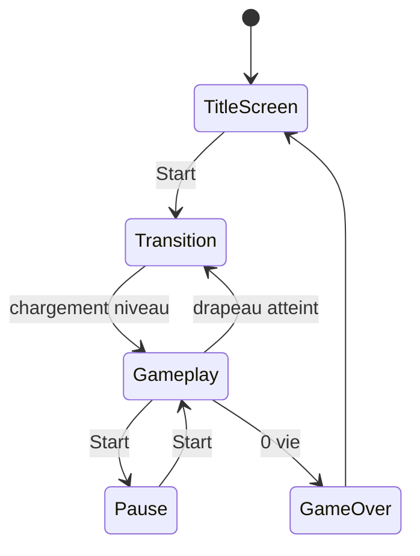
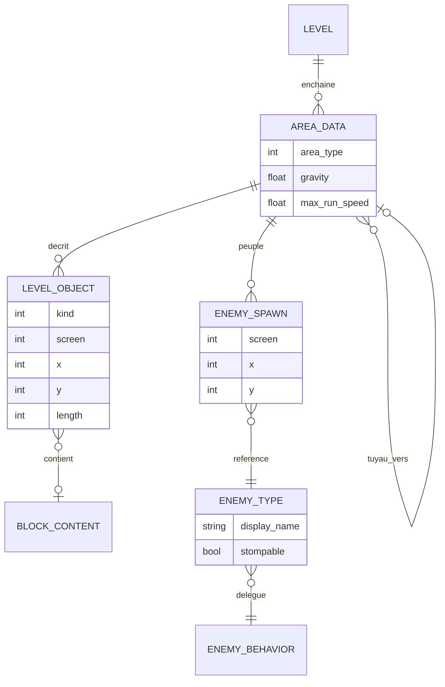

# Décorticage architecture — Super Mario Bros. (NES, 1985)

Grille appliquée : les 4 niveaux complets, glitch illustratif. Affirmations techniques recalées sur le désassemblage SMBDIS d'après doppelganger et la [RAM map Data Crystal](https://datacrystal.tcrf.net/wiki/Super_Mario_Bros./RAM_map).

## Niveau 1 — Machine à états globale



Comme Zelda : temps réel, donc pas d'état "Combat" séparé — un Goomba touché se résout instantanément dans la même boucle (stomp ou dégât), pas de changement d'écran.

Nuance intéressante, troisième occurrence de la même leçon : les niveaux "eau", "souterrain" et "château" ne sont PAS des états différents non plus. C'est le même état Gameplay, avec un tileset différent et des paramètres différents selon le type de zone — de la donnée, pas un nouveau mode.

**Précision importante par rapport à la version initiale de ce fichier.** La différenciation de physique réelle n'oppose pas « eau / souterrain / château » : elle oppose **l'eau à tout le reste**. Souterrain et château ont exactement la physique de l'extérieur ; le type d'aire n'y change que la musique, les palettes, le fond et le décor. Les tables de mouvement le montrent directement — `JumpMForceData`, `FallMForceData` et `PlayerYSpdData` ont sept entrées chacune, dont **les deux dernières sont les valeurs de nage**, et la friction de Mario est documentée comme ayant « no area-type modifiers ». Les plafonds de vitesse suivent la même logique : ±40 en course et ±24 sinon en temps normal, contre ±24 en dur et ±16 au sol dans l'eau.

Et la gravité n'est pas un `if` sur le type de zone, c'est une **variable réécrite depuis des tables** : `$0709` porte la gravité courante, `$070A` la gravité de chute qui y est recopiée quand Mario descend, `$0704` le drapeau de nage. Trois cas particuliers s'y greffent (transition d'écran forçant `$28`, zones aquatiques hors limites à `$18`). C'est la forme la plus pure de ce que dit le niveau 1 : le comportement change, le code ne change pas, seule la donnée dans la variable change.

## Niveau 2 — Découpage des scènes

Contrairement à Zelda (grille de 128 écrans) et Pokémon (une scène par zone), un niveau Mario n'est pas stocké comme une grille de tuiles : il est **compressé en objets**. Chaque élément (une plateforme, un tuyau, une rangée de briques) est encodé comme « type + position + longueur » plutôt que tuile par tuile, puis développé au chargement.

Le format tient sur deux octets par objet. Les champs sont établis — un drapeau « écran suivant », un type d'objet sur 7 bits qui **encode aussi la longueur** (une plage de valeurs désigne le même objet à différentes tailles), une position X et une position Y en nibbles :

```
type et flag   position
nttttttt       xxxxyyyy
|||||||| ||||++++- position Y dans l'écran
|||||||| ++++----- position X dans l'écran
|+++++++---------- type d'objet (longueur incluse dans la plage)
+----------------- flag "écran suivant"
```

**Deux réserves honnêtes sur ce diagramme.** D'abord, la page NESdev qui le donne le présente comme un *exemple générique* de ce à quoi mène le fait d'encoder la longueur dans le type (« this tends to lead to a format like the following »), pas comme le format documenté de SMB1. Ensuite, l'**ordre des deux octets** n'a pas pu être confirmé : le diagramme NESdev place l'octet type/flag en premier, la documentation de plusieurs éditeurs de niveaux place l'octet de position en premier. Le contenu des champs est fiable, leur ordre ne l'est pas — à revérifier dans `ProcessAreaData` / `AreaParserCore` avant de s'en servir comme référence.

Une « plateforme de longueur 5 » est donc une seule instruction compacte, pas 5 tuiles écrites en dur — la contrainte mémoire cartouche a forcé une compression **par description** plutôt que par stockage brut.

Deux corrections au passage. Il n'y a **pas d'objets sur 3 octets** dans SMB1 : le format étendu décrit par NESdev est celui de Super Mario World. Ce que fait SMB1, c'est détourner le format à deux octets — les commandes spéciales (destination d'un tuyau, activation d'un fond) sont **encodées comme des objets à position Y élevée**, hors de la plage utile de l'écran. Un champ de position réutilisé comme espace d'opcodes : le même genre de superposition que l'`UNION` mémoire de Pokémon, en plus propre parce que la plage détournée est inatteignable légitimement. Et le jeu s'appuie aussi sur une **bibliothèque de « templates » de colonnes verticales** et sur un jeu de **fonds posés avant les tuiles** sur chaque écran — deux couches de réutilisation en plus des objets.

**Écho direct avec ton pet desktop** : c'est exactement le même principe que ta seed FNV-1a — stocker une donnée compacte et la développer procéduralement à l'usage, plutôt que stocker le résultat final.

Un niveau enchaîne plusieurs « aires » continues (extérieur → tuyau → intérieur souterrain → tuyau → suite), et le mécanisme est confirmé : `LoadAreaPointer` récupère l'offset de l'aire suivante, `GetAreaDataAddrs` charge **les adresses de données de niveau et de données d'ennemis — deux flux séparés, chacun avec son propre header**. `AreaPointer` vit en `$0750`, le type d'aire en `$074E`, le style en `$0733`. Passer dans un tuyau n'est pas une continuation du flux courant : c'est le chargement d'un nouveau pointeur d'aire, avec sa propre entrée de header. Proche des warps de Zelda dans l'esprit, mais à l'intérieur d'un seul numéro de niveau.

Le type d'aire pilote ensuite des tables paramétriques, dont la plus lisible tient sur une ligne du désassemblage :

```
MusicSelectData: .db WaterMusic, GroundMusic, UndergroundMusic, CastleMusic
```

Quatre types d'aire, quatre entrées, un index. C'est le niveau 1 en une ligne de données.

Pour Godot : plutôt que 32 scènes `.tscn` pour les mondes 1-1 à 8-4, un petit format Resource décrivant les objets et un script qui les développe en cellules `TileMap` au chargement — plus proche de la technique d'origine que de tout dessiner à la main dans l'éditeur.

## Niveau 3 — Structures de données

### Le point central : le niveau est matérialisé en RAM, une fois

C'est la question que ce fichier devait trancher, et la réponse est oui — **mais pas exactement comme la version initiale le disait**. La décompression n'alimente pas un buffer unique lu à la fois par le rendu et par la collision. Elle alimente **deux destinations distinctes**, et c'est architecturalement plus intéressant.

| Buffer | Adresse | Taille | Dimensions | Lu par |
|---|---|---|---|---|
| `MetatileBuffer` | `$06A1` | 13 octets | **une colonne** de 13 metatiles | le rendu |
| `Block_Buffer_1` | `$0500` | 208 octets | 16 colonnes × 13 lignes | la logique de jeu |
| `Block_Buffer_2` | `$05D0` | 208 octets | 16 colonnes × 13 lignes | la logique de jeu |

`MetatileBuffer` est le **tampon de travail du parser** : une seule colonne, consommée immédiatement par `RenderAreaGraphics`, qui boucle dessus (`lda MetatileBuffer,x` … `cpx #$0d`) et écrit une colonne de 26 tuiles 8×8 dans `VRAM_Buffer2`. Il est vidé et réécrit à chaque colonne. Format d'un octet, commenté dans le code : `%xx000000` = bits d'attributs (palette), `%00xxxxxx` = numéro de metatile.

`Block_Buffer_1` et `Block_Buffer_2` sont la **carte logique du terrain** — et la RAM map est catégorique sur ce point : « Current tile (**Does not effect graphics**) ». Ce sont eux que la logique de jeu interroge. Deux buffers de 16×13, soit une « page » d'écran chacun, choisis selon la parité de page de la colonne demandée ; ensemble ils couvrent 32 colonnes, et celui qui sort de l'écran est réécrit par le parser. **Fenêtre glissante de deux pages, pas tableau de 32×13 contigu** — la nuance compte si tu reproduis l'indexation.

Ce que la version initiale de ce fichier voulait dire reste vrai, et c'est le fond de l'affaire : **les entités n'interrogent jamais le format compressé.** Le niveau est développé en RAM sous forme de metatiles, une fois, colonne par colonne, et tout ce qui a besoin de savoir « qu'y a-t-il à cette position » lit ce buffer. Ce qui est partagé, ce n'est pas rendu ↔ collision : c'est **joueur ↔ ennemis ↔ boules de feu ↔ blocs**, qui consultent tous la même carte logique.

Deux preuves indépendantes que la construction est bien incrémentale et visible : `$071E` est documenté comme « Column Sets. Counts back… **you can see the level being built in memory up as this counter progresses, one frame at a time** », et `$071F` porte le numéro de tâche du parser, qui compte de 4 à 0. Le développement du niveau est étalé sur plusieurs frames, pas fait d'un bloc.

**Ce qui reste incertain** : les noms exacts des routines qui lisent les block buffers. `BlockBufferCollision`, `BlockBufferChk_Enemy`, `BlockBufferChk_FBall`, `BlockBufferColli_Feet/Head/Side` sont les labels habituellement cités pour SMBDIS, mais ils n'ont pas pu être lus dans une source consultable (le gist du désassemblage est tronqué avant cette section). Le mécanisme est établi, la nomenclature des routines ne l'est pas — à confirmer par un `grep "Block_Buffer_1,"` sur le fichier complet.

### Transposition : le format objet en Resource

```gdscript
class_name LevelObject
extends Resource

enum Kind {
	PLATFORM,          ## longueur horizontale
	PIPE,              ## hauteur, entrable ou non
	BRICK_ROW,
	QUESTION_BLOCK,
	COIN_ROW,
	STAIRCASE,
}

@export var kind: Kind = Kind.PLATFORM
@export_range(0, 255) var screen: int = 0      ## remplace le flag "écran suivant"
@export_range(0, 15) var x: int = 0            ## position dans l'écran
@export_range(0, 12) var y: int = 0
@export_range(1, 16) var length: int = 1       ## sorti du champ "type"
@export var content: BlockContent              ## null sauf pour les blocs
```

```gdscript
class_name AreaData
extends Resource

enum AreaType { WATER, GROUND, UNDERGROUND, CASTLE }

## Un seul "numéro de niveau" enchaîne plusieurs AreaData.
## Chacune a son propre flux d'objets ET son propre flux d'ennemis,
## comme les deux pointeurs séparés de l'original.
@export var area_type: AreaType = AreaType.GROUND
@export var objects: Array[LevelObject] = []
@export var enemies: Array[EnemySpawn] = []
@export var music: AudioStream
@export var gravity: float = 900.0
@export var max_walk_speed: float = 100.0
@export var max_run_speed: float = 160.0
@export var next_area: AreaData                ## destination d'un tuyau
```

Le point important pour le niveau 1 : `gravity` et les vitesses maximales sont des **champs de l'aire**, pas des constantes du script du joueur. Le joueur lit ses paramètres depuis l'aire courante. C'est la transposition directe de `$0709` réécrite depuis des tables — et ça rend l'aire aquatique un simple `.tres` de plus, sans une ligne de code spécifique.

### Le développement en cellules de TileMap

```gdscript
class_name AreaBuilder
extends Node

const ROWS := 13

var _tilemap: TileMapLayer
var _area: AreaData

#region Développement des objets
func build_column_range(from_col: int, to_col: int) -> void:
	for obj in _area.objects:
		var start := obj.screen * 16 + obj.x
		if start > to_col or start + obj.length - 1 < from_col:
			continue
		_expand(obj, start)

func _expand(obj: LevelObject, start_col: int) -> void:
	match obj.kind:
		LevelObject.Kind.PLATFORM:
			for i in obj.length:
				_set_cell(start_col + i, obj.y, &"ground")
		LevelObject.Kind.PIPE:
			for h in obj.length:
				_set_cell(start_col, obj.y - h, &"pipe_left")
				_set_cell(start_col + 1, obj.y - h, &"pipe_right")
		LevelObject.Kind.BRICK_ROW:
			for i in obj.length:
				_set_cell(start_col + i, obj.y, &"brick")
		_:
			push_warning("Type d'objet non développé : %s" % obj.kind)

func _set_cell(col: int, row: int, terrain: StringName) -> void:
	if row < 0 or row >= ROWS:
		return
	_tilemap.set_cell(Vector2i(col, row), 0, _atlas_for(terrain))
#endregion
```

Note sur ce que Godot rend inutile : **il n'y a pas besoin de reproduire les deux block buffers.** Un `TileMapLayer` *est* la carte logique en RAM, et `get_cell_source_id()` / les formes de collision du `TileSet` font le travail des routines de collision. La leçon architecturale à reproduire, ce n'est pas le buffer, c'est le **principe** : un seul endroit dit ce qu'il y a à une position donnée, et toutes les entités le consultent — jamais le format source.

### Ennemis et contenus de blocs : data-driven, un seul champ

Ennemis (Goomba, Koopa…) et blocs `?` (pièce, champignon, fleur, étoile, 1-up) sont tous les deux pilotés par un champ de type unique, pas par une classe par variante. Le flux d'ennemis étant séparé du flux d'objets dans l'original, la transposition garde la séparation :

```gdscript
class_name EnemySpawn
extends Resource

@export var enemy_type: EnemyType              ## donnée de référence partagée
@export_range(0, 255) var screen: int = 0
@export_range(0, 15) var x: int = 0
@export_range(0, 12) var y: int = 0
@export var hard_mode_only: bool = false

class_name EnemyType
extends Resource

@export var display_name: String = ""
@export var scene: PackedScene
@export var behavior: EnemyBehavior            ## Strategy, voir niveau 4
@export var stompable: bool = true
@export var speed: float = 40.0

class_name BlockContent
extends Resource

@export var item_scene: PackedScene            ## null = pièce
@export var quantity: int = 1
@export var becomes_used_block: bool = true
```

C'est un cas plus direct que les groupes de monstres de Zelda : ici un seul champ de donnée pilote tout, comme le modèle Pokémon — une structure, des données qui varient.

### Le schéma vu comme base de données



La relation à remarquer est l'auto-référence `AREA_DATA → AREA_DATA` : le tuyau est une clé étrangère d'une aire vers une autre. C'est le premier embryon de **graphe** du corpus, deux jeux avant Metroid — sauf qu'ici le graphe est un chemin quasi linéaire avec quelques branches, là où Zebes en fait une structure d'exploration à part entière.

## Niveau 4 — Design patterns observés

| Pattern | Où | Idiome Godot |
|---|---|---|
| Flyweight | définitions de metatiles et d'`EnemyType` partagées | Resource partagée |
| Factory | développement d'un `LevelObject` en cellules de TileMap | `AreaBuilder._expand()` |
| Strategy | comportement par type d'ennemi | sous-classes d'`EnemyBehavior` |
| State | Petit / Super / Fleur, et la nage | objet State imbriqué |
| Object Pool | créneaux d'entités réutilisés, fenêtre glissante du terrain | tableau pré-alloué |
| Composition over inheritance | `EnemySpawn` référence un `EnemyType` | Resource référencée |

Les définitions générales sont dans [`../_framework/design-patterns.md`](../_framework/design-patterns.md).

### Factory — l'expansion comme fabrique

`_expand()` du niveau 3 est une fabrique au sens strict : une description compacte entre, des objets concrets sortent, et l'appelant ne sait pas comment. Le cas est plus intéressant que la `Pokemon.from_species()` de Pokémon parce que le rapport est **un vers plusieurs** — un `LevelObject` produit N cellules. C'est la forme que prend n'importe quel chargeur de niveau data-driven.

### State — Mario lui-même

```gdscript
class_name PlayerForm
extends Resource

@export var sprite_frames: SpriteFrames
@export var collision_height: float = 16.0
@export var can_break_bricks: bool = false
@export var can_shoot: bool = false

func on_damage(player: Node) -> void:
	player.set_form(player.small_form)

class_name SmallForm
extends PlayerForm

func on_damage(player: Node) -> void:
	player.die()
```

Petit / Super / Fleur ne sont pas trois booléens (`is_big`, `has_flower`) vérifiés partout : c'est un état, avec sa propre réponse aux dégâts. Le test qui le prouve dans l'original : prendre un dégât en Fleur redescend à Super, en Super redescend à Petit, en Petit tue. Trois comportements différents pour un même événement — la signature d'un pattern State, pas d'un drapeau.

### Object Pool — et la fenêtre glissante comme sa généralisation

Les deux block buffers de 16×13 sont un pool : deux emplacements pré-alloués, recyclés indéfiniment, où « libérer » signifie « laisser le parser réécrire par-dessus ». Rien n'est jamais alloué ni libéré pendant qu'un niveau tourne — ce qui, sur un processeur sans allocateur dynamique, n'était pas un choix d'optimisation mais la seule option.

**Et c'est ici que l'idée mise de côté pour plus tard trouve sa place.** Le principe « décompresser juste en avance de ce qui est consommé, recycler derrière » ne dépend pas de la contrainte mémoire qui l'a fait naître. C'est la base de n'importe quel monde théoriquement sans limite :

```gdscript
class_name StreamingTerrain
extends Node

## Deux pages recyclées, comme Block_Buffer_1/2 — mais le générateur
## en amont peut être une seed plutôt qu'un flux d'objets en ROM.
const PAGE_COLUMNS := 16
const LOOKAHEAD_COLUMNS := 8

var _generator: TerrainGenerator          ## objets en ROM, ou bruit, ou règles
var _built_up_to: int = -1

func ensure_built_ahead_of(player_column: int) -> void:
	var target := player_column + LOOKAHEAD_COLUMNS
	while _built_up_to < target:
		_built_up_to += 1
		_generator.build_column(_built_up_to)
		_recycle_behind(player_column)

func _recycle_behind(player_column: int) -> void:
	var stale := player_column - PAGE_COLUMNS
	if stale >= 0:
		_generator.clear_column(stale)
```

La différence entre « niveau 1-1 en ROM » et « monde infini par seed », c'est uniquement l'implémentation de `build_column()`. L'architecture qui consomme est la même — et c'est pour ça que le format objet de Mario est le plus proche de ce qu'on ferait aujourd'hui pour de la génération procédurale, comme le note la [synthèse inter-jeux](../_framework/synthese-inter-jeux.md). Rien à construire maintenant ; juste à savoir que la brique existe et qu'elle a 40 ans.

## Glitch illustratif — Minus World

Sur la fin du niveau 1-2 (souterrain), une manipulation précise (casser certains blocs, s'accroupir et sauter contre le dernier bloc restant près du tuyau) fait « clipper » Mario à travers le mur : l'éjection anti-« coincé dans un bloc » le pousse du mauvais côté. Il atterrit dans la salle des tuyaux de la Warp Zone sans être passé par le déclenchement normal — le texte « Welcome to Warp Zone! » ne s'affiche pas.

Conséquence : les destinations des tuyaux n'ont jamais été affectées par le chemin d'entrée prévu. TASVideos le formule sans détour : *« it's just an oversight of the programmers that you can get into the pipe before the correct warp labels are assigned »*.

**Et la table responsable porte son propre aveu dans le désassemblage** :

```
WarpZoneNumbers: .db $04, $03, $02, $00 ;warp zone numbers, note spaces on middle
                 .db $24, $05, $24, $00 ;zone, partly responsible for
                 .db $08, $07, $06, $00 ;the minus world
```

La deuxième rangée est celle de la Warp Zone de 4-2, qui n'offre qu'une seule destination. Les deux emplacements inutilisés sont remplis avec **`$24` = 36**, choisi comme valeur « espace ». Et c'est cette même valeur qui sert ensuite de numéro de monde.

**Pourquoi « -1 » s'affiche.** Ni dizaine vide ni chiffre invalide : le numéro de monde est dessiné avec une tuile d'indice égal au numéro, et `$24` est la tuile **espace** du jeu de tuiles de fond. MarioWiki le formule précisément : le jeu charge « the graphic that is 36 tiles after the graphic for `0` », qui se trouve être un blanc. « 36-1 » s'affiche donc « ␠-1 », le tiret étant le séparateur monde–niveau habituel. Le joueur lit « -1 ». Cohérent avec le comportement observé : tuyaux gauche **et** droit envoient vers World 36, le tuyau du milieu vers World 5-1 — sa valeur, `$05`, était la seule vraie destination de la rangée.

Reste incertain : l'arithmétique exacte d'indexation qui fait atterrir sur cette deuxième rangée quand `WarpZoneControl` (`$06D6`) n'a pas été affecté. Le code concerné n'a pas pu être lu.

**La version disquette diffère**, et la raison est jolie : sur Famicom Disk System, World -1 est une vraie suite jouable de trois niveaux, avec un Bowser flottant sans tête et tous les objets en palettes « sous l'eau ». Wikipédia donne la cause — *« cartridges and disks store data in different ways, resulting in the different versions sending the offset the Warp Pipe receives arriving at a different byte in the programming »*. Le même octet non initialisé, lu dans deux agencements de données différents, produit deux bugs différents. Sur cartouche, le tuyau de fin n'est pas mis à jour non plus et renvoie au début du niveau : la boucle infinie que tout le monde connaît.

**Trois leçons, dont une nouvelle par rapport à Pokémon** :

1. **Une donnée jamais initialisée** parce que son unique chemin d'initialisation a été contourné. Différence avec MissingNo : il n'y a même pas d'ancien usage légitime de cet emplacement à ce moment précis, juste une init qui ne s'est pas produite.
2. **Une valeur de remplissage n'est pas une valeur neutre.** `$24` a été choisi parce qu'il s'affiche blanc, donc pour une propriété *de rendu*. Il a fini utilisé comme *numéro de monde*, où il n'a aucun sens. Un remplissage qui traverse une frontière de couche devient une donnée réelle — d'où l'intérêt d'un sentinelle qui plante bruyamment (`-1`, `null`, une assertion) plutôt que d'un joli blanc.
3. **Ne jamais faire confiance à un état sans être sûr du chemin qui l'a mis en place.** C'est la formulation générale, et c'est la même question que pose le niveau 3 : la position que je lis dans le buffer, est-ce que quelqu'un l'a vraiment écrite ?

## Corrections et ajouts

- **Niveau 1, physique** — corrigé. La différenciation n'oppose pas « eau / souterrain / château » mais **l'eau à tout le reste** : souterrain et château ont la physique de l'extérieur. Ajouté les tables réelles (`JumpMForceData`, `FallMForceData`, `PlayerYSpdData`, sept entrées dont deux de nage), les plafonds de vitesse, et le fait que la gravité est une variable RAM (`$0709`/`$070A`) réécrite depuis des tables plutôt qu'un branchement par type de zone.
- **Niveau 2, format d'objet** — deux réserves ajoutées, qui n'étaient pas dans la version initiale : le diagramme `nttttttt xxxxyyyy` est présenté par NESdev comme un **exemple générique**, pas comme le format documenté de SMB1, et **l'ordre des deux octets n'est pas confirmé** (les sources divergent). Le contenu des champs reste fiable.
- **Niveau 2** — corrigé : il n'y a **pas d'objets sur 3 octets** dans SMB1 (c'est Super Mario World). Les commandes spéciales sont des objets à deux octets à position Y élevée. Ajouté la bibliothèque de templates de colonnes et les fonds posés avant les tuiles.
- **Niveau 2, aires** — confirmé et détaillé : `LoadAreaPointer` / `GetAreaDataAddrs`, **deux flux séparés** (niveau et ennemis) chacun avec son header, `AreaPointer` en `$0750`, et `MusicSelectData` comme illustration en une ligne du paramétrage par type d'aire.
- **Niveau 3 — le point que le brief demandait de trancher.** Réponse : oui, le niveau est matérialisé en RAM et les entités n'interrogent jamais le format compressé, **mais la formulation initiale était inexacte sur deux points**. (a) Il n'y a pas un buffer de 32×13 : il y a `MetatileBuffer` (`$06A1`, 13 octets, **une colonne**, pour le rendu) et **deux** `Block_Buffer` (`$0500` et `$05D0`, 208 octets = 16×13 chacun, pour la logique de jeu), soit une fenêtre glissante de deux pages. (b) Le buffer partagé ne l'est **pas entre rendu et collision** — la RAM map dit explicitement des block buffers « does not effect graphics » — mais entre **joueur, ennemis, boules de feu et blocs**. Ajouté les deux preuves de construction incrémentale (`$071E`, `$071F`) et signalé comme incertains les noms des routines de collision.
- **Niveau 3** — était réduit à un aperçu de trois lignes. Développé en entier : `LevelObject` et `AreaData` en Resources (avec gravité et vitesses comme champs de l'aire, transposition directe de `$0709`), `AreaBuilder` avec l'expansion en cellules de TileMap, `EnemySpawn`/`EnemyType`/`BlockContent`, diagramme ERD, et la remarque que `TileMapLayer` rend inutile la reproduction des block buffers — seul le principe compte.
- **Niveau 4** — était absent. Ajouté : Factory (expansion un-vers-plusieurs), State sur les formes de Mario avec le test qui le prouve, Object Pool sur les block buffers, et **la généralisation en streaming procédural** mise de côté jusqu'ici, avec le code de la fenêtre glissante généralisée.
- **Glitch** — enrichi et corrigé. Ajouté la table `WarpZoneNumbers` verbatim, dont le commentaire d'origine désigne lui-même le bug, et la citation TASVideos sur l'ordre d'affectation. **Corrigé l'explication du « -1 »** : ce n'est pas une dizaine vide, c'est que `$24` = 36 est l'indice de la tuile *espace*. Ajouté la destination du tuyau du milieu (World 5-1) et la divergence de la version disquette avec sa cause. Ajouté la deuxième leçon, sur les valeurs de remplissage qui traversent une frontière de couche.
- **Sources** — ajout de la RAM map et de la source des tables de mouvement ; réserve explicite sur la troncature du désassemblage consultable.

## Sources

- Buffers de metatiles, parser d'aire, table des Warp Zones : SMBDIS.ASM d'après doppelganger — [gist.github.com/1wErt3r/4048722](https://gist.github.com/1wErt3r/4048722) (`MetatileBuffer`, `Block_Buffer_1/2`, `RenderAreaGraphics`, `LoadAreaPointer`, `GetAreaDataAddrs`, `WarpZoneNumbers`, `MusicSelectData`). **Réserve** : la version consultable via le web est tronquée avant les routines `BlockBuffer*` ; leurs noms ne sont pas vérifiés.
- Adresses RAM, rôles des buffers, compteurs du parser : [Data Crystal — RAM map](https://datacrystal.tcrf.net/wiki/Super_Mario_Bros./RAM_map) et [Notes](https://datacrystal.tcrf.net/wiki/Super_Mario_Bros./Notes)
- Format de compression des niveaux (avec sa réserve) : [NESdev — Level compression](https://www.nesdev.org/wiki/Level_compression)
- Tables de mouvement, plafonds de vitesse, physique aquatique : [smb1_tll — Movement](https://simplistic6502.github.io/smb1_tll/smbpedia_movement.html)
- Minus World, affichage du « 36 », version disquette : [MarioWiki — Minus World](https://www.mariowiki.com/Minus_World), [Wikipédia — Minus World](https://en.wikipedia.org/wiki/Minus_World), [TASVideos — Super Mario Bros.](https://tasvideos.org/GameResources/NES/SuperMarioBros)
