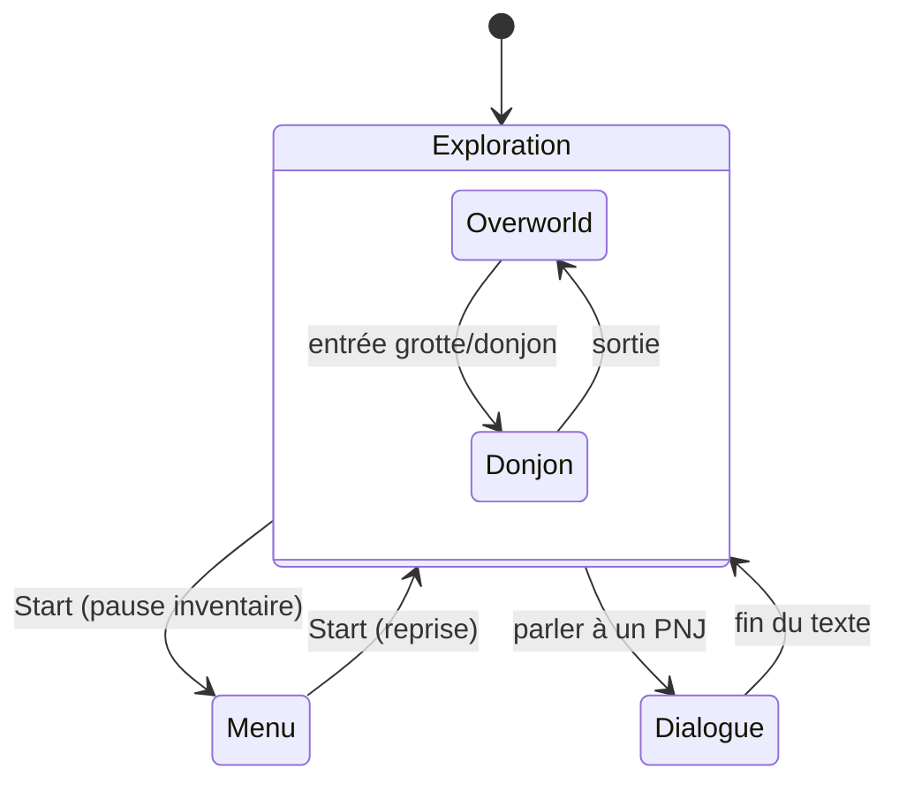
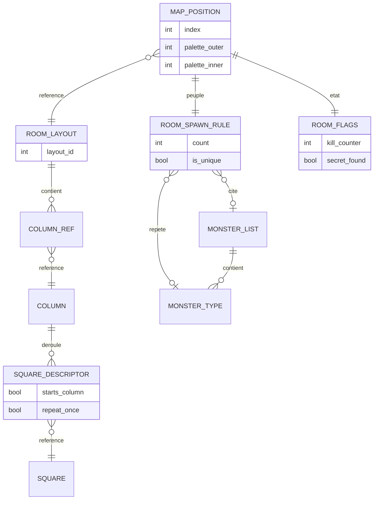

# Décorticage architecture — The Legend of Zelda (NES, 1986)

Grille appliquée : les 4 niveaux complets. Affirmations techniques recalées sur le [désassemblage d'Aldo Núñez](https://github.com/aldonunez/zelda1-disassembly) et la [ROM map Data Crystal](https://datacrystal.tcrf.net/wiki/The_Legend_of_Zelda/ROM_map).

## Niveau 1 — Machine à états globale

Différence notable avec Pokémon : pas d'état "Combat" séparé. Le combat est temps réel et se déroule dans le même état que l'exploration — pas un nouveau mode, juste un comportement de plus sur l'entité Link (une petite FSM locale : Idle / Marche / Attaque / Dégâts), pas un changement d'écran global.

L'Overworld et les donjons, eux, partagent le même état "Exploration" : le moteur de rendu et de déplacement est partagé entre les deux au niveau du code, seules les données de carte changent selon la zone.



**Leçon pour Godot** : la question n'est pas "combien d'états je code" mais "est-ce un nouveau MODE d'interaction, ou juste de nouvelles DONNÉES pour le mode existant ?" Pokémon avait besoin d'un vrai état Combat car le tour par tour change les règles d'interaction. Zelda n'en a pas besoin : marcher et taper à l'épée fonctionne pareil partout — un seul état "Exploration" paramétré par la carte courante suffit, avec juste une variable `current_map_id` plutôt qu'un autoload aussi élaboré que celui de Pokémon.

Le désassemblage confirme que c'est exactement ainsi que c'est fait : les routines de mise en page (`LayoutRoomOW`, `LayoutRoomUW`) sont distinctes mais la boucle de jeu, elle, ne l'est pas. Overworld et donjon diffèrent par leurs **tables de données** et par un jeu de bits, pas par leur moteur.

## Niveau 2 — Découpage des scènes

L'overworld est une grille de 16 × 8 écrans (128 au total). Chaque écran fait 16 × 11 — non pas 16 × 11 tuiles de 8×8, mais **16 × 11 « squares » de 16×16 pixels**, soit 32 × 22 tuiles matérielles. Le code boucle explicitement sur ces unités (`CMP #$0B ; There are $B square rows in the play area`, puis 16 colonnes), et convertit en pixels par `ligne × $10 + $40` — le `$40` étant le décalage sous le HUD.

Le défilement entre écrans est fluide, sans coupure franche. Fait notable, et c'est le cœur de ce niveau 2 : les écrans ne stockent pas chacun leurs squares en entier. Le mécanisme réel est à **trois niveaux d'indirection**, et chacun partage quelque chose :

1. **Position de carte → layout.** Il n'y a que **121 layouts stockés pour 128 positions** (`RoomLayoutsOW.dat`, 1936 octets = 121 × 16). Chaque position pointe le sien par les 6 bits bas d'un octet d'attribut (`GetUniqueRoomId` masque `AND #$3F`), donc plusieurs positions de carte partagent littéralement le même layout.
2. **Layout → colonnes.** Un layout fait 16 octets, un par colonne d'écran. Chaque octet est un *column descriptor* : nibble haut = numéro de table de colonnes (16 tables, `ColumnDirectoryOW` → `ColumnHeapOW0…F`), nibble bas = index de la colonne dans cette table. Il existe **150 colonnes uniques** pour tout l'overworld (964 octets).
3. **Colonne → squares.** Chaque octet d'une colonne est un *square descriptor* au format `%CDTTTTTT` : bit 7 = début d'une nouvelle colonne, bit 6 = répéter ce square une fois, bits 0–5 = index dans la table des squares. Le bit 6 est un RLE à un bit — la compression la plus économe possible.

Et la recoloration se joue à part : `FillPlayAreaAttrs` lit **2 bits** de palette extérieure et **2 bits** de palette intérieure par écran, puis remplit uniformément l'attribute table (`RoomPaletteSelectorToNTAttr: .BYTE $00, $55, $AA, $FF`). Quatre octets de code suffisent à faire qu'une même colonne partagée apparaisse verte dans une zone et ocre dans une autre. C'est bien une contrainte de place cartouche, pas un choix esthétique — mais le résultat esthétique est réel.

Les donjons suivent le même schéma en plus serré : `RoomLayoutsUW.dat` fait 504 octets = **42 salles × 12 colonnes**, sur 10 tables de colonnes, avec un descripteur différent (bits 4–6 = compteur de répétition sur 3 bits, bits 0–2 = index parmi seulement 8 squares primaires).

Deux façons de transposer ça en Godot, avec un vrai arbitrage à faire (pas juste "copier l'original") :

- **Une scène par écran** (comme pour Pokémon) — 128 fichiers `.tscn`, simple à raisonner, lourd à gérer
- **Un seul TileMap continu** + une caméra bornée dynamiquement par écran — plus proche de ce que Godot fait bien nativement (le TileMap gère déjà la réutilisation de tuiles que le NES devait faire à la main)

```gdscript
# Une seule scène pour tout l'overworld : la caméra se borne
# dynamiquement à la "case écran" où se trouve le joueur.
const SCREEN_WIDTH := 256
const SCREEN_HEIGHT := 176

func snap_camera_to_screen(camera: Camera2D, player_pos: Vector2) -> void:
	var sx := floori(player_pos.x / SCREEN_WIDTH)
	var sy := floori(player_pos.y / SCREEN_HEIGHT)
	camera.limit_left = sx * SCREEN_WIDTH
	camera.limit_right = (sx + 1) * SCREEN_WIDTH
	camera.limit_top = sy * SCREEN_HEIGHT
	camera.limit_bottom = (sy + 1) * SCREEN_HEIGHT
```

La deuxième option évite 128 fichiers de scène pour un rendu identique à l'écran — un arbitrage où la contrainte d'origine (mémoire cartouche) ne s'applique plus, donc pas la peine de la reproduire telle quelle.

En revanche, **le partage de layouts, lui, vaut d'être reproduit** — pas pour la place, pour la maintenance. 121 layouts au lieu de 128, c'est 7 écrans dont on est certain qu'ils resteront identiques parce qu'ils sont le même objet. C'est du Flyweight avant l'heure, et le niveau 4 y revient.

## Niveau 3 — Structures de données

Trois modèles distincts à décortiquer ici : la carte (ci-dessus, données de référence pures), le peuplement en ennemis, et l'état persistant. Les deux derniers sont le vrai intérêt du jeu, parce qu'ils illustrent un arbitrage qui ne se pose jamais dans un modèle relationnel classique : **que faut-il sauvegarder par instance, et que peut-on se permettre de perdre ?**

### Le peuplement : un identifiant + un compteur

L'attribution des ennemis se fait **par salle**, pas par donjon — et il n'existe pas de table de « groupes de boss » séparée. Chaque salle porte, dans ses octets d'attributs, un **identifiant de liste d'objets sur 7 bits** (6 bits dans l'attribut C, le bit haut dans l'attribut D) et un **index de quantité sur 2 bits** qui pointe dans `LevelInfo_FoeCounts`, quatre valeurs définies par niveau.

Le désassemblage distingue trois plages, et la logique est entièrement portée par la valeur de l'identifiant :

| Plage | Signification | Quantité |
|---|---|---|
| `< $32` | un **type** unique, répété | `count` exemplaires |
| `[$32, $62)` | objet non récurrent (boss, PNJ unique) | forcée à 1 |
| `≥ $62` | une **liste hétérogène** prédéfinie (`ObjListAddrs`, 30 entrées) | `count` types lus dans la liste |

C'est un champ polymorphe : le même octet est tantôt une clé étrangère vers une table de types, tantôt vers une table de listes, et la plage numérique fait office de discriminant. Ça marche, c'est compact, et c'est exactement le genre de champ dont le sens s'oublie six mois plus tard. Transposé en Godot, on sépare les deux cas plutôt que de les superposer :

```gdscript
class_name RoomSpawnRule
extends Resource

## Deux cas exclusifs : soit un type répété, soit une liste hétérogène.
## L'original les superposait dans un seul octet ; on les distingue ici.
@export var repeated_type: MonsterType         ## null si on utilise une liste
@export var monster_list: MonsterList          ## null si on répète un type
@export_range(0, 9) var count: int = 3
@export var is_unique: bool = false            ## boss / PNJ : force count = 1

func resolve() -> Array[MonsterType]:
	if is_unique:
		return [repeated_type] as Array[MonsterType]
	if monster_list != null:
		return monster_list.types.slice(0, count)
	var out: Array[MonsterType] = []
	out.resize(count)
	out.fill(repeated_type)
	return out
```

```gdscript
class_name MonsterList
extends Resource

## Une des 30 listes hétérogènes prédéfinies.
## Donnée de référence pure : partagée par toutes les salles qui la citent.
@export var types: Array[MonsterType] = []

class_name MonsterType
extends Resource

@export var display_name: String = ""
@export var scene: PackedScene
@export var max_hp: int = 1
@export var damage: int = 1
@export var behavior: MonsterBehavior          ## Strategy, voir niveau 4
@export var drops: Array[DropEntry] = []
```

Les positions d'apparition ne sont pas stockées par salle non plus : quatre listes de neuf positions (`SpawnPosList0..3`), choisies par `AssignObjSpawnPositions`. Encore du partage : une salle ne possède pas ses emplacements, elle en cite un jeu.

### Le schéma vu comme base de données



Trois familles cette fois, et c'est la nouveauté par rapport à Pokémon :

- **Données de référence** (`Column`, `Square`, `RoomLayout`, `MonsterType`, `MonsterList`) — en ROM, jamais modifiées, massivement partagées ;
- **Données de définition par position** (`MapPosition` : quel layout, quelle palette, quelle règle de peuplement) — en ROM aussi, mais une ligne par écran ;
- **Données d'état** (`RoomFlags`) — la seule partie en RAM sauvegardée, et elle est minuscule.

Pokémon séparait référence et instance. Zelda ajoute une distinction que tout modèle de jeu finit par rencontrer : la **définition** d'un lieu (immuable, en ROM) n'est pas son **état** (mutable, sauvegardé). Mélanger les deux, c'est se retrouver à sauvegarder la carte entière.

### L'état persistant : un octet par salle, et des pertes assumées

Le schéma réel est d'une économie remarquable : **un octet par salle, 128 octets par monde**, adressé par `GetRoomFlags` (`LDY RoomId ; LDA ($00),Y`). Trois copies existent en RAM sauvegardée, une par fichier de sauvegarde.

En donjon :

| Bits | Contenu |
|---|---|
| 0–3 | portes ouvertes, une par direction |
| 4 | objet de la salle ramassé |
| 5 | salle visitée (pour la carte) |
| 6–7 | compteur de monstres tués, **saturé à 3** |

En overworld :

| Bits | Contenu |
|---|---|
| 0–2 | compteur de monstres tués, **saturé à 7** |
| 7 | secret découvert |

Ce bit 7 de l'overworld est celui qui fait le plus de travail dans tout le jeu : c'est lui qui transforme durablement un arbre en escalier ou un rocher en entrée de grotte (`LayoutRoomOrCaveOW` : `AND #$80 / BEQ @SkipSecret`). Un bit, et la carte du joueur n'est plus celle du départ.

**Ce qui est perdu, et c'est volontaire** : on ne stocke qu'un compteur saturé, jamais l'identité ni la position des monstres tués. Le décompte exact vit dans un tableau RAM non sauvegardé (`LevelKillCounts`), et un historique des **six dernières salles** (`RoomHistory`) sert à ne pas réengendrer les ennemis immédiatement quand on fait un aller-retour. Au-delà de cette fenêtre de six, on retombe sur le compteur saturé : d'où les réapparitions partielles que tout joueur a remarquées sans savoir les nommer.

Les blocs poussés ne sont pas stockés du tout. Seul leur **effet** persiste, via les bits porte/secret ; le bloc poussable lui-même est retrouvé à chaque entrée en **scannant le layout** à la recherche d'une tuile de bloc sur une ligne donnée (`FindAndCreatePushBlockObject`). C'est-à-dire : l'état n'est pas « ce bloc est ici », mais « la conséquence de l'avoir poussé est acquise ».

La transposition Godot évidente — et l'erreur à ne pas commettre :

```gdscript
class_name RoomFlags
extends RefCounted

## Un seul octet suffisait sur NES. Ici on peut être explicite :
## ce qui compte, c'est de garder la MÊME granularité de perte,
## pas de reproduire le bitfield.
var doors_opened: int = 0          ## bitmask 4 directions
var item_taken: bool = false
var visited: bool = false
var kill_counter: int = 0          ## saturé, pas exact
var secret_found: bool = false

func to_dict() -> Dictionary:
	return {
		"doors": doors_opened,
		"item": item_taken,
		"visited": visited,
		"kills": kill_counter,
		"secret": secret_found,
	}
```

Le réflexe naturel, sur PC, serait de sauvegarder chaque ennemi individuellement — son identifiant, sa position, ses PV. Techniquement possible, et c'est précisément le piège : ça transforme une sauvegarde de quelques centaines d'octets en sérialisation d'un monde entier, et ça t'oblige à décider ce qui se passe quand tu modifies le peuplement d'une salle entre deux versions de ton jeu (une sauvegarde qui référence un ennemi supprimé, c'est une clé étrangère cassée). Le compteur saturé n'est pas une limitation de 1986 ; c'est un choix de granularité qui reste défendable aujourd'hui.

## Niveau 4 — Design patterns observés

| Pattern | Où | Idiome Godot |
|---|---|---|
| Flyweight | 121 layouts pour 128 écrans, 150 colonnes partagées, 30 listes de monstres | Resource partagée via le cache du `ResourceLoader` |
| Composition over inheritance | une salle référence un layout, une règle de peuplement, une palette | Resources référencées |
| Strategy | comportement de déplacement par type de monstre | sous-classes de `MonsterBehavior` |
| State | FSM locale de Link (Idle / Marche / Attaque / Dégâts) | objet State imbriqué, sans changement de scène |
| Memento | l'octet de flags par salle | `Dictionary` sérialisé en JSON |

Les définitions générales sont dans [`../_framework/design-patterns.md`](../_framework/design-patterns.md) ; ci-dessous, ce qui est propre à ce jeu.

### Flyweight, en trois couches superposées

Pokémon partageait ses `PokemonSpecies`. Zelda partage à trois échelles imbriquées — square, colonne, layout — et c'est la démonstration la plus claire du corpus que le Flyweight se compose :

```gdscript
class_name RoomLayout
extends Resource

## 16 colonnes, chacune une référence vers une Column partagée.
## Deux positions de carte peuvent référencer CE MÊME layout.
@export var columns: Array[Column] = []

class_name Column
extends Resource

## Les squares d'une colonne, avec le drapeau de répétition
## qui tenait dans le bit 6 du descripteur d'origine.
@export var entries: Array[SquareEntry] = []

class_name SquareEntry
extends Resource

@export var square: Square          ## référence partagée, jamais dupliquée
@export var repeat_once: bool = false
```

Le gain en mémoire n'est plus l'argument sur PC. L'argument qui reste, et il est plus fort : **une référence partagée est une garantie d'identité**. Si deux écrans doivent rester visuellement cohérents, les faire pointer vers le même `RoomLayout` rend la divergence impossible, là où deux copies finiront par diverger à la première retouche.

### Strategy — le comportement par type de monstre

```gdscript
class_name MonsterBehavior
extends Resource

func update(monster: Node2D, delta: float) -> void:
	pass

class_name WalkGridBehavior
extends MonsterBehavior

@export var speed: float = 40.0
@export var turn_chance: float = 0.02

var _direction := Vector2.RIGHT

func update(monster: Node2D, delta: float) -> void:
	if randf() < turn_chance:
		_direction = [Vector2.RIGHT, Vector2.LEFT, Vector2.UP, Vector2.DOWN].pick_random()
	monster.position += _direction * speed * delta

class_name ChargeOnSightBehavior
extends MonsterBehavior

@export var speed: float = 120.0

func update(monster: Node2D, delta: float) -> void:
	if monster.aligned_with_player():
		monster.position += monster.direction_to_player() * speed * delta
```

Le comportement est un champ du `MonsterType` (`@export var behavior: MonsterBehavior`), donc une donnée éditable dans l'inspecteur — même structure que les `MoveEffect` de Pokémon. C'est le pattern le plus réutilisable du corpus, et c'est exactement celui que tu appliqueras au nouveau type de mob de Dodge the Creeps.

### Memento — le pattern que l'octet de flags met en œuvre sans le nommer

Sauvegarder l'état d'un objet à l'extérieur de cet objet, sous une forme opaque qu'il sait relire, sans exposer sa structure interne : c'est la définition GoF du Memento. L'octet de flags par salle en est un, minimal.

```gdscript
class_name WorldFlags
extends RefCounted

var _rooms: Dictionary = {}          ## room_id: int -> RoomFlags

func flags_for(room_id: int) -> RoomFlags:
	if not _rooms.has(room_id):
		_rooms[room_id] = RoomFlags.new()
	return _rooms[room_id]

#region Sérialisation
func save_to(path: String) -> void:
	var payload := {}
	for room_id in _rooms:
		payload[str(room_id)] = _rooms[room_id].to_dict()
	var f := FileAccess.open(path, FileAccess.WRITE)
	f.store_string(JSON.stringify(payload, "\t"))

func load_from(path: String) -> void:
	if not FileAccess.file_exists(path):
		return
	var parsed: Variant = JSON.parse_string(FileAccess.open(path, FileAccess.READ).get_as_text())
	if typeof(parsed) != TYPE_DICTIONARY:
		push_warning("Sauvegarde illisible, état des salles réinitialisé")
		return
	for key in parsed:
		flags_for(int(key)).from_dict(parsed[key])
#endregion
```

Le `Dictionary` creux plutôt qu'un tableau de 128 entrées, c'est le même arbitrage que l'original poussé un cran plus loin : une salle jamais visitée n'occupe rien. Et le parallèle avec ton `GameState.gd` de Dodge the Creeps est direct — même autoload, même JSON, même principe de clés centralisées.

## Aperçu — ce qui n'a pas été creusé

Deux mécanismes repérés mais volontairement laissés de côté, parce qu'ils n'apportent pas de leçon d'architecture nouvelle par rapport à ce qui précède : le système de sons (deux canaux de bruit partagés entre effets et musique, avec priorités) et le format des textes des PNJ (compressé par dictionnaire de mots fréquents, à comparer au RLE de Final Fantasy si l'envie de creuser la compression revient).

## Corrections et ajouts

- **Niveau 2, unité de mesure** — « 16 × 11 tiles » était faux d'un facteur 2 : ce sont 16 × 11 **squares de 16×16 pixels**, soit 32 × 22 tuiles matérielles. Le code boucle bien sur `$B` lignes de squares.
- **Niveau 2, mécanisme de partage** — la version précédente disait « les écrans référencent des séquences de colonnes partagées » sans plus de détail. Détaillé en trois niveaux d'indirection avec les chiffres réels : 121 layouts pour 128 positions, 16 tables de colonnes, 150 colonnes uniques, descripteur `%CDTTTTTT` avec son RLE à un bit. Ajout du mécanisme de palette (2 + 2 bits par écran) qui rend le partage invisible à l'œil, et du schéma donjon (42 salles × 12 colonnes, 10 tables, 8 squares primaires).
- **Niveau 2** — ajout de l'argument qui justifie de reproduire le partage de layouts en Godot malgré l'absence de contrainte mémoire : garantie d'identité, pas économie de place.
- **Niveau 3, peuplement** — corrigé sur le point principal : l'attribution des ennemis est **par salle, pas par donjon**, et il n'existe **pas de table de groupes de boss** — un identifiant dans `[$32, $62)` force simplement une quantité de 1. Détaillé le champ polymorphe (identifiant 7 bits dont la plage fait office de discriminant), les 30 listes prédéfinies, l'index de quantité sur 2 bits vers `LevelInfo_FoeCounts`, et les 4 listes de 9 positions d'apparition. La transposition GDScript sépare volontairement les deux cas que l'original superposait.
- **Niveau 3, état persistant** — la version précédente disait « un schéma de flags volontairement limité », qualifié de "lossy" par blargg. **L'attribution nominative est retirée** : le terme n'a pas pu être retrouvé dans une source consultable, et il valait mieux le remplacer par la description factuelle. Ajouté : le schéma exact (1 octet par salle, 128 par monde, 3 fichiers de sauvegarde), la répartition des bits en donjon et en overworld, la fenêtre d'historique de 6 salles, et le fait que les blocs poussés ne sont pas stockés — seul leur effet l'est, le bloc étant retrouvé par scan du layout.
- **Niveau 3** — ajout de la distinction en trois familles (référence / définition par position / état), qui est la vraie nouveauté du jeu par rapport au modèle référence/instance de Pokémon, et de l'argument contre la sérialisation par ennemi.
- **Niveau 4** — était absent. Ajouté en entier : Flyweight en trois couches composées, Strategy avec le pont vers Dodge the Creeps, Memento avec la sérialisation JSON et le parallèle avec `GameState.gd`.
- **Sources** — remplacement des sources secondaires par le désassemblage et la ROM map, avec les noms de routines et les offsets.

## Sources

- Mise en page, colonnes, palettes, peuplement : [`src/Z_05.asm`](https://raw.githubusercontent.com/aldonunez/zelda1-disassembly/master/src/Z_05.asm) (`LayoutRoomOW`, `LayoutRoomOrCaveOW`, `GetUniqueRoomId`, `FillPlayAreaAttrs`, `InitMode_EnterRoom`, `AssignObjSpawnPositions`, `FindAndCreatePushBlockObject`, `ModifyObjCountByHistoryOW/UW`)
- Drapeaux de salle : [`src/Z_07.asm`](https://raw.githubusercontent.com/aldonunez/zelda1-disassembly/master/src/Z_07.asm) (`GetRoomFlags`, `LevelMasks`, `MarkRoomVisited`), [`src/Z_01.asm`](https://raw.githubusercontent.com/aldonunez/zelda1-disassembly/master/src/Z_01.asm) (`SetRoomFlagUWItemState`), [`src/Variables.inc`](https://raw.githubusercontent.com/aldonunez/zelda1-disassembly/master/src/Variables.inc)
- Listes d'objets : [`src/dat/ObjListAddrs.inc`](https://raw.githubusercontent.com/aldonunez/zelda1-disassembly/master/src/dat/ObjListAddrs.inc) (30 entrées)
- Offsets et tailles des tables (layouts, colonnes, squares, peuplement) : [Data Crystal — ROM map](https://datacrystal.tcrf.net/wiki/The_Legend_of_Zelda/ROM_map)
- Structure de l'overworld, vue d'ensemble : [inventwithpython.com — NES Legend of Zelda map data](https://inventwithpython.com/blog/8-bit-nes-legend-of-zelda-map-data)
