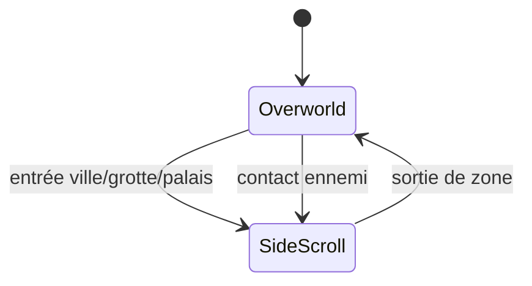
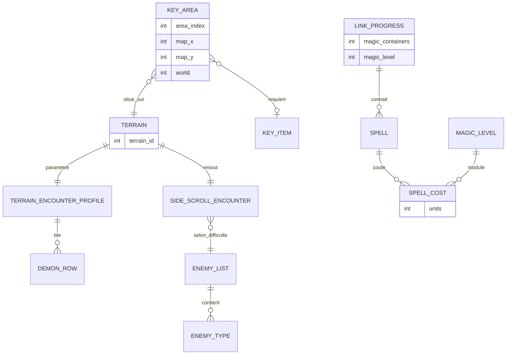

# Décorticage architecture — Zelda II: The Adventure of Link (NES, 1987)

Grille appliquée : les 4 niveaux complets, glitch illustratif. Affirmations techniques recalées sur le [désassemblage de Trax](https://github.com/FiendsOfTheElements/z2disassembly) et la [RAM/ROM map Data Crystal](https://datacrystal.tcrf.net/wiki/Zelda_II:_The_Adventure_of_Link/RAM_map).

## Niveau 1 — Machine à états globale

Contrairement à Zelda 1 et Mario, ici c'est un vrai changement de mode d'interaction, pas juste de nouvelles données pour le même mode — le genre RPG a explicitement influencé ce choix.



L'overworld (vue du dessus) sert uniquement à la navigation — aucun combat ne s'y déroule directement. Des sprites d'ennemis s'y déplacent visiblement (un blob pour les faibles, un bipède pour les costauds, une fée pour soigner) ; entrer en contact avec l'un d'eux, ou marcher sur une case ville/grotte/palais, bascule vers le mode vue de côté, seul endroit où le combat, la magie et l'interaction avec les PNJ existent.

**Nuance sur la leçon des niveaux précédents** : Zelda 1 et Mario n'avaient pas besoin d'état "Combat" séparé parce que le temps réel gardait les mêmes règles partout. Ici, la question se pose différemment et la réponse change : naviguer (8 directions, pas de gravité, pas de combat) et se battre (gravité, saut, attaque, sorts) sont deux modèles d'interaction réellement distincts, donc deux vrais états au sens plein — même architecture questionnée, réponse différente selon le jeu.

Le désassemblage donne une précision qui compte pour le glitch : la transition n'est pas déclenchée par une zone de collision au sens Godot, mais par un **scan de table à comparaison exacte de coordonnées**. `Check_if_Link_stepped_on_a_Key_Area` parcourt les entrées de la table des Key Areas et compare la position de Link (`$73`/`$74`) aux colonnes `$6A00,x` et `$6A3F,x`. Pas de tolérance, pas de rectangle : une égalité. C'est l'équivalent d'un `WHERE y = ? AND x = ?` sur une table indexée — efficace, et sans le moindre filet si la position lue n'est pas celle qu'on croit.

## Niveau 2 — Découpage des scènes

L'overworld reprend une logique de zones proche de Zelda 1 (même studio, Nintendo R&D4), mais ne sert plus qu'à la navigation. Chaque ville, grotte ou palais est une zone en vue de côté totalement séparée, chargée à l'entrée — dans l'esprit des warps de Zelda 1, mais cette fois le changement de scène implique aussi un changement de modèle physique complet (gravité et saut apparaissent, le déplacement 8 directions disparaît).

L'indexation des zones mérite d'être regardée de près, parce que c'est elle qui portera tout le poids du glitch. Une variable unique, `$0748`, sert d'index dans **quatre tables parallèles de 63 entrées** :

| Table | Plage | Contenu |
|---|---|---|
| `$6A00`–`$6A3E` | 63 octets | position Y de la zone sur l'overworld |
| `$6A3F`–`$6A7D` | 63 octets | position X |
| `$6A7E`–`$6ABC` | 63 octets | numéro de carte |
| `$6ABD`–`$6AFB` | 63 octets | numéro de « world » |

Quatre tableaux alignés, un seul index. En modèle relationnel, c'est une table à quatre colonnes stockée en *column-major* : toutes les valeurs de Y à la suite, puis toutes celles de X, etc. Parfaitement légitime, et c'est exactement ce que fait un stockage orienté colonnes moderne. Le problème n'est pas là — il est dans le fait que rien ne vérifie que l'index reste dans `[0, 62]`.

**Progression par objet-clé : vérifiée en code, pas seulement en level design.** Certains passages de l'overworld sont bloqués jusqu'à l'obtention d'un objet précis, et chaque blocage est un test explicite :

- **Marteau** (`$078B`) — bouton A ; si le terrain regardé (`$0563`) est un rocher (`$0E`) ou une forêt (`$06`) et que le marteau est possédé, la case est *transformée*. La transformation passe par une table : `0E→04` rocher→désert, `0F→04` toile d'araignée→désert, `04→02` désert→palais (le Palais Caché), `06→00` forêt→ville (Kasuto Caché, avec vérification des coordonnées exactes en plus).
- **Flûte** (`$0789`) — bouton B, puis comparaison de la position à la case du Palais Caché.
- **Radeau** (`$0787`) — la Key Area du dock de West Hyrule est simplement **ignorée pendant le scan** si le drapeau est nul.
- **Bottes** (`$0788`) — le terrain « eau franchissable » (`$0D`) n'est traversable que si les bottes sont possédées ; tout terrain ≥ `$0B` est bloqué sinon.

Quatre objets, quatre mécanismes différents : modification de donnée de carte, comparaison de position, entrée de table masquée, et règle de franchissement. C'est un vrai mécanisme de progression par objet-clé, la marque de fabrique du genre qu'on appellera plus tard « metroidvania » — et le contraste avec Metroid est instructif : [là-bas](../metroid), **aucune** porte ne teste une capacité, tout est dans le level design. Ici, tout est en code. Deux réponses opposées à la même question de design.

Pour Godot : un autoload conserve l'état persistant de Link (niveau, objets, sorts, PV, magie) pendant que deux familles de scènes bien distinctes se succèdent — une scène `Overworld` (déplacement libre, pas de gravité) et des scènes `SideScroll` (`CharacterBody2D` avec gravité/saut). Contrairement à Pokémon où une seule scène de combat suffisait, ici il faut vraiment deux moteurs de mouvement différents partageant le même autoload de données.

## Niveau 3 — Structures de données

Trois modèles à décortiquer : les rencontres (une cascade de tables indexées par terrain), les sorts (une table à clé composite), et la scène de combat sélectionnée (un index calculé — correctement borné, cette fois).

### Les rencontres : tout est indexé par le terrain

La version initiale de ce fichier disait « une table par région du monde ». C'est **par terrain**, pas par région — et le mécanisme est une cascade de cinq tables :

```
terrain courant
  └→ table $8231 : terrain → groupe 0-6
       ├→ table $823F : délai avant la prochaine vague de démons
       ├→ table $8246 : durée de vie d'un démon
       └→ table $824D : 4 seuils de RNG → choix d'une ligne
            └→ table $8265 : 4 lignes × 4 démons → type de démon
```

Les sept terrains sont Désert, Herbe, Forêt, Marais, Cimetière, Route, Lave. Les valeurs donnent le rythme du jeu de façon très lisible : le délai vaut `$03` sur la lave et `$09` sur la route (harcèlement constant), contre `$20` en herbe et au cimetière (tranquillité relative). Et la quatrième ligne de la table de probabilités, `01 03 01 03`, est la « ligne fée » — la seule d'où peuvent sortir des soins.

Transposé, ça devient une Resource par terrain, ce qui rend le tuning éditable sans toucher au code :

```gdscript
class_name TerrainEncounterProfile
extends Resource

## Une Resource par terrain (Désert, Herbe, Forêt, Marais, Cimetière, Route, Lave).
## Remplace la cascade de cinq tables parallèles de l'original.
@export var terrain_name: String = ""
@export_range(1, 64) var spawn_delay_frames: int = 32
@export_range(1, 64) var demon_lifetime: int = 16

## Quatre lignes de quatre types, tirées par un seuil de RNG.
## La ligne "fée" est celle qui contient DemonKind.FAIRY.
@export var probability_rows: Array[DemonRow] = []
@export var row_thresholds: PackedByteArray = PackedByteArray([64, 128, 192, 255])

func pick_demon(rng: RandomNumberGenerator) -> int:
	var roll := rng.randi_range(0, 255)
	for i in row_thresholds.size():
		if roll <= row_thresholds[i]:
			return probability_rows[i].kinds.pick_random()
	return probability_rows[-1].kinds.pick_random()

class_name DemonRow
extends Resource

enum DemonKind { FAIRY = 0, WEAK = 1, STRONG = 2 }

@export var kinds: Array[DemonKind] = []
```

### La scène de combat : un index calculé, et correctement borné

Une fois le contact établi, quelle zone en vue de côté charger ? L'original calcule :

```
index = (terrain_regardé - 4) × 2 + drapeau_sud
```

Le drapeau sud vient de la comparaison de la position Y de Link à une frontière nord/sud propre à la région. Le résultat indexe une table de **7 terrains × 2 entrées** (nord, sud), et le résultat est écrit dans un créneau de zone pseudo, `$3E` — un brouillon réutilisé pour toutes les rencontres aléatoires.

**Et cet index-là est correctement borné.** Deux tests en amont (`CMP #$04 / BCC skip` et `CMP #$0D / BEQ skip`) combinés à la règle de franchissement (terrain ≥ `$0B` bloqué, `$0D` franchissable seulement avec les bottes) garantissent que seuls les terrains `$04`–`$0A` peuvent déclencher une rencontre — exactement les sept entrées de la table. Aucun débordement possible.

Garder ce point en tête pour le glitch plus bas : **le même jeu borne cet index-ci et pas celui-là.** Ce n'est pas une équipe qui ignorait la question, c'est une équipe qui l'a traitée là où elle y a pensé.

La difficulté de la scène dépend enfin du type de démon touché : `$075A` vaut 0 pour une fée, 1 pour un faible, 2 pour un costaud, et à partir de 2 la routine de chargement **avance le pointeur de liste d'ennemis vers la zone suivante** — c'est-à-dire qu'une rencontre difficile réutilise la même zone avec la liste d'ennemis de la zone d'après. Un décalage de pointeur pour changer la difficulté : rien de plus économe, et rien de plus fragile si le pointeur arrive en bout de table.

```gdscript
class_name SideScrollEncounter
extends Resource

## Sept terrains × 2 (nord/sud), comme la table d'origine.
@export var scene_north: PackedScene
@export var scene_south: PackedScene

## Trois listes de difficulté croissante, plutôt qu'un décalage de pointeur.
@export var enemy_list_fairy: EnemyList
@export var enemy_list_weak: EnemyList
@export var enemy_list_strong: EnemyList

func list_for(kind: DemonRow.DemonKind) -> EnemyList:
	match kind:
		DemonRow.DemonKind.FAIRY: return enemy_list_fairy
		DemonRow.DemonKind.STRONG: return enemy_list_strong
		_: return enemy_list_weak
```

Trois références explicites plutôt qu'un `+1` sur un pointeur : plus verbeux, impossible à faire déborder, et surtout lisible six mois plus tard.

### Les sorts : une table à clé composite, et un gating à deux conditions

Les huit sorts sont, **dans l'ordre interne** : Shield, Jump, Life, **Fairy**, Fire, Reflect, Spell, Thunder. (La version initiale de ce fichier plaçait Fairy en dernier ; il est quatrième — confirmé par la table de pointeurs de routines, par les drapeaux `$077B`–`$0782` et par le texte du menu de pause.)

Le coût n'est pas un scalaire par sort : c'est une table de **8 sorts × 8 niveaux de magie**, lue par `coût = table[sort × 8 + niveau_de_magie]`. L'unité du compteur est parlante : un conteneur de magie vaut `$20` = 32 unités.

| Sort | Niveau 1 → Niveau 8 (hex) |
|---|---|
| Shield | 40 30 30 20 20 20 20 20 |
| Jump | 60 50 40 40 28 20 18 10 |
| Life | 8C 8C 78 78 64 64 64 64 |
| Fairy | A0 A0 78 78 50 50 50 50 |
| Fire | F0 A0 78 3C 20 20 20 20 |
| Reflect | F0 F0 A0 60 50 40 30 20 |
| Spell | F0 E0 C0 A0 60 40 30 20 |
| Thunder | F0 F0 F0 F0 F0 F0 C8 80 |

C'est une relation many-to-many **avec payload**, à clé composite `(sort, niveau_de_magie)` — la même famille que le movepool de Pokémon, mais où les deux côtés de la relation sont des données de référence et où la table est *dense* : les 64 cases existent. Quand une table de jointure est pleine par construction, elle se stocke comme une matrice, pas comme une liste de lignes. C'est exactement l'arbitrage `Array[Array]` contre `Array[JoinEntity]` en GDScript :

```gdscript
class_name SpellCostTable
extends Resource

enum Spell { SHIELD, JUMP, LIFE, FAIRY, FIRE, REFLECT, SPELL, THUNDER }

const MAGIC_LEVELS := 8
const UNITS_PER_CONTAINER := 32

## Matrice dense 8 × 8 : la jointure est pleine, donc pas d'entité de jointure.
## Une ligne par sort, huit colonnes de niveau de magie.
@export var costs: Array[PackedByteArray] = []

func cost_of(spell: Spell, magic_level: int) -> int:
	return costs[spell][clampi(magic_level, 0, MAGIC_LEVELS - 1)]

func can_cast(spell: Spell, magic_level: int, current_magic_units: int) -> bool:
	return current_magic_units >= cost_of(spell, magic_level)
```

**Le gating est doublement conditionné**, et le second test est facile à manquer. La routine de dialogue du Sage pose bien le drapeau du sort — mais **seulement si le nombre de conteneurs de magie est suffisant** : le sort d'index N exige N+1 conteneurs. Parler au bon PNJ ne suffit pas ; il faut aussi avoir progressé. Deux verrous indépendants sur la même porte, tous les deux en code :

```gdscript
class_name LinkProgress
extends Node                       ## autoload

var magic_containers: int = 1
var magic_level: int = 1
var known_spells: int = 0          ## bitmask sur SpellCostTable.Spell

func try_learn(spell: SpellCostTable.Spell) -> bool:
	## Le PNJ enseigne, mais la progression autorise.
	if magic_containers < spell + 1:
		return false
	known_spells |= 1 << spell
	return true

func knows(spell: SpellCostTable.Spell) -> bool:
	return (known_spells & (1 << spell)) != 0
```

### Le schéma vu comme base de données



`SPELL_COST` est l'entité de jointure promue du jeu, à clé composite `(sort, niveau)`. Le contraste avec Pokémon vaut d'être noté : là-bas la jointure était *creuse* (un Pokémon connaît 4 capacités sur des dizaines possibles) donc stockée en liste ; ici elle est *dense* (64 cases sur 64) donc stockée en matrice. Même relation logique, deux structures physiques, et le critère de choix est le taux de remplissage — exactement le raisonnement qui fait choisir entre une table de jointure et une colonne calculée en base.

## Niveau 4 — Design patterns observés

| Pattern | Où | Idiome Godot |
|---|---|---|
| Singleton | état persistant de Link entre deux familles de scènes | Autoload |
| Strategy | un effet différent par sort | sous-classes de `SpellEffect` |
| Flyweight | profils de terrain, listes d'ennemis, table de coûts | Resource partagée |
| State | overworld / vue de côté, deux modèles de mouvement | changement de scène + autoload |
| Command | les sorts liés à des drapeaux et invoqués par index | `Dictionary` de `Callable` ou d'objets |

Les définitions générales sont dans [`../_framework/design-patterns.md`](../_framework/design-patterns.md).

### Strategy — les sorts

Le candidat direct annoncé dans la version initiale de ce fichier, et le plus propre du corpus après les `MoveEffect` de Pokémon :

```gdscript
class_name SpellEffect
extends Resource

@export var spell_id: SpellCostTable.Spell = SpellCostTable.Spell.SHIELD

func cast(link: Node2D) -> void:
	push_warning("cast() non implémenté")

class_name ShieldEffect
extends SpellEffect

@export var damage_divisor: int = 2
@export var duration: float = -1.0            ## -1 = jusqu'à la sortie de zone

func cast(link: Node2D) -> void:
	link.add_defense_modifier(damage_divisor, duration)

class_name JumpEffect
extends SpellEffect

@export var jump_multiplier: float = 1.8

func cast(link: Node2D) -> void:
	link.jump_velocity *= jump_multiplier

class_name LifeEffect
extends SpellEffect

@export var heal_amount: int = 64

func cast(link: Node2D) -> void:
	link.heal(heal_amount)
```

### Command — l'original le fait déjà, sans le nommer

Le désassemblage a une `Pointer_Table_for_spells_routines` : huit entrées, une routine par sort, invoquée par index. C'est littéralement le pattern Command — une action encapsulée, référencée par une clé, exécutée sans que l'appelant sache laquelle. La transposition en tire le même bénéfice gratuit que partout ailleurs :

```gdscript
class_name SpellBook
extends Node

var _effects: Dictionary = {}                 ## Spell -> SpellEffect
var _cast_log: Array[SpellCostTable.Spell] = []

func register(effect: SpellEffect) -> void:
	_effects[effect.spell_id] = effect

func cast(spell: SpellCostTable.Spell, link: Node2D) -> bool:
	if not LinkProgress.knows(spell):
		return false
	var cost := cost_table.cost_of(spell, LinkProgress.magic_level)
	if not cost_table.can_cast(spell, LinkProgress.magic_level, link.magic_units):
		return false
	link.magic_units -= cost
	_effects[spell].cast(link)
	_cast_log.append(spell)                   ## historique gratuit
	return true
```

L'historique en fin de méthode est le bénéfice secondaire du pattern : encapsuler l'action dans un objet rend le log, le replay et l'undo triviaux. Pour un RPG au tour par tour — le prochain projet du backlog — c'est exactement ce qui alimente un journal de combat sans code dédié.

### State — deux moteurs de mouvement, un seul état de données

Ce que ce jeu ajoute au corpus, c'est un cas de State où **le changement d'état est un changement de scène**, et où ce qui persiste est explicitement séparé de ce qui ne persiste pas :

```gdscript
extends Node                                  ## autoload GameState

enum Mode { OVERWORLD, SIDE_SCROLL }

var mode: Mode = Mode.OVERWORLD

#region Persistant entre les deux modes
var progress := LinkProgress.new()
var current_hp: int = 16
var magic_units: int = 32
var overworld_position := Vector2i.ZERO
var facing := Vector2i.RIGHT                  ## la variable au cœur du glitch
#endregion

func enter_side_scroll(encounter: SideScrollEncounter, from_south: bool) -> void:
	mode = Mode.SIDE_SCROLL
	var scene := encounter.scene_south if from_south else encounter.scene_north
	get_tree().change_scene_to_packed(scene)

func return_to_overworld(exit_direction: Vector2i) -> void:
	mode = Mode.OVERWORLD
	## UNE seule variable de direction, et c'est celle-ci.
	facing = exit_direction
	overworld_position += exit_direction
	get_tree().change_scene_to_file("res://overworld/Overworld.tscn")
```

Le commentaire sur `facing` n'est pas décoratif : c'est précisément la duplication de cette variable qui casse le jeu d'origine.

## Glitch illustratif — l'absence de garde-fou, et ce que la version initiale affirmait à tort

La version initiale de ce fichier présentait « Glitch Town » comme **un vrai mécanisme défensif pour état invalide** : un écran de secours nommé en interne, vers lequel le jeu se redirigerait volontairement plutôt que de planter. C'est faux, et il faut le dire nettement parce que toute la leçon en dépendait.

**Le code ne contient aucune vérification de borne.** Trois preuves :

1. `$0748` indexe quatre tables de **63 entrées** (niveau 2). Aucun test ne vérifie `[0, 62]`.
2. Le code de ville et le code de palais sont calculés **en aveugle, par soustraction** : `$056B = ($0748 - $2C) / 2` et `$056C = $0748 - $34`. Un `$0748` hors plage produit une soustraction qui boucle et un index de ville ou de palais arbitraire, sans le moindre test.
3. Le numéro de « world » est calculé `(AreaByte3 >> 2) & $07`, donc **0 à 7** — alors que la table de pointeurs correspondante ne contient que **6 entrées**. Les mondes 6 et 7 lisent au-delà de la table et récupèrent un pointeur poubelle.

Ce n'est pas la signature d'un écran de secours. C'est la signature d'un index hors plage non protégé. Et rien dans TCRF ni dans Data Crystal ne documente un fallback intentionnel ; TCRF liste des zones *inutilisées* (une grotte sans pointeur, une aire de cimetière atteignable seulement par code), ce qui est autre chose. Le nom « Glitch Town » lui-même n'a pas pu être retrouvé dans une source consultable : au mieux un surnom communautaire pour une zone atteinte par index hors plage.

**Le « Scroll Lock » existe bien, mais sa cause n'est pas celle annoncée.** Ce n'est pas « sortir par la mauvaise porte » : c'est un **débordement de tableau**, et le désassemblage le documente noir sur blanc. Une routine met en cache les données de scroll d'une salle dans une série de tableaux indexés par X — `$697B,x`, `$6982,x`, … `$69BA,x`. Or `$69C4` est `STOP_SCROLLING_LEFT_AT_THIS_MAP_PAGE`, soit exactement `$69BA + $0A`. Quand X vaut `$0A`, l'écriture dans le dernier tableau **écrase la limite de scroll gauche**, et le défilement est verrouillé définitivement. Le commentaire du désassemblage, à cet endroit précis :

> *« This is where healer glitch writes 69C4 at 1, triggering scroll lock — X=A »*

Le nom communautaire attesté est donc **« healer glitch »** — lié à la guérisseuse en ville — et le scroll lock en est la conséquence, pas un mécanisme indépendant.

**Sur le mécanisme de transition lui-même**, la version initiale parlait d'un « subpixel de sortie » atteint par la position X de Link, avec un changement de direction à la frame exacte. Rien de tel dans le code. Ce qui est réellement couplé à la direction, c'est la **sortie** d'une zone traversante : la routine de retour à l'overworld recalcule la case de destination puis applique un ±1 ou ±2 dont le **signe est pris dans une variable de direction** — soit `$5F` (direction de Link en vue de côté), soit `$0562` (direction conservée depuis l'overworld). Le choix entre les deux est fait par un bit de la donnée de zone. Deux variables de direction coexistent, et un bit décide laquelle fait foi.

Voilà la vraie racine d'une incohérence direction/destination. Au passage : la description « changer de direction pile à la frame où la condition se déclenche, au bord de l'écran » décrit presque mot pour mot le **Screen Scroll glitch de Zelda 1**, pas Zelda II. Il y a probablement eu confusion entre les deux jeux lors de la rédaction initiale.

### La leçon, reformulée

L'ancienne version disait : *« ne pas juste se demander si une transition peut être interrompue, mais aussi si le filet de sécurité a été testé aussi rigoureusement que le chemin normal. »* Bonne leçon en général — mais elle ne s'applique pas ici, puisqu'il n'y a pas de filet. La vraie leçon est double, et plus utile :

**1. Deux variables pour un même fait, c'est une divergence programmée.** `$5F` et `$0562` décrivent tous deux « la direction de Link ». Un bit de configuration décide laquelle est autoritaire selon le contexte. C'est la même erreur que deux colonnes `status` dans deux tables censées rester synchronisées : ça tient jusqu'au premier chemin d'exécution qui n'en met à jour qu'une. La parade est architecturale, pas défensive — **une seule source de vérité**, comme le `facing` unique de l'autoload du niveau 4.

**2. Le même jeu borne un index et pas l'autre, et c'est le plus instructif.** L'index de rencontre du niveau 3 est correctement contraint par deux tests amont et la règle de franchissement : impossible de le faire déborder. L'index de zone `$0748`, lui, n'est vérifié nulle part. Ce n'est pas une équipe qui ignorait la question du bornage — c'est une équipe qui l'a traitée là où elle y a pensé, et pas ailleurs. Le corollaire pour tes propres projets : le fait d'avoir validé une entrée quelque part ne dit rien des autres. Le bornage se raisonne **par frontière de donnée**, pas par réputation de la base de code — et en GDScript, `clampi()` et une assertion de développement sur la taille du tableau coûtent une ligne chacune.

Comparaison avec le reste du corpus : Pokémon lisait une donnée non réinitialisée (problème de *temps*), Mario une donnée jamais initialisée (problème de *chemin*), Zelda II lit **au-delà d'un tableau** (problème de *plage*). Trois façons distinctes de récupérer des octets qui ne veulent rien dire, et c'est la troisième qui est la plus facile à éliminer mécaniquement.

## Corrections et ajouts

- **Glitch — la correction la plus importante de ce fichier.** L'affirmation « Glitch Town est un vrai mécanisme défensif pour état invalide, un écran de secours nommé en interne » est **fausse et a été supprimée**. Le code n'a aucune vérification de borne : ni sur `$0748` (index dans quatre tables de 63 entrées), ni sur les codes de ville et de palais calculés par soustraction, ni sur le numéro de world (0–7 contre une table de 6 pointeurs). Aucune source consultable ne documente de fallback intentionnel, et le nom « Glitch Town » lui-même n'a pas pu être retrouvé.
- **Glitch, Scroll Lock** — corrigé : ce n'est pas « sortir par la mauvaise porte », c'est un **débordement de tableau** (`$69BA,x` avec X = `$0A` écrase `$69C4`, la limite de scroll gauche). Le désassemblage nomme le déclencheur **« healer glitch »** dans un commentaire cité verbatim.
- **Glitch, mécanisme de transition** — corrigé : il n'existe pas de « subpixel de sortie ». Le vrai mécanisme est la coexistence de **deux variables de direction** (`$5F` en vue de côté, `$0562` depuis l'overworld), l'une ou l'autre faisant foi selon un bit de la donnée de zone. Signalé que la description initiale correspond probablement au **Screen Scroll glitch de Zelda 1**.
- **Glitch, leçon** — reformulée en conséquence. L'ancienne leçon (« le filet de sécurité a-t-il été testé ? ») ne s'appliquait pas faute de filet. Remplacée par deux leçons : une seule source de vérité pour un même fait, et le bornage se raisonne par frontière de donnée — avec le contraste interne au jeu (l'index de rencontre est borné, l'index de zone non).
- **Niveau 1** — ajout du mécanisme réel de déclenchement : scan de la table des Key Areas par **comparaison exacte de coordonnées**, pas zone de collision.
- **Niveau 2** — ajout de la structure d'indexation des zones (`$0748` dans quatre tables parallèles de 63 entrées, stockage orienté colonnes), qui est ce que le glitch exploite.
- **Niveau 2, objets-clés** — la version initiale disait « un vrai mécanisme de progression par objet-clé » sans préciser s'il était vérifié en code. Il l'est, et de quatre façons différentes : transformation de tuile par table (Marteau), comparaison de position (Flûte), entrée de table masquée pendant le scan (Radeau), règle de franchissement de terrain (Bottes). Ajout du contraste avec Metroid, où aucune porte ne teste une capacité.
- **Niveau 3, rencontres** — corrigé : les tables sont indexées **par terrain, pas par région**. Détaillé la cascade réelle de cinq tables, les sept terrains, les valeurs de délai qui donnent le rythme du jeu, et la « ligne fée ». Ajouté le mécanisme de difficulté par décalage de pointeur de liste d'ennemis, et l'argument contre sa reproduction.
- **Niveau 3, scène de combat** — ajouté : l'index est calculé `(terrain - 4) × 2 + drapeau_sud` sur une table de 7 × 2, et il est **correctement borné** par deux tests amont. C'est le contre-exemple interne qui rend la leçon du glitch utilisable.
- **Niveau 3, sorts** — corrigé : l'ordre interne est Shield, Jump, Life, **Fairy**, Fire, Reflect, Spell, Thunder — Fairy est quatrième, pas dernier. Ajouté la table de coûts complète (8 sorts × 8 niveaux de magie), l'unité du compteur (1 conteneur = 32 unités), et l'analyse de la jointure dense contre la jointure creuse de Pokémon.
- **Niveau 3, gating** — ajouté le second verrou, absent de la version initiale : le PNJ ne pose le drapeau **que si le nombre de conteneurs de magie est suffisant** (sort N ⇒ N+1 conteneurs). Deux conditions indépendantes, toutes deux en code.
- **Niveau 4** — était absent. Ajouté : Strategy sur les sorts, Command avec le constat que l'original le fait déjà (`Pointer_Table_for_spells_routines`) et le bénéfice gratuit de l'historique pour le futur RPG au tour par tour, State avec la séparation explicite de ce qui persiste et l'unicité de `facing`.
- **Sources** — remplacement des sources secondaires par le désassemblage et Data Crystal, avec adresses et noms de routines.

## Sources

- Transition overworld, sortie de zone, variables de direction, codes de ville/palais : [`src/prg7.asm`](https://github.com/FiendsOfTheElements/z2disassembly/blob/main/src/prg7.asm) (`bank7_go_outside`, `bank7_Determine_the_Random_Battle…`, table de transformation de tuiles) — dont le commentaire sur le scroll lock : [prg7.asm#L1143](https://github.com/FiendsOfTheElements/z2disassembly/blob/main/src/prg7.asm#L1143)
- Key Areas, tables de démons, objets-clés, table de coûts des sorts, table de pointeurs de sorts : [`src/prg0.asm`](https://github.com/FiendsOfTheElements/z2disassembly/blob/main/src/prg0.asm) (`Check_if_Link_stepped_on_a_Key_Area`, `Table_for_Magic_Needed_for_Spells`, `Pointer_Table_for_spells_routines`, `Blocked_by_Tile_or_Not_Routine`)
- Gating des sorts par le Sage : [`src/prg3.asm`](https://github.com/FiendsOfTheElements/z2disassembly/blob/main/src/prg3.asm) (`bank3_Dialog_Conditions_Wise_Man`)
- Adresses RAM, tables de zones, plages : [Data Crystal — RAM map](https://datacrystal.tcrf.net/wiki/Zelda_II:_The_Adventure_of_Link/RAM_map), [ROM map](https://datacrystal.tcrf.net/wiki/Zelda_II:_The_Adventure_of_Link/ROM_map)
- Absence de fallback documenté, zones inutilisées : [TCRF — Zelda II](https://tcrf.net/Zelda_II:_The_Adventure_of_Link)
- Screen Scroll glitch (Zelda 1, pour la confusion signalée) : [Zelda Dungeon](https://www.zeldadungeon.net/wiki/Screen_Scroll_(Glitch))
